<h1 align="center">🟧 Bitmap Sunset 🌇   Exploring the Bitcoin Multiverse </h1>

  
  
  

<a href="nfts/pics/bitmap_599.png">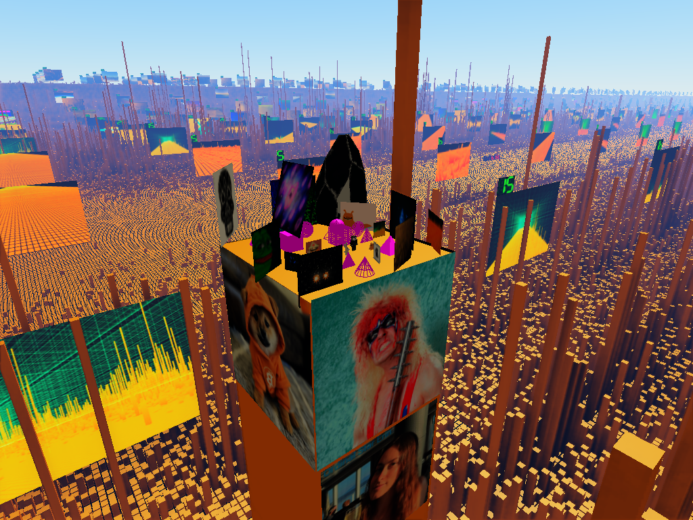</a>

 

<!--------------------------------------------------------------------------------------------------------------------------->
<!--------------------------------------------------------------------------------------------------------------------------->
<!--------------------------------------------------------------------------------------------------------------------------->
##

<strong>1. Abstract</strong>

  
BitmapSunset is a fully onchain 3D metaverse application built on Bitcoin Ordinals. It transforms the entire Bitcoin blockchain into a navigable three-dimensional landscape, where each of the over 900,000 mined Bitcoin blocks is represented as a discrete tile in a persistent, shared world. Bitmap owners can inscribe scripts onto their blocks to place 3D models, images, geometric primitives, and other visual content into this world, creating permanent, censorship-resistant builds that are visible to all users.

The application runs entirely in the browser, reads data exclusively from the Bitcoin blockchain via ordinals recursive endpoints, and requires no wallet connection, no proprietary server infrastructure, and no user accounts. Everything that exists in the BitmapSunset world is a Bitcoin inscription. The application itself is a Bitcoin inscription. While the application requires no servers of its own, it depends on ordinals content servers to deliver inscription data — the same decentralized infrastructure that serves all ordinals applications.

This white paper describes the architecture, scripting system, tokenomics, bootstrapping mechanism, security model, and future direction of BitmapSunset.

<!--------------------------------------------------------------------------------------------------------------------------->
<!--------------------------------------------------------------------------------------------------------------------------->
<!--------------------------------------------------------------------------------------------------------------------------->
##

<strong>2. Introduction</strong>

### The Problem

The concept of a digital metaverse has been explored extensively, yet existing implementations share common limitations: centralized infrastructure, mutable state controlled by platform operators, dependency on external servers, and the impermanence of digital assets. When a centralized metaverse platform shuts down, the worlds built within it disappear. Users own nothing; they rent access to someone else's servers.

The Bitcoin Ordinals protocol introduced a paradigm shift by enabling arbitrary data to be inscribed directly onto the Bitcoin blockchain. The Bitmap protocol extended this by assigning each Bitcoin block a unique digital identity, claimable as an ordinal inscription. Together, these innovations created the raw material for a new kind of metaverse: one where both the land and the structures built upon it exist as permanent, immutable Bitcoin inscriptions.

### The Vision

BitmapSunset realizes this potential. It is a 3D world engine that interprets the Bitcoin blockchain as terrain and ordinal inscriptions as building instructions. Every bitmap block becomes a buildable tile. Every script inscription becomes a permanent structure. The result is a shared, persistent, permissionless metaverse where ownership is enforced by Bitcoin's consensus mechanism and content is stored on the most secure and decentralized ledger in existence.

The project has been in continuous development for over two years, representing a sustained, independent engineering effort to create a genuinely decentralized spatial computing platform on Bitcoin.

<!--------------------------------------------------------------------------------------------------------------------------->
<!--------------------------------------------------------------------------------------------------------------------------->
<!--------------------------------------------------------------------------------------------------------------------------->
##

<strong>3. Foundational Concepts</strong>

### Bitcoin Ordinals

Bitcoin Ordinals is a protocol that assigns a unique serial number to each individual satoshi, allowing arbitrary data to be attached to it as an inscription. Inscriptions are stored in Bitcoin's witness data and are propagated, validated, and stored by every full node on the network. This makes inscriptions permanent, censorship-resistant, and verifiable without reliance on any external infrastructure.

### Bitmap

Bitmap is a metaprotocol built on Ordinals that maps each Bitcoin block to a unique digital asset. A bitmap is claimed by inscribing a specific pattern that references a block number. Once claimed, a bitmap functions as a deed to a specific tile in the BitmapSunset world. There are as many bitmaps as there are mined Bitcoin blocks, currently exceeding 900,000.

### Parent-Child Inscriptions

The Ordinals protocol supports parent-child relationships between inscriptions. A child inscription references a parent, establishing a verifiable ownership chain. BitmapSunset uses this mechanism to link build scripts to bitmaps: a script inscribed as a child of a bitmap is interpreted as the building instructions for that bitmap's tile in the 3D world. Only the bitmap owner can inscribe children on their own bitmap, enforcing property rights at the protocol level.

### Recursive Endpoints

Ordinals recursive endpoints allow inscriptions to reference and load the content of other inscriptions by their ID. BitmapSunset uses recursive endpoints to fetch script data, 3D models, images, and other assets at runtime. This means the entire application, including all user-generated content, operates within the ordinals sandbox without requiring any proprietary API calls or dedicated server infrastructure.

<!--------------------------------------------------------------------------------------------------------------------------->
<!--------------------------------------------------------------------------------------------------------------------------->
<!--------------------------------------------------------------------------------------------------------------------------->
##

<strong>4. System Architecture</strong>

### Application Delivery

BitmapSunset is itself an ordinal inscription. The application code, including the 3D rendering engine, script compiler, virtual machine, and user interface, is inscribed on the Bitcoin blockchain. Users access it by navigating to the inscription's content URL on any ordinals-compatible content server. This eliminates single points of failure in application delivery: as long as the Bitcoin network operates and ordinals content servers exist, BitmapSunset is accessible.

### Rendering Engine

The rendering engine is a custom-built WebGL-based 3D graphics pipeline written in TypeScript, without reliance on third-party frameworks. This architectural decision was made to achieve full control over the rendering stack, which is essential for displaying a massive world composed of over 900,000 discrete tiles, each potentially containing user-generated 3D content.

The world layout follows the ordinalswallet bitmap map convention, arranging all Bitcoin blocks in a 1000-column grid. The engine renders this grid with configurable mirror reflections at the boundaries, creating the visual impression of an infinite, seamless landscape extending in all directions.

### Script Compiler and Virtual Machine

User-authored scripts are written in the BitmapSunset Script language (BSS), a domain-specific text format designed for compactness. The compiler parses BSS source text, validates syntax and semantics, and emits a compact binary representation. This binary is encoded into a BMP image file for inscription. The choice of the BMP format is no coincidence: scripts for bitmap, stored as bitmaps. Every inscribed script appears as a visible image on ordinals explorers, turning each new inscription into a recognizable visual signature that sparks curiosity and draws attention to the application.

At runtime, the virtual machine decodes BMP inscriptions back into binary, then interprets the instruction stream to instantiate 3D objects, apply transforms, set colors, and execute referenced subscripts.

<!--------------------------------------------------------------------------------------------------------------------------->
<!--------------------------------------------------------------------------------------------------------------------------->
<!--------------------------------------------------------------------------------------------------------------------------->
##

<strong>5. The BitmapSunset Script Language</strong>

BSS is a declarative, line-oriented scripting language purpose-built for describing 3D scenes within the constraints of onchain storage. Every script begins with a version header for backward compatibility, followed by resource declarations, transform chains, and rendering commands.

### Script Structure

| Component | Description |
|---|---|
| **Version Header** | `BSS 0 0 11` — Required first line. Identifies the script version for backward compatibility. |
| **Resource Slots** | `resource <slot> <inscription_id>` — Registers an inscription (model, image, or script) into a numbered slot for reuse. |
| **Bind Commands** | `bind <slot> [transforms] <type>` — Instantiates a resource as a 3D object. Types: model, quad, billboard, mosaic, script. |
| **Transforms** | `scale X Y Z`, `translate X Y Z`, `rotate Rx Ry Rz` — Applied in sequence to position and orient objects. |
| **Primitives** | `sphere`, `cube`, `cone`, `circle`, `triangle`, `squpyr`, `tripyr` — Built-in geometric shapes requiring no inscription. |
| **Coloring** | `color <hex>`, `bitmaps <count> <ids>`, `pixels <count> <colors>` — Colors bitmap tiles on the map. |

### Rendering Modes

Objects can be rendered in solid mode (filled, opaque surfaces) or wire mode (wireframe outlines). Both modes can be applied simultaneously to the same object, which is useful for visualization during editing. The rendering mode is specified as a keyword in the bind command or after a primitive declaration.

### Composability

BSS supports two powerful mechanisms for cross-referencing content across the world:

- **Script referencing:** A script can load and execute another script inscription using `bind <slot> script`. The referenced script runs with full transform support, enabling code reuse, collaborative building, and modular scene composition.

- **Bitmap cloning:** The `bitmap <number>` command creates a live link to another bitmap's most recent build. When the source bitmap is updated, all clones automatically reflect the change, enabling efficient multi-bitmap deployments from a single source.

### Compilation and Encoding

The BSS compiler performs a multi-stage pipeline: source text is parsed and validated, then emitted as a compact binary instruction stream. This binary is encoded into the pixel data of a BMP image file. The resulting BMP file is the artifact inscribed onto the blockchain. At runtime, the process reverses: the BMP is decoded, the binary is extracted, and the virtual machine executes the instructions. A full round-trip verification ensures encoding integrity before export.

<!--------------------------------------------------------------------------------------------------------------------------->
<!--------------------------------------------------------------------------------------------------------------------------->
<!--------------------------------------------------------------------------------------------------------------------------->
##

<strong>6. The BitmapSunset Collection</strong>

### Overview

The BitmapSunset collection consists of 600 unique ordinal inscriptions, numbered 0 through 599. Each BitmapSunset is a piece of generative art: a screenshot captured during the development process of the application, documenting the evolving visual state of the 3D world engine. These images were collected organically over the course of development, making each one a historical artifact of the project's progression.

<a href="nfts/bitmap_sunset.png">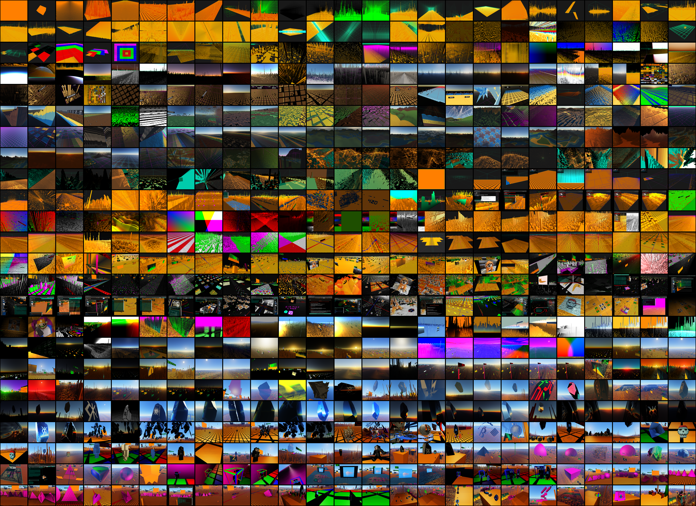</a>

### Utility

BitmapSunset holders receive concrete in-application utility:

- **Billboard control:** Each OG BitmapSunset (0–99) corresponds to a billboard structure positioned over a 100x100 bitmap patch in the 3D world. Holders can replace the default sunset image with any inscription of their choosing and rule over their patch, creating a persistent, high-visibility display space.

- **Bootstrapping authority:** OG sunset holders (0–99) can inscribe scripts on their sunsets that specify which bitmaps should be loaded first when any user opens the application. This priority loading mechanism gives sunset holders the ability to curate the initial user experience. Holders can promote multiple bitmaps and even lend or monetize bootstrap slots by including other bitmap owners in their loading queue. Bootstrap support for sunsets 100–599 is planned for v0.0.12.

- **Mosaic placement:** Sunset scripts can stamp images flat on the ground plane at specific coordinates, enabling ground-level art, territorial markers, and large-scale visual compositions visible from altitude.

### Collection Tiers

| Range | Trait | Description |
|---|---|---|
| **0–99** | OG | Original founder sunsets. Billboards positioned over 100x100 bitmap patches in the central map cell. First to load, highest visibility. Bootstrapping authority active. Future evolution into floating islands with parceling and building capabilities. |
| **100–599** | Mirror | Extended collection. Billboard placement and bootstrapping authority planned for v0.0.12. |

The collection is available on Magic Eden for secondary trading. Expansion to 1,000 items is planned, with future sunsets potentially covering additional blockchain landscapes within the multiverse framework.

<!--------------------------------------------------------------------------------------------------------------------------->
<!--------------------------------------------------------------------------------------------------------------------------->
<!--------------------------------------------------------------------------------------------------------------------------->
##

<strong>7. Bootstrapping and Caching</strong>

### The Discovery Problem

With over 900,000 bitmaps in existence, the application faces a fundamental discovery challenge: it cannot know which bitmaps contain builds without querying each one individually. Sequential scanning from block 0 to the chain tip is impractical for initial load times. A mechanism is needed to prioritize the most active and curated content.

### Solution Architecture

Bootstrapping solves this through a hierarchical priority loading system:

1. **Phase 1:** The application fetches OG BitmapSunset scripts (sunsets 0–99), ordered by sunset number. These scripts contain `bitmaps` commands that identify which bitmaps should be loaded.

2. **Phase 2:** Border-land bitmaps (0–999) are fetched, as these occupy the visible edges of the initial viewport.

3. **Phase 3:** Sequential fetching proceeds from bitmap 1000 upward through the entire chain.

Critically, bootstrapped bitmaps can themselves reference additional bitmaps, creating a chaining effect. A single sunset can bootstrap a network of builds through transitive references. This gives sunset holders significant curatorial power over the world's initial presentation without requiring any centralized coordination.

Even without a sunset or a low-number bitmap, any user of the application can highlight a bitmap with the mouse cursor and force it to be loaded on demand, ensuring that no build is permanently hidden.

> **Note:** Bootstrap support for sunsets 100–599 is planned for v0.0.12. Once enabled, Phase 1 will expand to include all 600 sunsets, extending priority loading authority to the full collection.

### Local Caching and Continuous Synchronization

As the world grows, re-downloading all bitmap data on every session becomes impractical. A planned local cache will store fetched scripts and world data on the user's device, allowing the application to launch almost instantly by rendering from cached state rather than streaming everything from scratch.

However, the world is not static. Builders continuously inscribe new scripts and update existing ones. The bootstrapping mechanism serves a dual purpose here: beyond initial discovery, it provides the backbone for continuous synchronization. On each session, the application will walk the bootstrap sequence and compare timestamps against cached data, detecting which bitmaps have been updated since the last visit. Only changed scripts are re-fetched, while the rest of the world loads from local storage. This means that even once all 900,000+ bitmaps have been cached, a lightweight polling process will keep running in the background to ensure the world stays current — new builds appear, updated scripts replace old ones, and the local cache gradually converges on the live state of the blockchain.

### Economic Implications

Bootstrapping creates a natural value hierarchy. OG BitmapSunset holders and low-number bitmap owners have guaranteed early visibility. High-number bitmap owners can gain visibility through relationships with sunset holders, creating organic economic incentives around curation, promotion, and collaborative building. Sunset holders can monetize bootstrap slots by lending priority positions in their loading queue to other bitmap owners.

<!--------------------------------------------------------------------------------------------------------------------------->
<!--------------------------------------------------------------------------------------------------------------------------->
<!--------------------------------------------------------------------------------------------------------------------------->
##

<strong>8. Block War</strong>

### Concept

Block War is the default multiverse mode in BitmapSunset, transforming it into a shared, competitive canvas. In Block War mode, the application renders cross-bitmap commands from all loaded scripts, meaning that builders can visually affect bitmaps they do not own. Switching to Bitmap mode enforces property rights: each bitmap displays only the scripts inscribed by its owner.

Think of it as a shared canvas layered on top of the standard world — players can enhance each other's builds, place graffiti, or wage territorial pixel wars.

### Mechanics

Block War leverages the `bitmaps`, `pixels`, and `mosaic` commands to enable cross-bitmap interaction. From your own bitmap's script, you can target any other bitmap on the map. Switching to Bitmap mode restricts rendering so that only the owner's commands take effect on their tile. Block War mode reveals the full competitive layer: every loaded script's cross-bitmap commands become visible.

The same script commands used for normal building apply in Block War. The difference is scope: a builder's `pixels` command can paint bitmaps they do not own, their `mosaic` command can stamp images on foreign ground, and their 3D structures can occupy contested territory.

### Strategic Dimensions

- **Territorial control:** Players use the `pixels` command to paint bitmaps in faction colors across large swaths of the map, visible to all Block War participants.

- **Visual occupation:** The `mosaic` command allows players to stamp logos, flags, or images on the ground plane of contested bitmaps.

- **Structural presence:** 3D models and primitive shapes can be placed to create visible landmarks and territorial markers.

- **Script stacking:** Multiple Block War scripts can accumulate effects on a single bitmap, creating collaboratively or competitively layered scenes.

All Block War inscriptions are permanent. They persist on the blockchain indefinitely, creating an immutable record of territorial contests and collaborative builds.

<!--------------------------------------------------------------------------------------------------------------------------->
<!--------------------------------------------------------------------------------------------------------------------------->
<!--------------------------------------------------------------------------------------------------------------------------->
##

<strong>9. Security Model</strong>

BitmapSunset was designed with the goal of reducing trust requirements wherever possible. Every architectural decision, from building a custom rendering engine to avoiding third-party JavaScript dependencies, was made to minimize the attack surface and eliminate the need for users to trust anything beyond the Bitcoin blockchain itself.

### No External Trust Requirements

- **No wallet connection:** The application never requests wallet credentials, private keys, recovery phrases, or transaction signatures.

- **No external links:** The application does not navigate to external websites or load resources from outside the ordinals sandbox.

- **No software installation:** No browser extensions, downloads, or additional software are required.

- **No user accounts:** There is no identity system, login mechanism, or personal data collection.

### Verification

Users are encouraged to verify the BitmapSunset inscription ID through the official @BitmapSunset X account before using the application. The application version is displayed in the settings panel for confirmation. Recommended security practices include using a dedicated browser profile, a virtual machine, or private browsing mode without wallet extensions installed.

<!--------------------------------------------------------------------------------------------------------------------------->
<!--------------------------------------------------------------------------------------------------------------------------->
<!--------------------------------------------------------------------------------------------------------------------------->
##

<strong>10. The Multiverse Architecture</strong>

### Mirror System

BitmapSunset's rendering engine uses a two-level mirror system that serves both as a visual seamlessness technique and as the structural foundation for a cross-chain multiverse.

At the first level, each blockchain is rendered as a **9-cell patch**: one root cell containing the actual blockchain data, surrounded by 8 mirror cells. The mirror cells are symmetrically reflected copies of the root — mirrored on the X axis, the Z axis, or both — eliminating visible seams at every boundary. From the ground, the mirroring is imperceptible: a user flying across the landscape sees a continuous, infinite-looking world rather than a tiled grid with hard edges. The number of mirror cells rendered is configurable (0–7) as a performance setting.

### From Mirrors to Multiverse

The same 1+8 spatial pattern repeats at a higher level to form the multiverse. Bitcoin's 9-cell patch (root + 8 mirrors) occupies the center position. Eight surrounding positions, each itself a 9-cell patch (root + 8 mirrors), are reserved for additional blockchain landscapes. The architecture is recursive: the same structure used to make a single blockchain seamless is reused to tile multiple blockchains into a unified navigable world.

In the current release, only the Bitcoin blockchain is displayed. The surrounding blockchain positions are not yet populated. The mirror cells function purely as seamless world extension, creating the visual impression of an infinite Bitcoin landscape. When cross-chain support is added, each surrounding position would render a different blockchain's map protocol (such as .dogemap or other .\*map equivalents), with its own root cell and its own 8 mirrors.

### Navigation and Spawn

Users spawn in the center of the Bitcoin root cell — the primary, non-mirrored representation of the blockchain. This is where the OG BitmapSunset billboards (0–99) are positioned, ensuring they are the first structures visible to every user. Flying outward, a user crosses into Bitcoin's mirror cells, then eventually into the territory of neighboring blockchain patches. Each blockchain's root cell contains its own unique content; its surrounding mirrors reflect that content seamlessly.

### Design Principles

This design preserves Bitcoin's primacy: it occupies the center, loads first, and is the default experience. Other blockchains are accessible but peripheral, reflecting Bitcoin's position as the foundational layer. Mirror sunsets (100–599) are planned for billboard placement on the mirror cells that border neighboring blockchain patches, giving them visibility at the crossroads between chains while keeping the OG billboards in the most prominent central position.

<!--------------------------------------------------------------------------------------------------------------------------->
<!--------------------------------------------------------------------------------------------------------------------------->
<!--------------------------------------------------------------------------------------------------------------------------->
##

<strong>11. Development Roadmap</strong>

### v0.0.12 — Next Release

- **Rotating camera** mode for cinematic orbital viewing around bitmaps and builds.
- **Reinscription support** as a lower-cost alternative to parent-child inscriptions for updating bitmap scripts, enabling sub-1-sat inscription fees.
- **Bootstrap support for sunsets 100–599**, extending priority loading authority to the full Mirror collection.
- **Rendering improvements** across all mirror maps and high-number bitmaps.

### BSS Language Evolution

- **New shape primitives:** text, cylinder, and tube opcodes.
- **Texture on shapes:** ability to apply inscription textures to primitive shapes, not just quads and models.
- **Push/pop transform stack:** opcodes for hierarchical transforms, enabling grouped object positioning.
- **Script comments:** support for inline comments, line information, and formatting.
- **Loop and control flow:** iteration and conditional logic, evolving BSS toward a full virtual machine with program counter and execution context.
- **BSS language specification** published on GitHub, enabling AI-assisted vibe coding where language models can generate valid BitmapSunset scripts from natural language descriptions.
- **Official bitmap color/image format** support for the emerging bitmap protocol standard.

### Editor and User Experience

- **Bitmap directory and teleportation:** a pre-fetched gallery of all bitmaps that contain builds, allowing users to click and teleport directly to active builds.
- **BMP import:** the ability to extract the original script text from a previously inscribed BMP file, enabling script recovery and inspection.
- **Asset library window:** an in-editor browser for selecting inscription resources.
- **Enhanced script error reporting** with interactive input, clickable error navigation, verbose logging, and configurable log limits.
- **Camera sensitivity controls:** rotation speed setting and smoother auto-rotation transitions.
- **Mobile support:** touch controls, free camera for mobile, and performance configuration presets for mobile devices.

### World and Gameplay

- **Floating islands:** OG billboards (0–99) will be transformed into giant cubic bitmaps — 3D structures where holders can display images on all sides and build on top. These floating islands will feature parceling, enabling subdivided building within a sunset holder's domain. Each floating island could host its own lobby area.
- **Billboard placement for Mirror sunsets** (100–599): dedicated 2D billboard positions on mirror cells bordering neighboring blockchain patches, complementary to but distinct from OG floating islands.
- **Parceling system:** individual bitmaps will be subdividable, allowing builders to work at finer spatial resolution within a single tile. Support for Bitmon parcels planned first, followed by inscribing additional parcel data onchain.
- **Playable characters and avatars:** BRC-420 avatar integration at human scale, with skeletal animation (skinning) support for animated characters.
- **Third-person camera:** a camera mode that follows avatars, enabling cinematic exploration of bitmap creations.
- **Interactive inscription display:** rendering other ordinal inscriptions as interactive screens on quads and billboards, allowing HTML inscriptions, videos, and other onchain applications to be displayed and interacted with inside the 3D world. This would enable portals between BitmapSunset and other ordinals applications.
- **GLSL billboards:** shader-based dynamic billboards for more expressive visual content.
- **Collection expansion** to 1,000 BitmapSunset items.

### Performance and Streaming

- **Reduce shape vertex count** for lighter inscriptions and better rendering performance.
- **Default model scale normalization** so that imported GLTF models appear at a reasonable size without requiring manual scale adjustments.
- **Streaming controls:** user-configurable fetch frequency and resource consumption visibility.
- **Rune-based priority ranking** for bitmap loading, leveraging the `/r/utxo` recursive endpoint to weight loading order by rune holdings.

### Rendering

- **Order-independent transparency (OIT)** for correct alpha blending of overlapping transparent surfaces.
- **Multiple light sources** and physically-based rendering (PBR) for more realistic scene illumination.
- **Virtual texturing** and model instancing for large-scale world rendering.
- **Depth buffer precision improvements** for reducing visual artifacts at distance.

### Long-Term Vision

- **Physics engine** to enable interaction with the world: collision detection, gravity, and drivable vehicles including the puppet kart.
- **Networking and multiplayer** so that users can see each other's avatars in real time, transforming BitmapSunset from a single-player exploration tool into a shared social space.
- **Spatial indexing** for models, enabling efficient collision queries and proximity-based interactions at scale.
- **Cross-chain multiverse rendering** with support for additional blockchain landscapes displayed in surrounding 9-cell patches alongside Bitcoin's central patch. Each blockchain rendered as its own root cell with 8 mirrors, navigable by flying across patch boundaries.
- **Progressive open-sourcing** of the full codebase to enable community-driven development and scaling beyond a solo developer effort.
- **Minecraft-style terrain and sandbox features** that were prototyped in early development and set aside for the onchain release, planned for reintroduction.
- **Onchain builder rankings** to surface and reward the most active and creative builders in the world.

<!--------------------------------------------------------------------------------------------------------------------------->
<!--------------------------------------------------------------------------------------------------------------------------->
<!--------------------------------------------------------------------------------------------------------------------------->
##

<strong>12. Conclusion</strong>

BitmapSunset represents a fundamentally different approach to digital world-building. It does not ask users to trust a company, depend on a server, or hope that a platform will continue to exist. Every component of the system, from the application itself to the land it renders to the structures built upon it, exists as a permanent Bitcoin inscription.

The project demonstrates that a functional, interactive, visually rich 3D metaverse can operate entirely onchain, within the constraints of the ordinals sandbox, and without any centralized infrastructure. The BSS scripting language provides a purpose-built tool for spatial expression on Bitcoin. The bootstrapping system creates a decentralized curation mechanism. Block War introduces competitive social dynamics that emerge naturally from the permissionless nature of the protocol.

Bitcoin is the most secure, decentralized, and enduring digital infrastructure ever created. BitmapSunset builds a world on top of it. Every block that Bitcoin mines adds new land to the map. Every inscription adds new content to the world. The result is a metaverse that grows with Bitcoin itself, as permanent and uncensorable as the blockchain that sustains it.

<!--------------------------------------------------------------------------------------------------------------------------->
<!--------------------------------------------------------------------------------------------------------------------------->
<!--------------------------------------------------------------------------------------------------------------------------->

 

<a href="nfts/pics/bitmap_598.png">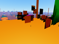</a>
<a href="nfts/pics/bitmap_597.png">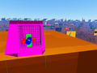</a>
<a href="nfts/pics/bitmap_596.png">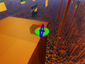</a>
<a href="nfts/pics/bitmap_595.png">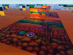</a>
<a href="nfts/pics/bitmap_594.png">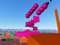</a>
<a href="nfts/pics/bitmap_593.png">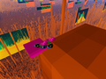</a>
<a href="nfts/pics/bitmap_592.png">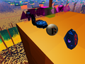</a>
<a href="nfts/pics/bitmap_591.png">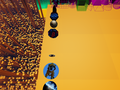</a>
<a href="nfts/pics/bitmap_590.png">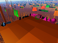</a>
<a href="nfts/pics/bitmap_589.png">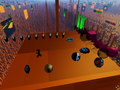</a>
<a href="nfts/pics/bitmap_588.png">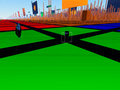</a>
<a href="nfts/pics/bitmap_587.png">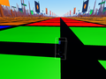</a>
<a href="nfts/pics/bitmap_586.png">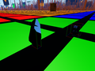</a>
<a href="nfts/pics/bitmap_585.png">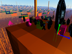</a>
<a href="nfts/pics/bitmap_584.png">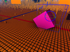</a>
<a href="nfts/pics/bitmap_583.png">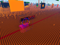</a>
<a href="nfts/pics/bitmap_582.png">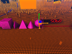</a>
<a href="nfts/pics/bitmap_581.png">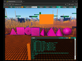</a>
<a href="nfts/pics/bitmap_580.png">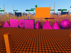</a>
<a href="nfts/pics/bitmap_579.png">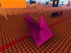</a>
<a href="nfts/pics/bitmap_578.png">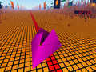</a>
<a href="nfts/pics/bitmap_577.png">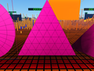</a>
<a href="nfts/pics/bitmap_576.png">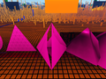</a>
<a href="nfts/pics/bitmap_575.png">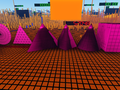</a>
<a href="nfts/pics/bitmap_574.png">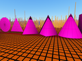</a>
<a href="nfts/pics/bitmap_573.png">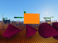</a>
<a href="nfts/pics/bitmap_572.png">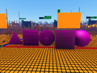</a>
<a href="nfts/pics/bitmap_571.png">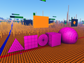</a>
<a href="nfts/pics/bitmap_570.png">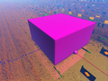</a>
<a href="nfts/pics/bitmap_569.png">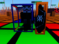</a>
<a href="nfts/pics/bitmap_568.png">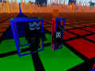</a>
<a href="nfts/pics/bitmap_567.png">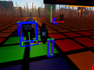</a>
<a href="nfts/pics/bitmap_566.png">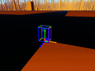</a>
<a href="nfts/pics/bitmap_565.png">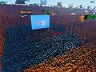</a>
<a href="nfts/pics/bitmap_564.png">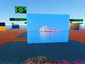</a>
<a href="nfts/pics/bitmap_563.png">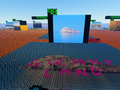</a>
<a href="nfts/pics/bitmap_562.png">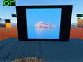</a>
<a href="nfts/pics/bitmap_561.png">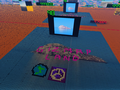</a>
<a href="nfts/pics/bitmap_560.png">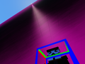</a>
<a href="nfts/pics/bitmap_559.png">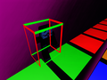</a>
<a href="nfts/pics/bitmap_558.png">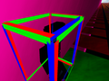</a>
<a href="nfts/pics/bitmap_557.png">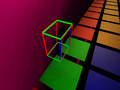</a>
<a href="nfts/pics/bitmap_556.png">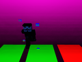</a>
<a href="nfts/pics/bitmap_555.png">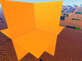</a>
<a href="nfts/pics/bitmap_554.png">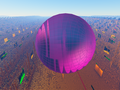</a>
<a href="nfts/pics/bitmap_553.png">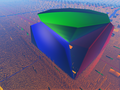</a>
<a href="nfts/pics/bitmap_552.png">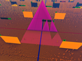</a>
<a href="nfts/pics/bitmap_551.png">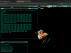</a>

## $\color{red}{\textsf{DISCLAIMER}}$

BitmapSunset is provided "AS IS" and "AS AVAILABLE" without warranties, guarantees, or support of any kind. You acknowledge and accept all risks associated with using blockchain-based applications, including financial losses. You are solely responsible for securing your private keys, Bitcoin, and other digital assets. The creators are not liable for any damages, losses, or security breaches resulting from the use of this application. BitmapSunset inscriptions are not investments and carry no expectation of financial return. While inscriptions are permanently stored on the Bitcoin blockchain, access to them depends on ordinals content servers and infrastructure outside the creators' control. All inscriptions are permanent and irreversible — once data is inscribed, it cannot be modified or deleted. It is your responsibility to comply with any applicable laws and regulations in your jurisdiction. By using BitmapSunset, you confirm that you understand and accept these terms.

