<h1 align="center">🟧 BitmapSunset 🌇 <br> Build and Explore the Bitcoin Multiverse<br></h1>

<p align="center">
  <a href="https://ordinals.com/content/42d68f827add0681426a541d861293e24db5f8928b042c4dd5a83704fc2aa8cfi0"></a>
  <a href="vibedoc.md"></a>
  <a href="https://ord-dropz.xyz/secondary/collections/bitmapsunset"></a>
  <a href="https://www.satflow.com/ordinals/bitmapsunset"></a>
  <a href="https://x.com/i/chat/group_join/g1998381136075002019/OS4j4rmw6E"></a>
</p>

<div align="center">
<a href="nfts/pics/bitmap_691.png">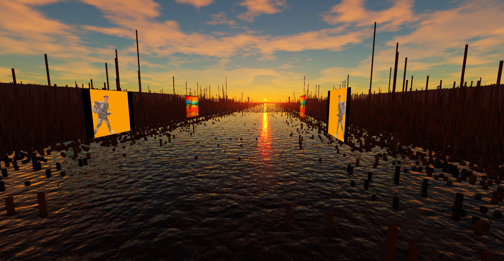</a>
</div>

<br>

<!--------------------------------------------------------------------------------------------------------------------------->
<!--------------------------------------------------------------------------------------------------------------------------->
<!--------------------------------------------------------------------------------------------------------------------------->
##
<details>
<summary><strong>1. Abstract</strong></summary>
  
BitmapSunset is a fully onchain 3D metaverse application built on Bitcoin Ordinals, running on both desktop and mobile browsers. It transforms the entire Bitcoin blockchain into a navigable three-dimensional landscape, where each mined Bitcoin block is represented as a discrete tile in a persistent, shared world that extends automatically as new blocks are added. Bitmap owners can inscribe scripts onto their blocks to place 3D models, images, geometric primitives, and other visual content into this world, creating permanent, censorship-resistant builds that are visible to all users.

The application runs entirely in the browser, reads data exclusively from the Bitcoin blockchain via ordinals recursive endpoints, and requires no wallet connection, no proprietary server infrastructure, and no user accounts. Everything that exists in the BitmapSunset world is a Bitcoin inscription. The application itself is a Bitcoin inscription. While the application requires no servers of its own, it depends on ordinals content servers to deliver inscription data, the same decentralized infrastructure that serves all ordinals applications.

This vibe paper describes the architecture, scripting system, the collection and its role in the application, bootstrapping mechanism, security model, and future direction of BitmapSunset.

</details>

<!--------------------------------------------------------------------------------------------------------------------------->
<!--------------------------------------------------------------------------------------------------------------------------->
<!--------------------------------------------------------------------------------------------------------------------------->
##
<details>
<summary><strong>2. Introduction</strong></summary>

### The Problem

The concept of a digital metaverse has been explored extensively, yet existing implementations share common limitations: centralized infrastructure, mutable state controlled by platform operators, dependency on external servers, and the impermanence of digital assets. When a centralized metaverse platform shuts down, the worlds built within it disappear. Users own nothing; they rent access to someone else's servers.

The Bitcoin Ordinals protocol, created by [@rodarmor](https://x.com/rodarmor), introduced a paradigm shift by enabling arbitrary data to be inscribed directly onto the Bitcoin blockchain. The Bitmap protocol, created by [@blockamoto](https://x.com/blockamoto), extended this by assigning each Bitcoin block a unique digital identity, claimable as an ordinal inscription. Together, these innovations created the raw material for a new kind of metaverse: one where both the land and the structures built upon it exist as permanent, immutable Bitcoin inscriptions.

### The Vision

BitmapSunset realizes this potential. It is a 3D world engine that interprets the Bitcoin blockchain as terrain and ordinal inscriptions as building instructions. Every bitmap block becomes a buildable tile. Every script inscription becomes a permanent structure. The result is a shared, persistent, permissionless metaverse where ownership is enforced by Bitcoin's consensus mechanism and content is stored on the most secure and decentralized ledger in existence.

The project has been in continuous development for over three years, representing a sustained, independent engineering effort to create a genuinely decentralized spatial computing platform on Bitcoin.

</details>

<!--------------------------------------------------------------------------------------------------------------------------->
<!--------------------------------------------------------------------------------------------------------------------------->
<!--------------------------------------------------------------------------------------------------------------------------->
##
<details>
<summary><strong>3. Foundational Concepts</strong></summary>

### Bitcoin Ordinals

Bitcoin Ordinals is a protocol created by [@rodarmor](https://x.com/rodarmor) that assigns a unique serial number to each individual satoshi, allowing arbitrary data to be attached to it as an inscription. Inscriptions are stored in Bitcoin's witness data and are propagated, validated, and stored by every full node on the network. This makes inscriptions permanent, censorship-resistant, and verifiable without reliance on any external infrastructure.

### Bitmap

Bitmap is a metaprotocol built on Ordinals, created by [@blockamoto](https://x.com/blockamoto), that maps each Bitcoin block to a unique digital asset. A bitmap is claimed by inscribing a specific pattern that references a block number. Once claimed, a bitmap functions as a deed to a specific tile in the BitmapSunset world. There are as many bitmaps as there are mined Bitcoin blocks, growing with every new block added to the chain.

### Parent-Child Inscriptions

The Ordinals protocol supports parent-child relationships between inscriptions. A child inscription references a parent, establishing a verifiable ownership chain. BitmapSunset uses this mechanism to link build scripts to bitmaps: a script inscribed as a child of a bitmap is interpreted as the building instructions for that bitmap's tile in the 3D world. Only the bitmap owner can inscribe children on their own bitmap, enforcing property rights at the protocol level.

### Recursive Endpoints

Ordinals recursive endpoints allow inscriptions to reference and load the content of other inscriptions by their ID. BitmapSunset uses recursive endpoints to fetch script data, 3D models, images, and other assets at runtime. This means the entire application, including all user-generated content, operates within the ordinals sandbox without requiring any proprietary API calls or dedicated server infrastructure.

</details>

<!--------------------------------------------------------------------------------------------------------------------------->
<!--------------------------------------------------------------------------------------------------------------------------->
<!--------------------------------------------------------------------------------------------------------------------------->
##
<details>
<summary><strong>4. System Architecture</strong></summary>

### Design Philosophy: Digital Matter Theory (DMT)

BitmapSunset is built around the concept of Digital Matter Theory (DMT), a framework for treating Bitcoin block data as the raw material for digital worlds. Every architectural decision, from how the blockchain is laid out as terrain to how mirror cells extend the landscape, follows from the principle that Bitcoin’s data structures are the substrate on which spatial computing is built. The application's substrate-rendering controls live across two surfaces: the **Distance** and **Terrain** sliders in Settings > Performance set the concentric mirror-ring depth and the geometry level of detail, while the **Base Level** and **Block Level** combos in the Terrain panel choose how raw Bitcoin block data is mapped into terrain heights. In the default configuration, each block's visual height combines two layers: Bitcoin mining difficulty (Base Level = Difficulty), which forms a stepped terrain that changes every 2016 blocks, and the total BTC value transacted in the block (Block Level = TxOutput), which gives each tile its individual height.

### Application Delivery

BitmapSunset is itself an ordinal inscription. The application code, including the 3D rendering engine, script compiler, virtual machine, and user interface, is inscribed on the Bitcoin blockchain. Users access it by navigating to the inscription's content URL on any ordinals-compatible content server. This eliminates single points of failure in application delivery: as long as the Bitcoin network operates and ordinals content servers exist, BitmapSunset is accessible.

### Rendering Engine

The rendering engine is a custom-built WebGL-based 3D graphics pipeline written in TypeScript, without reliance on third-party frameworks. This architectural decision was made to achieve full control over the rendering stack, which is essential for displaying a massive world composed of one tile per mined Bitcoin block, each potentially containing user-generated 3D content.

The world layout follows the [@ordinalswallet](https://x.com/ordinalswallet) bitmap map convention, arranging all Bitcoin blocks in a 1000-column grid. The engine renders this grid with configurable mirror reflections at the boundaries, creating the visual impression of an infinite, seamless landscape extending in all directions. The 3D viewport supports both fullscreen and movable/resizable windowed modes.

The camera system supports free-flight, orbit, and third-person modes with smooth transitions between them. The third-person mode follows a character model with gravity, collision, and skeletal animation.

The engine ships water, 2D volumetric clouds, Perlin-noise terrain, and altitude-band block coloring. Each subsystem has its own quality slider in the Performance panel so users can trade visual fidelity for frame time on lower-end devices; the [vibedoc](vibedoc.md#settings-panel) documents the full slider list.

### Script Compiler and Virtual Machine

User-authored scripts are written in the BitmapSunset Script language (BSS), a domain-specific text format designed for compactness. The compiler parses BSS source text, validates syntax and semantics, and emits a compact binary representation. This binary is encoded into a BMP image file for inscription. The choice of the BMP format is no coincidence: scripts for bitmap, stored as bitmaps. Every inscribed script appears as a visible image on ordinals explorers, turning each new inscription into a recognizable visual signature that sparks curiosity and draws attention to the application.

At runtime, the virtual machine decodes BMP inscriptions back into binary, then interprets the instruction stream to instantiate 3D objects, apply transforms, set colors, and execute referenced subscripts. Malformed images, scripts, and glTF models fail closed and are auto-banned to their per-type ban list; 404 responses are cached in the universal ban list as a negative cache.

### Data Pipeline

Open the app in a browser; from there it pulls every other inscription itself, with no external server in the loop:

```bash
  Browser
     │  opens an ordinals content URL for the BitmapSunset inscription
     ▼
  Ordinals content server
     │  serves the BitmapSunset app (JavaScript + assets), then steps out
     ▼
  BitmapSunset app, now running locally in the browser
     │  uses ordinals recursive endpoints (/r/...) to fetch on-chain content
     ▼
  Bitmap scripts (BMP inscriptions)
     │  BMP pixels → BSS binary → opcode stream
     ▼
  BSS virtual machine
     │  builds the 3D scene from the opcodes: meshes, transforms, colors, child scripts
     ▼
  WebGL renders the scene to the 3D viewport
```

Every step is either a fetch from the ordinals network or a computation in your browser. There is no BitmapSunset-operated server, no proprietary API, and nothing routes through a back-end we control.

</details>

<!--------------------------------------------------------------------------------------------------------------------------->
<!--------------------------------------------------------------------------------------------------------------------------->
<!--------------------------------------------------------------------------------------------------------------------------->
##
<details>
<summary><strong>5. The BitmapSunset Script Language</strong></summary>

BSS is a declarative, line-oriented scripting language purpose-built for describing 3D scenes within the constraints of onchain storage. Every script begins with a version header for backward compatibility, followed by resource declarations, control commands, and object commands.

### Script Structure

| Component | Description |
|---|---|
| **Version Header** | `BSS 0 0 14`: Required first line. Compiles into a 9-byte binary header containing a magic signature, version, and filesize (binary format unchanged since v0.0.13). The filesize field enables strict end-of-file validation against BMP padding overflow. |
| **Target Commands** | `block <number>` targets a bitmap for the build; `sunset <number>` targets a sunset for billboard / mosaic. Both are serialized into the binary. `block` carries `color` (tile tint) via a COLOR opcode preceding BLOCK. `sunset` accepts `color`, `translate`, and mosaic / billboard binds in the text syntax; `color` fills the sunset billboard with a solid color (via a COLOR opcode preceding the BILLBOARD opcode in the binary), while the parser consumes `translate` and binds to create separate billboard and mosaic objects. The SUNSET opcode itself carries only the sunset number. When the script runs onchain, the parent inscription determines the target bitmap or sunset; the author's `block` / `sunset` values are only used in the editor, where no parent inscription exists. |
| **Named Inscriptions** | `inscription <name> <inscription_id>`: Registers an inscription (model, image, SVG, HTML, or subscript) under a short name. Names are 1–16 alphanumeric characters (first character must be a letter; reserved keywords are rejected) and survive the binary round-trip, so onchain scripts carry meaningful identifiers instead of opaque indices. |
| **Control Commands** | `scale X Y Z`, `translate X Y Z`, `rotate X Y Z`, `color 0xRRGGBB`: Can appear in any order before an object command. Shapes additionally accept `wire` and `alpha 0xBB`. Object commands take the inscription name as a direct argument (`model <name>`, `quad <name>`, `script <name>`). **Note:** A `color` preceding the `block` command also sets the bitmap tile tint; this is independent from the `bitmaps`/`pixels` painting commands. |
| **Object Commands** | `model`, `script`, and primitives. **2D:** `triangle`, `quad`, `circle`; **3D:** `tripyr`, `squpyr`, `cube`, `cone`, `sphere`. Terminates a statement and triggers rendering. `billboard <name>` and `mosaic <name>` are inscription-binding modifiers consumed by the `sunset` command rather than standalone terminals. `quad` doubles as a textured surface (image / SVG) when bound to a named inscription. |
| **Comments** | `#` line and inline comments are tokenized as dedicated `COMMENT` / `COMMENT_INLINE` opcodes and round-trip through the binary; the comment bytes ride along with the on-chain inscription and are visible to any re-decoder. |
| **Hex literals** | `0xRRGGBB` (up to 6 hex digits, zero-padded) or `0xRRGGBBAA` (exactly 8 hex digits, combined color + alpha) for `color`; `0xRRGGBB` for `pixels`. The tokenizer emits the `0x` prefix form for writes and accepts both prefixed and bare forms for backward compatibility with older scripts. |
| **Cross-Referencing** | `script <name>`: Loads and executes another script inscription. The parser rejects all modifiers on `script`, so the referenced script runs at its authored transforms. `bitmap <number>`: Creates a live link to another bitmap's most recent build; auto-updates when the source bitmap is re-inscribed. |
| **Map Painting** | `bitmaps <count> <ids>`, `pixels <count> <hex_values>`: Paint commands that color bitmap tiles on the map and queue them for fetch. Independent from the `color` control command. Mosaic coordinates are map-space positions corresponding to bitmap numbers. |

### Rendering Modes

Shapes render filled by default. The `wire` control command renders the next shape as wireframe outlines instead. Filled rendering is the default for every shape, so no explicit keyword is needed; simply omit `wire`. Wire applies only to primitive shapes, not models.

### Composability

BSS supports two powerful mechanisms for cross-referencing content across the world:

- **Script referencing:** A script can load and execute another script inscription using `script <name>`. The referenced script runs at its authored transforms (the `script` statement accepts no modifiers), enabling code reuse, collaborative building, and modular scene composition.
- **Bitmap cloning:** The `bitmap <number>` command creates a live link to another bitmap's most recent build. When the source bitmap is updated, all clones automatically reflect the change, enabling efficient multi-bitmap deployments from a single source.

### Inscription Kind Validation

Because `inscription` declarations carry only a name and an inscription ID (the underlying content type is discovered only after the fetch completes), the virtual machine validates the **kind** at apply time. The `mosaic` and shape commands (including `quad`) accept only image or SVG inscriptions; binding an HTML-only (iframed) inscription surfaces an editor console error rather than silently rendering an empty tile. Only `billboard` accepts the full set (image, SVG, HTML-via-iframe). Cross-script reference chains (`script <name>` and `bitmap <N>`) are additionally capped at 8 levels deep to block runaway recursion and fetch bombs.

### Compilation and Encoding

The BSS compiler runs a multi-stage pipeline: source text is tokenized and validated with line:column tracking, then emitted as a compact binary instruction stream. The stream is encoded into the pixel data of a BMP image file. The resulting BMP is the artifact inscribed onto the blockchain. At runtime, the process reverses: the BMP is decoded, the binary is extracted, the filesize is validated against the decoded length, and the virtual machine executes the instructions. A full round-trip verification (text → binary → BMP → binary → text) ensures encoding integrity before export, and the editor disables the export button on tabs that have compile errors.

### Backward Compatibility

The version header enables forward migration between BSS revisions. Older onchain scripts (`BSS 0 0 9` through `BSS 0 0 13`) remain renderable via dedicated reader paths. New scripts should always target the latest version (`BSS 0 0 14`). A parent script in an older version can call a child script in a newer version; updating the parent to `0 0 14` is recommended for full feature parity.

</details>

<!--------------------------------------------------------------------------------------------------------------------------->
<!--------------------------------------------------------------------------------------------------------------------------->
<!--------------------------------------------------------------------------------------------------------------------------->
##
<details>
<summary><strong>6. The BitmapSunset Collection</strong></summary>

### Overview

The BitmapSunset collection currently consists of 644 unique ordinal inscriptions[^gallery] (as of v0.0.14), numbered from 0 upward. Each BitmapSunset is a development screenshot captured during the building process of the application, documenting the evolving visual state of the 3D world engine. These images were collected organically over the course of development. Taken together, the collection is a historical timelapse of BitmapSunset's evolution as an engine, with each inscription preserving the visual state of the application at a specific point in its development. New items are added as development continues.

[^gallery]: The count is loaded from an on-chain CBOR gallery inscription at startup rather than hardcoded in the app. The gallery itself is immutable once inscribed, so growing the collection beyond the figure cited here requires minting a new CBOR gallery and shipping an app update that points to it.

<div align="center">
<a href="nfts/bitmap_sunset.png"></a>
</div>

### Dynamic art

The application is free to use, without paywalls or gatekeepers: anyone can explore the world, write scripts, preview builds, and export inscription files. Owning a bitmap is only needed to inscribe a BitmapSunset script onchain as its child using regular inscription services, making your build permanently visible to everyone who launches the app. Bitmaps are claimed through the open bitmap protocol and are not sold by the developer. The BitmapSunset collection is a series of development screenshots released as standalone artistic inscriptions, captured chronologically during the building of the application; taken together they form a historical timelapse of its development. Each inscription is also a piece of dynamic, customizable art: the renderer reads its inscription number and renders it in the 3D world, and the displayed artwork changes based on what scripts are inscribed as children of it. The behaviours described below are properties of the art itself, expressed through how the current renderer interprets inscription IDs. They are not a contractual benefit, a revenue share, a promise of future development, or a stake in the project's success.

- **Billboard placement across mirror rings:** Every inscription in the gallery is mapped to a billboard slot in the 3D world. Inscriptions **0–99** occupy slots in the central root cell (mirror 0/1, one billboard per 100×100 bitmap patch). Inscriptions **100–199** are placed on **mirror ring 2**, **200–299** on **ring 3**, **300–399** on **ring 4**, and so on; each successive 100-inscription tier projects onto the next outward mirror ring. The default image displayed at a slot can be replaced by inscribing a child script that points to any other inscription, turning the slot into a persistent, high-visibility display space.

- **Bootstrap loading:** The full CBOR gallery feeds the startup pipeline. Any sunset's child script can include `bitmaps` commands; the loader walks those references during startup and adds them to the priority load queue. This is how a sunset's child script influences which other artworks load first.

- **Mosaic stamps:** The `mosaic` command, callable in child scripts, stamps images flat on the ground plane at map-space positions corresponding to bitmap numbers, enabling ground-level art, territorial markers, and large-scale visual compositions visible from altitude.

### Collection Tiers

| Range | Trait | Description |
|---|---|---|
| **0–99** | OG | Original sunsets. Mapped to billboard slots in the central root cell (mirror 0/1, one billboard per 100×100 bitmap patch). First in the startup load order, highest visibility. |
| **100+** | Outer | Each successive 100-inscription tier sits on the next outward mirror ring: 100–199 on ring 2, 200–299 on ring 3, 300–399 on ring 4, and so on. |

Every sunset in the gallery bootstraps and is rendered in the world; the placement formula is `ring = floor(n / 100) + 1` for `n ≥ 100`, root cell for `n < 100`.

The collection is being transitioned to an immutable onchain gallery format using ord's native gallery inscriptions (CBOR-encoded metadata in tag 17), ensuring permanent, decentralized provenance independent of any marketplace. The collection is intended to grow to roughly 1,000 items, though because each BitmapSunset is a screenshot captured during the development process, new items are added at the natural pace of ongoing development.

</details>

<!--------------------------------------------------------------------------------------------------------------------------->
<!--------------------------------------------------------------------------------------------------------------------------->
<!--------------------------------------------------------------------------------------------------------------------------->
##
<details>
<summary><strong>7. Bootstrapping and Caching</strong></summary>

### The Discovery Problem

With every mined Bitcoin block represented as a bitmap, the application faces a fundamental discovery challenge: it cannot know which bitmaps contain builds without querying each one individually. Sequential scanning from block 0 to the chain tip is impractical for initial load times. A mechanism is needed to prioritize the most active and curated content.

### Solution Architecture

Bootstrapping solves this through a hierarchical priority loading system. Since v0.0.14 the loader runs a conceptually four-phase serial pipeline (implemented as priority sets that drain in order): each phase finishes before the next begins, giving predictable request waves and a deterministic priority cache.

1. **Phase 1, OG images:** Fetch the billboard image for each OG sunset (0–99), ordered by sunset number.

2. **Phase 2, OG sunrise:** Fetch the child scripts of each OG sunset and execute them. `bitmaps` commands inside these scripts queue their referenced bitmaps for priority loading.

3. **Phase 3, outer images:** Fetch the image for each outer sunset (100..N-1, where N is the gallery count, 644 as of v0.0.14).

4. **Phase 4, outer sunrise:** Fetch the child scripts of each outer sunset and execute them. Their `bitmaps` commands queue additional bitmaps after the OG-driven queue, so every sunset in the gallery contributes to startup priority loading. OG sunsets remain the highest-priority slot.

Independent of the sunset pipeline: when the user clicks the **fetch** button in the toolbar, bitmap data fetching begins. A hardcoded seed list of bitmaps is fetched alongside sunset-discovered bitmaps; both sources feed the same bootstrap queue. Additional bitmaps chain transitively via `bitmaps` commands in scripts. Until fetch is activated, no bitmap data is downloaded regardless of bootstrap priority. The fetch on/off state is persisted in localStorage, so subsequent sessions on the same device resume in whichever state the user last left it.

Bootstrapped bitmaps can themselves reference additional bitmaps, creating a chaining effect. A single sunset can bootstrap a network of builds through transitive references. This gives sunset holders significant curatorial power over the world's initial presentation without requiring any centralized coordination.

Even without a sunset or a low-number bitmap, any user can double-click a bitmap to force it to be loaded on demand, ensuring that no build is permanently hidden. A seed list of pioneer scripts is maintained manually and embedded in the application. If you have a high bitmap number and want your build included in the next version, reach out to [@BitmapSunset](https://x.com/BitmapSunset).

### Local Caching and Continuous Synchronization

The application maintains an IndexedDB cache for inscription content. All inscription bytes (scripts, bitmap-page JSON, blockheight, glTF models, images, and resolved SVG references) share a single object store named `inscriptions` in DB `bs_cache`, keyed by content path. Cached entries are stored locally after their first fetch. Subsequent sessions serve cached inscriptions instantly while still walking the bootstrap sequence to discover newly-inscribed builds. What isn't cached yet is the per-session world state; the bootstrap queue and per-bitmap discovery still re-run on launch, just much faster because most inscriptions are already local.

The next step is per-script timestamp resolution (via `/r/inscription/<id>` metadata) so the cache can detect updated scripts without re-fetching their bytes, and cached bootstrap state so the application can skip the discovery walk entirely and converge to the live blockchain state via a lightweight background poll. With those in place, even once every bitmap has been cached, a continuous polling process keeps the world current: new builds appear, updated scripts replace old ones, and the local cache converges on the live blockchain state.

### Visibility Hierarchy

Bootstrapping creates a natural visibility hierarchy. OG BitmapSunset holders and low-number bitmap owners appear first. High-number bitmap owners can gain visibility through relationships with sunset holders, encouraging collaboration and community curation.

</details>

<!--------------------------------------------------------------------------------------------------------------------------->
<!--------------------------------------------------------------------------------------------------------------------------->
<!--------------------------------------------------------------------------------------------------------------------------->
##
<details>
<summary><strong>8. Block War</strong></summary>

Block War is a pixel-painting layer on top of the metaverse. Using the `bitmaps`, `pixels`, and `mosaic` commands, any builder can change the base color of bitmaps they do not own and stamp images on their ground plane. Every viewer sees these contributions layered over the map. Property rights at the inscription layer (only a bitmap's owner can inscribe a child script on it) are still enforced by the Ordinals protocol; Block War only affects tile colors and ground-level imagery, not 3D structures.

Think of it as a persistent pixel war: factions paint territory in their colors, stamp logos on contested ground, and the results accumulate from every loaded script. All Block War inscriptions are permanent and immutable onchain.

</details>

<!--------------------------------------------------------------------------------------------------------------------------->
<!--------------------------------------------------------------------------------------------------------------------------->
<!--------------------------------------------------------------------------------------------------------------------------->
##
<details>
<summary><strong>9. Security Model</strong></summary>

BitmapSunset was designed with the goal of reducing trust requirements wherever possible. Every architectural decision, from building a custom rendering engine to avoiding third-party JavaScript dependencies, was made to minimize the attack surface and eliminate the need for users to trust anything beyond the Bitcoin blockchain itself.

### No External Trust Requirements

- **No wallet connection:** The application never requests wallet credentials, private keys, recovery phrases, or transaction signatures.

- **No external links:** The application does not navigate to external websites or load resources from outside the ordinals sandbox.

- **No software installation:** No browser extensions, downloads, or additional software are required.

- **No user accounts:** There is no identity system, login mechanism, or personal data collection.

- **No identity verification:** The application never asks to verify your identity, account, or any personal information.

- **No permissions:** The application never asks to enable any browser or system permissions.

### Content Sanitization

All inscription content (SVG, glTF, images, scripts) is sanitized, size-capped, and validated before use. Recursive references are depth-limited to prevent resource exhaustion. Malformed or oversized content is automatically rejected and banned so it cannot retry across sessions. The DOM write surface has been audited to eliminate injection vectors, and an automated build phase scans the source and final bundle for forbidden patterns before every release.

### Iframe Isolation for HTML Billboards

HTML inscriptions rendered on `billboard` surfaces are embedded in a hardened sandbox with strict Content Security Policy, no access to cookies or origin state, and a broad permissions lockdown. When a user enters interactive mode, every iframe receives a visible 3 px orange outline and a top-right **"External inscription content"** badge (white text on a translucent dark background) to prevent UI spoofing by malicious inscriptions.

### User-Controlled Content Filtering

The ban list system provides a tabbed window with five categories (universal, image, script, model, and inscription), giving users fine-grained control over what content appears in their view of the world. Bans are persisted in the browser's localStorage and take effect immediately during the fetch process. Auto-bans from image and script decode failures appear in the corresponding tab, so users can inspect and clear them individually. This layered approach requires no centralized moderation while still letting users manage both manual bans and automatic rejections. A future release will add subscribable ban list inscriptions: users will be able to subscribe to lists maintained by anyone they trust, build and share their own, and opt out at any time. Curation is bottom-up: there is no central authority deciding what is visible; each user assembles their own filtering from the lists they choose.

### Author Protections

Because inscribing is permanent and irreversible, the editor enforces its own validation layer to prevent an author from committing a script that won't render. A full round-trip (text → binary → BMP → binary → text) is executed on every export, and the export button is disabled on tabs with compile errors. NaN and infinity guards ship in release inscriptions so an accidental divide-by-zero in script transforms surfaces loudly rather than propagating silently through the VM.

### Verification

Users are encouraged to verify the BitmapSunset inscription ID through the official @BitmapSunset X account before using the application. The application version is displayed in the settings panel for confirmation. Recommended security practices include using a dedicated browser profile, a virtual machine, or private browsing mode without wallet extensions installed.

</details>

<!--------------------------------------------------------------------------------------------------------------------------->
<!--------------------------------------------------------------------------------------------------------------------------->
<!--------------------------------------------------------------------------------------------------------------------------->
##
<details>
<summary><strong>10. The Multiverse Architecture</strong></summary>

### Mirror System

BitmapSunset's rendering engine uses a two-level mirror system that serves both as a visual seamlessness technique and as the structural foundation for a future cross-chain multiverse.

At the first level, each blockchain is rendered as a **root cell** containing the actual blockchain data, surrounded by concentric **rings of mirror cells**. Each ring adds a layer of symmetrically reflected copies of the root (mirrored on the X axis, the Z axis, or both), eliminating visible seams at every boundary. The first ring adds 8 mirror cells, the second ring adds 16, and so on. From the ground, the mirroring is imperceptible: a user flying across the landscape sees a continuous, infinite-looking world rather than a tiled grid with hard edges. The number of mirror rings rendered is configurable (1–6) as a performance setting; lowering the tier reduces the ring count, trading horizon seamlessness for frame time.

### World Layers

Before extending the multiverse to other blockchains, the same architecture enables multiple presentation layers of the Bitcoin map itself. Each layer renders the same blockchain data through a different visual lens, and users can switch between them or run them side by side. Planned layers include:

- **City** (current default): the orange-block skyline visible today.
- **RPG**: full procedural-landscape mode with elevation, biomes, and natural features. Partially delivered in v0.0.14: a Perlin-noise base level (configurable scale, octaves, detail, ridged-FBM toggle, height, sea-level threshold flatten) is now selectable from the Terrain settings panel, and altitude-band coloring (Beach/Grass/Dirt/Rock with slope-aware classification and integer-hash dither) ships alongside it. The full RPG layer (game systems, biome variety, exploration mechanics) remains planned.
- **Content layers**: thematic filters such as SFW or NSFW, where each layer selectively shows or hides inscriptions based on subscribable ban lists.
- **Racing**: blocks as track segments for time trials across the map.
- **Gallery**: clean exhibition spaces focused on art viewing.
- **Strategy**: top-down territorial overview for large-scale Block War coordination.

Layers are additive: a user could explore the RPG terrain while a racing event runs on the same blocks. Because layers share the same underlying block data and inscription set, builds inscribed once are visible across every layer that chooses to render them.

### From Mirrors to Multiverse

The concentric mirror pattern repeats at a higher level to form the multiverse. Bitcoin's root cell and its surrounding mirror rings occupy the center position. Eight surrounding positions, each itself a root cell with its own mirror rings, are reserved for additional blockchain landscapes. The architecture is recursive: the same structure used to make a single blockchain seamless is reused to tile multiple blockchains into a unified navigable world.

In the current release, only the Bitcoin blockchain is displayed with the City layer. The surrounding blockchain positions are not yet populated. The mirror rings function purely as seamless world extension, creating the visual impression of an infinite Bitcoin landscape. When cross-chain support is added, each surrounding position would render a different blockchain's map protocol (such as .dogemap or other .\*map equivalents), with its own root cell, its own mirror rings, and its own set of available layers.

### Navigation and Spawn

Users spawn in the center of the Bitcoin root cell, the primary, non-mirrored representation of the blockchain. The OG BitmapSunset billboards (0–99) sit in this root cell, so they are the first structures visible to every user. Outer sunsets (100+) are placed on outward mirror rings (100–199 on ring 2, 200–299 on ring 3, and so on), forming concentric bands of billboards that come into view as a user flies outward. Beyond Bitcoin's mirror rings, the user eventually crosses into the territory of neighboring blockchain patches. Each blockchain's root cell contains its own unique content; its surrounding mirrors reflect that content seamlessly.

### Design Principles

This design preserves Bitcoin's primacy: it occupies the center, loads first, and is the default experience. Other blockchains are accessible but peripheral, reflecting Bitcoin's position as the foundational layer. Sunsets 100+ occupy concentric billboard rings on Bitcoin's mirror cells, so they are visible at the crossroads between the central root cell and neighbouring blockchain territory while the OG billboards keep the most prominent central position.

</details>

<!--------------------------------------------------------------------------------------------------------------------------->
<!--------------------------------------------------------------------------------------------------------------------------->
<!--------------------------------------------------------------------------------------------------------------------------->
##
<details>
<summary><strong>11. Development Roadmap</strong></summary>

The following reflects the long-term vision for BitmapSunset. Timelines are fluid; this is a solo development effort and features ship when they're ready. Detailed changelogs for each release are published separately.

Roadmap items are aspirational and not commitments. Nothing in this section is promised or guaranteed, and nothing here should be relied upon as a basis for valuing any inscription.

### Recently shipped (v0.0.14)

- **Water rendering:** projected-grid Gerstner waves with PBR cubemap reflections, Beer-Lambert absorption, depth-clamped refraction, screen-space caustics, and an underwater fog/scattering pass.
- **2D clouds:** spherical cloud shell driven by an FBM weather mask, edge-displaced silhouettes, Henyey-Greenstein silver lining, with IBL re-baked when cloud parameters change.
- **Perlin terrain base level:** ridged-FBM heightmap with sea-level threshold flatten, configurable scale/octaves/detail/height/road-fill; a first step toward the RPG world layer.
- **Altitude band coloring:** per-block matIdx with slope-aware Beach/Grass/Dirt/Rock palette and integer-hash dither at thresholds.
- **Bootstrap loading for sunsets 100+:** CBOR gallery loader extends the priority-loading pipeline to all 644 sunsets via a 4-phase serial fetch.
- **Render perf overhaul:** cubemap half-cadence + camera-quadrant cull, SSAO at 1/4 face size, aerial raymarch 32→8 steps, heightmap mip chain, OIT format shrink, cellData skip-on-unchanged.

### Scripting Language

- New shape primitives (text, cylinder, tube) and texture support on all primitives.
- Hierarchical transforms via push/pop opcodes for grouped object positioning.
- Loop and control flow, evolving BSS toward a full virtual machine.
- Reinscription support via a `sat` keyword for cheap script updates without new parent-child inscriptions.
- Published BSS language specification, enabling AI-assisted vibe coding from natural language descriptions.
- Official bitmap color/image format support for the emerging bitmap protocol standard.

### Editor and User Experience

- Bitmap directory with teleportation to active builds.
- BMP import for script recovery from previously inscribed files.
- Asset library for browsing inscription resources in-editor.
- Touch-first gizmos and mobile-optimized editor layout.

### World and Gameplay

- **Parceling:** individual bitmaps subdividable for finer spatial resolution, building on [@mononautical](https://x.com/mononautical)'s bitfeed layout.
- **Playable characters and avatars:** BRC-420 integration at human scale.
- **Interactive inscriptions:** other ordinal applications displayed as interactive screens inside the 3D world, enabling portals between projects.
- **World layers:** multiple presentation modes (City, RPG terrain, racing, gallery, strategy) over the same blockchain data.
- Collection expansion to 1,000 BitmapSunset items.

### Rendering and Performance

- Multiple light sources beyond the single directional sun.
- Virtual texturing for large-scale rendering without VRAM limits.
- Streaming controls and rune-based priority ranking for bitmap loading.

### Long-Term

- Physics and drivable vehicles.
- Networking and multiplayer: see other avatars in real time.
- Cross-chain multiverse rendering with additional blockchain landscapes in surrounding patches.
- Progressive open-sourcing of the codebase at github.com/BitmapSunset/bitmap_sunset.
- Minecraft-style terrain and sandbox features, prototyped early and planned for reintroduction.
- Onchain builder rankings.

</details>

<!--------------------------------------------------------------------------------------------------------------------------->
<!--------------------------------------------------------------------------------------------------------------------------->
<!--------------------------------------------------------------------------------------------------------------------------->
##
<details>
<summary><strong>12. Conclusion</strong></summary>

BitmapSunset represents a fundamentally different approach to digital world-building. It does not ask users to trust a company, depend on a server, or hope that a platform will continue to exist. Every component of the system, from the application itself to the land it renders to the structures built upon it, exists as a permanent Bitcoin inscription.

The project demonstrates that a functional, interactive, visually rich 3D metaverse can operate entirely onchain, within the constraints of the ordinals sandbox, and without any proprietary infrastructure beyond the shared ordinals content servers that serve the entire ecosystem. The BSS scripting language provides a purpose-built tool for spatial expression on Bitcoin. The bootstrapping system creates a decentralized curation mechanism. Block War introduces competitive social dynamics that emerge naturally from the permissionless nature of the protocol.

Bitcoin is the most secure, decentralized, and enduring digital infrastructure ever created. BitmapSunset builds a world on top of it. Every block that Bitcoin mines adds new land to the map. Every inscription adds new content to the world. The result is a metaverse that grows with Bitcoin itself, as permanent and uncensorable as the blockchain that sustains it.

</details>

<!--------------------------------------------------------------------------------------------------------------------------->
<!--------------------------------------------------------------------------------------------------------------------------->
<!--------------------------------------------------------------------------------------------------------------------------->
##
<details>
<summary><strong>Acknowledgments</strong></summary>

BitmapSunset would not exist without the bitmap protocol. Many thanks to [@blockamoto](https://x.com/blockamoto) for inventing it; without his work, this project would never have been conceived. Thanks to [@rodarmor](https://x.com/rodarmor) for creating ord and the Ordinals protocol that made it all possible, to [@boppleton](https://x.com/boppleton) for maintaining the OCI (On-Chain Index) that maps bitmaps to their satoshi IDs, to [@mononautical](https://x.com/mononautical) for the bitfeed transaction layout, to [@ordinalswallet](https://x.com/ordinalswallet) where the bitmap community formed and minted the first 800k bitmaps to catch up to the current block in what became known as the blockout, and to [@TheBlockRunner](https://x.com/TheBlockRunner) whose podcast is where I first heard of bitmap.

Special thanks to the 30 BitmapSunset pioneers for their support, their help testing the app, the time they took to engage on social media, and the scripts they inscribed onchain. Every build, every piece of feedback, and every shared screenshot pushed the project forward. This would be a lonely metaverse without you.

And thanks to Satoshi Nakamoto for building the foundation all of this stands on.

</details>

<!--------------------------------------------------------------------------------------------------------------------------->
<!--------------------------------------------------------------------------------------------------------------------------->
<!--------------------------------------------------------------------------------------------------------------------------->
##
<details>
<summary><strong>Glossary</strong></summary>

| Term | Meaning |
|---|---|
| **bitmap** | A Bitcoin block claimed as an ordinal under the bitmap protocol. One bitmap = one tile in the 3D world. |
| **sunset** | A BitmapSunset collection inscription. OG sunsets are 0–99; outer sunsets are 100+. |
| **OG sunset** | BitmapSunset 0–99. Mapped to a billboard slot in the central map cell; its child scripts contribute to the bootstrap queue. |
| **billboard** | A vertical image surface positioned over a 100×100 bitmap patch. Placed for every sunset in the gallery: OG (0–99) on the central root cell, 100+ on successive outward mirror rings (ring 2 for 100–199, ring 3 for 200–299, and so on). |
| **mosaic** | A flat image stamped on the ground plane at map-space coordinates (image or SVG; not HTML). |
| **BSS / script** | BitmapSunset Script, the text source you write, compiled into binary and inscribed as a BMP. |
| **inscription (keyword)** | A BSS declaration `inscription <name> <hash>` that registers an ordinal inscription under a short name for later use via `quad <name>`, `model <name>`, `billboard <name>`, etc. |
| **bind** | Binary opcode that links a named inscription to an object. In text, use the direct-argument form instead (`model <name>`, `quad <name>`, etc.). |
| **inscription** | Arbitrary data attached to a single satoshi on the Bitcoin blockchain via the Ordinals protocol. |
| **parent / child** | Ordinals parent-child relationship. A BitmapSunset build script is inscribed as a child of a bitmap or sunset inscription. |
| **recursive endpoint** | `/r/...` URL on an ordinals content server that lets inscriptions load each other's content at runtime. |
| **reinscription** *(planned)* | Inscribing new data on an already-inscribed satoshi. Cheaper updates via a `sat` pointer child. |
| **Bitmap Boot** | Execution path for a script inscribed as a child of a bitmap. Parent sets the target tile. |
| **Sunrise Boot** | Execution path for a script inscribed as a child of a sunset. Parent sets the billboard and bootstrap queue. |
| **flat mode** | 3D view with all terrain heights collapsed to zero, useful for seeing `pixels` / `mosaic` placement without elevation in the way. |
| **Block War** | The default cross-bitmap rendering model: every builder's cross-bitmap commands are visible to every viewer. |
| **bootstrapping** | Sunset-controlled priority loading. `bitmaps` commands inside a sunset script queue those bitmaps for early-phase loading. OG sunsets (0–99) are highest priority; outer sunsets (100+) contribute via a serial second priority phase. |
| **multiverse architecture** | The cross-chain spatial tiling framework where Bitcoin's root cell is surrounded by eight reserved positions for additional blockchain landscapes. Architectural term only; no in-app toggle carries this name in v0.0.14. |
| **round-trip** | The editor pipeline: source → binary → BMP → binary → source. Deterministic; a green console means the export is on-chain-safe. |
| **OCI (On-Chain Index)** | On-chain index maintained by [@boppleton](https://x.com/boppleton), mapping bitmap numbers to satoshi IDs, covering ~942k bitmaps. |
| **assert ID** | Unique tag on every reader rejection path, enforced for uniqueness at build time. |
| **round-trip / fuzzer** | Editor-side and build-side validation layers that catch malformed inputs before they reach either the on-chain BMP or the live VM. |

</details>

<!--------------------------------------------------------------------------------------------------------------------------->
<!--------------------------------------------------------------------------------------------------------------------------->
<!--------------------------------------------------------------------------------------------------------------------------->

<br>
<div>
<a href="nfts/pics/bitmap_690.png">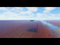</a>
<a href="nfts/pics/bitmap_689.png">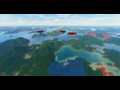</a>
<a href="nfts/pics/bitmap_688.png">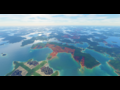</a>
<a href="nfts/pics/bitmap_687.png">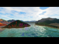</a>
<a href="nfts/pics/bitmap_686.png">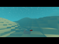</a>
<a href="nfts/pics/bitmap_685.png">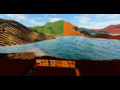</a>
<a href="nfts/pics/bitmap_684.png">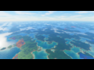</a>
<a href="nfts/pics/bitmap_683.png">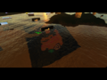</a>
<a href="nfts/pics/bitmap_682.png">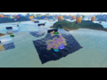</a>
<a href="nfts/pics/bitmap_681.png">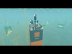</a>
<a href="nfts/pics/bitmap_680.png">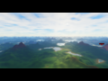</a>
<a href="nfts/pics/bitmap_679.png">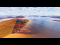</a>
<a href="nfts/pics/bitmap_678.png">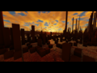</a>
<a href="nfts/pics/bitmap_677.png"></a>
<a href="nfts/pics/bitmap_676.png"></a>
<a href="nfts/pics/bitmap_675.png">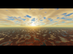</a>
<a href="nfts/pics/bitmap_674.png"></a>
<a href="nfts/pics/bitmap_673.png">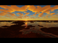</a>
<a href="nfts/pics/bitmap_672.png">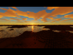</a>
<a href="nfts/pics/bitmap_671.png">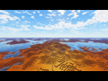</a>
<a href="nfts/pics/bitmap_670.png">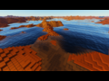</a>
<a href="nfts/pics/bitmap_669.png">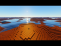</a>
<a href="nfts/pics/bitmap_668.png">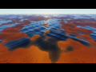</a>
<a href="nfts/pics/bitmap_667.png">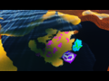</a>
<a href="nfts/pics/bitmap_666.png">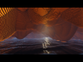</a>
<a href="nfts/pics/bitmap_665.png">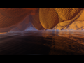</a>
<a href="nfts/pics/bitmap_664.png">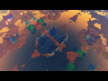</a>
<a href="nfts/pics/bitmap_663.png">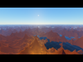</a>
<a href="nfts/pics/bitmap_662.png">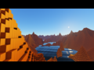</a>
<a href="nfts/pics/bitmap_661.png">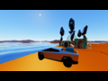</a>
<a href="nfts/pics/bitmap_660.png">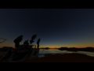</a>
<a href="nfts/pics/bitmap_659.png">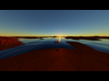</a>
<a href="nfts/pics/bitmap_658.png">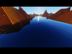</a>
<a href="nfts/pics/bitmap_657.png">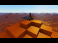</a>
<a href="nfts/pics/bitmap_656.png">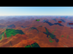</a>
<a href="nfts/pics/bitmap_655.png">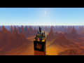</a>
<a href="nfts/pics/bitmap_654.png">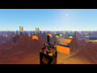</a>
<a href="nfts/pics/bitmap_653.png">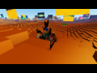</a>
<a href="nfts/pics/bitmap_652.png">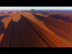</a>
<a href="nfts/pics/bitmap_651.png">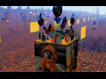</a>
<a href="nfts/pics/bitmap_650.png">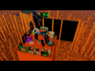</a>
<a href="nfts/pics/bitmap_649.png">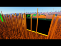</a>
<a href="nfts/pics/bitmap_648.png">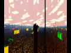</a>
<a href="nfts/pics/bitmap_647.png">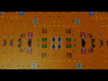</a>
<a href="nfts/pics/bitmap_646.png">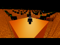</a>
<a href="nfts/pics/bitmap_645.png">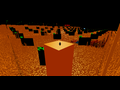</a>
<a href="nfts/pics/bitmap_644.png">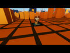</a>
<a href="nfts/pics/bitmap_643.png">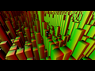</a>
<a href="nfts/pics/bitmap_642.png">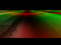</a>
<a href="nfts/pics/bitmap_641.png">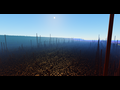</a>
<a href="nfts/pics/bitmap_640.png">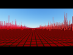</a>
<a href="nfts/pics/bitmap_639.png">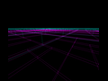</a>
<a href="nfts/pics/bitmap_638.png"></a>
<a href="nfts/pics/bitmap_637.png"></a>
<a href="nfts/pics/bitmap_636.png"></a>
<a href="nfts/pics/bitmap_635.png"></a>
<a href="nfts/pics/bitmap_634.png"></a>
<a href="nfts/pics/bitmap_633.png"></a>
<a href="nfts/pics/bitmap_632.png"></a>
<a href="nfts/pics/bitmap_631.png"></a>
<a href="nfts/pics/bitmap_630.png"></a>
<a href="nfts/pics/bitmap_629.png"></a>
<a href="nfts/pics/bitmap_628.png"></a>
<a href="nfts/pics/bitmap_627.png"></a>
<a href="nfts/pics/bitmap_626.png"></a>
<a href="nfts/pics/bitmap_625.png"></a>
<a href="nfts/pics/bitmap_624.png"></a>
<a href="nfts/pics/bitmap_623.png"></a>
<a href="nfts/pics/bitmap_622.png"></a>
<a href="nfts/pics/bitmap_621.png"></a>
<a href="nfts/pics/bitmap_620.png"></a>
<a href="nfts/pics/bitmap_619.png"></a>
<a href="nfts/pics/bitmap_618.png"></a>
<a href="nfts/pics/bitmap_617.png"></a>
<a href="nfts/pics/bitmap_616.png"></a>
<a href="nfts/pics/bitmap_615.png"></a>
<a href="nfts/pics/bitmap_614.png"></a>
<a href="nfts/pics/bitmap_613.png"></a>
<a href="nfts/pics/bitmap_612.png"></a>
<a href="nfts/pics/bitmap_611.png"></a>
<a href="nfts/pics/bitmap_610.png"></a>
<a href="nfts/pics/bitmap_609.png"></a>
<a href="nfts/pics/bitmap_608.png"></a>
<a href="nfts/pics/bitmap_607.png"></a>
<a href="nfts/pics/bitmap_606.png"></a>
<a href="nfts/pics/bitmap_605.png"></a>
<a href="nfts/pics/bitmap_604.png"></a>
<a href="nfts/pics/bitmap_603.png"></a>
<a href="nfts/pics/bitmap_602.png"></a>
<a href="nfts/pics/bitmap_601.png"></a>
<a href="nfts/pics/bitmap_600.png"></a>
<a href="nfts/pics/bitmap_599.png"></a>
<a href="nfts/pics/bitmap_598.png"></a>
<a href="nfts/pics/bitmap_597.png"></a>
<a href="nfts/pics/bitmap_596.png"></a>
<a href="nfts/pics/bitmap_595.png"></a>
<a href="nfts/pics/bitmap_594.png"></a>
<a href="nfts/pics/bitmap_593.png"></a>
<a href="nfts/pics/bitmap_592.png"></a>
<a href="nfts/pics/bitmap_591.png"></a>
<a href="nfts/pics/bitmap_590.png"></a>
<a href="nfts/pics/bitmap_589.png"></a>
<a href="nfts/pics/bitmap_588.png"></a>
<a href="nfts/pics/bitmap_587.png"></a>
<a href="nfts/pics/bitmap_586.png"></a>
<a href="nfts/pics/bitmap_585.png"></a>
<a href="nfts/pics/bitmap_584.png"></a>
<a href="nfts/pics/bitmap_583.png"></a>
<a href="nfts/pics/bitmap_582.png"></a>
<a href="nfts/pics/bitmap_581.png"></a>
<a href="nfts/pics/bitmap_580.png"></a>
<a href="nfts/pics/bitmap_579.png"></a>
<a href="nfts/pics/bitmap_578.png"></a>
<a href="nfts/pics/bitmap_577.png"></a>
<a href="nfts/pics/bitmap_576.png"></a>
<a href="nfts/pics/bitmap_575.png"></a>
<a href="nfts/pics/bitmap_574.png"></a>
<a href="nfts/pics/bitmap_573.png"></a>
<a href="nfts/pics/bitmap_572.png"></a>
<a href="nfts/pics/bitmap_571.png"></a>
<a href="nfts/pics/bitmap_570.png"></a>
<a href="nfts/pics/bitmap_569.png"></a>
<a href="nfts/pics/bitmap_568.png"></a>
<a href="nfts/pics/bitmap_567.png"></a>
<a href="nfts/pics/bitmap_566.png"></a>
<a href="nfts/pics/bitmap_565.png"></a>
<a href="nfts/pics/bitmap_564.png"></a>
<a href="nfts/pics/bitmap_563.png"></a>
<a href="nfts/pics/bitmap_562.png"></a>
<a href="nfts/pics/bitmap_561.png"></a>
<a href="nfts/pics/bitmap_560.png"></a>
<a href="nfts/pics/bitmap_559.png"></a>
<a href="nfts/pics/bitmap_558.png"></a>
<a href="nfts/pics/bitmap_557.png"></a>
<a href="nfts/pics/bitmap_556.png"></a>
<a href="nfts/pics/bitmap_555.png"></a>
<a href="nfts/pics/bitmap_554.png"></a>
<a href="nfts/pics/bitmap_553.png"></a>
<a href="nfts/pics/bitmap_552.png"></a>
<a href="nfts/pics/bitmap_551.png"></a>
<a href="nfts/pics/bitmap_550.png"></a>
<a href="nfts/pics/bitmap_549.png"></a>
<a href="nfts/pics/bitmap_548.png"></a>
<a href="nfts/pics/bitmap_547.png"></a>
<a href="nfts/pics/bitmap_546.png"></a>
<a href="nfts/pics/bitmap_545.png"></a>
<a href="nfts/pics/bitmap_544.png"></a>
<a href="nfts/pics/bitmap_543.png"></a>
<a href="nfts/pics/bitmap_542.png"></a>
<a href="nfts/pics/bitmap_541.png"></a>
<a href="nfts/pics/bitmap_540.png"></a>
<a href="nfts/pics/bitmap_539.png"></a>
<a href="nfts/pics/bitmap_538.png"></a>
<a href="nfts/pics/bitmap_537.png"></a>
<a href="nfts/pics/bitmap_536.png"></a>
<a href="nfts/pics/bitmap_535.png"></a>
<a href="nfts/pics/bitmap_534.png"></a>
<a href="nfts/pics/bitmap_533.png"></a>
<a href="nfts/pics/bitmap_532.png"></a>
<a href="nfts/pics/bitmap_531.png"></a>
<a href="nfts/pics/bitmap_530.png"></a>
<a href="nfts/pics/bitmap_529.png"></a>
<a href="nfts/pics/bitmap_528.png"></a>
<a href="nfts/pics/bitmap_527.png"></a>
<a href="nfts/pics/bitmap_526.png"></a>
<a href="nfts/pics/bitmap_525.png"></a>
<a href="nfts/pics/bitmap_524.png"></a>
<a href="nfts/pics/bitmap_523.png"></a>
<a href="nfts/pics/bitmap_522.png"></a>
<a href="nfts/pics/bitmap_521.png"></a>
<a href="nfts/pics/bitmap_520.png"></a>
<a href="nfts/pics/bitmap_519.png"></a>
<a href="nfts/pics/bitmap_518.png"></a>
<a href="nfts/pics/bitmap_517.png"></a>
<a href="nfts/pics/bitmap_516.png"></a>
<a href="nfts/pics/bitmap_515.png"></a>
<a href="nfts/pics/bitmap_514.png"></a>
<a href="nfts/pics/bitmap_513.png"></a>
<a href="nfts/pics/bitmap_512.png"></a>
<a href="nfts/pics/bitmap_511.png"></a>
<a href="nfts/pics/bitmap_510.png"></a>
<a href="nfts/pics/bitmap_509.png"></a>
<a href="nfts/pics/bitmap_508.png"></a>
<a href="nfts/pics/bitmap_507.png"></a>
<a href="nfts/pics/bitmap_506.png"></a>
<a href="nfts/pics/bitmap_505.png"></a>
<a href="nfts/pics/bitmap_504.png"></a>
<a href="nfts/pics/bitmap_503.png"></a>
<a href="nfts/pics/bitmap_502.png"></a>
<a href="nfts/pics/bitmap_501.png"></a>
<a href="nfts/pics/bitmap_500.png"></a>
<a href="nfts/pics/bitmap_499.png"></a>
<a href="nfts/pics/bitmap_498.png"></a>
<a href="nfts/pics/bitmap_497.png"></a>
<a href="nfts/pics/bitmap_496.png"></a>
<a href="nfts/pics/bitmap_495.png"></a>
<a href="nfts/pics/bitmap_494.png"></a>
<a href="nfts/pics/bitmap_493.png"></a>
<a href="nfts/pics/bitmap_492.png"></a>
<a href="nfts/pics/bitmap_491.png"></a>
<a href="nfts/pics/bitmap_490.png"></a>
<a href="nfts/pics/bitmap_489.png"></a>
<a href="nfts/pics/bitmap_488.png"></a>
<a href="nfts/pics/bitmap_487.png"></a>
<a href="nfts/pics/bitmap_486.png"></a>
<a href="nfts/pics/bitmap_485.png"></a>
<a href="nfts/pics/bitmap_484.png"></a>
<a href="nfts/pics/bitmap_483.png"></a>
<a href="nfts/pics/bitmap_482.png"></a>
<a href="nfts/pics/bitmap_481.png"></a>
<a href="nfts/pics/bitmap_480.png"></a>
<a href="nfts/pics/bitmap_479.png"></a>
<a href="nfts/pics/bitmap_478.png"></a>
<a href="nfts/pics/bitmap_477.png"></a>
<a href="nfts/pics/bitmap_476.png"></a>
<a href="nfts/pics/bitmap_475.png"></a>
<a href="nfts/pics/bitmap_474.png"></a>
<a href="nfts/pics/bitmap_473.png"></a>
<a href="nfts/pics/bitmap_472.png"></a>
<a href="nfts/pics/bitmap_471.png"></a>
<a href="nfts/pics/bitmap_470.png"></a>
<a href="nfts/pics/bitmap_469.png"></a>
<a href="nfts/pics/bitmap_468.png"></a>
<a href="nfts/pics/bitmap_467.png"></a>
<a href="nfts/pics/bitmap_466.png"></a>
<a href="nfts/pics/bitmap_465.png"></a>
<a href="nfts/pics/bitmap_464.png"></a>
<a href="nfts/pics/bitmap_463.png"></a>
<a href="nfts/pics/bitmap_462.png"></a>
<a href="nfts/pics/bitmap_461.png"></a>
<a href="nfts/pics/bitmap_460.png"></a>
<a href="nfts/pics/bitmap_459.png"></a>
<a href="nfts/pics/bitmap_458.png"></a>
<a href="nfts/pics/bitmap_457.png"></a>
<a href="nfts/pics/bitmap_456.png"></a>
<a href="nfts/pics/bitmap_455.png"></a>
<a href="nfts/pics/bitmap_454.png"></a>
<a href="nfts/pics/bitmap_453.png"></a>
<a href="nfts/pics/bitmap_452.png"></a>
<a href="nfts/pics/bitmap_451.png"></a>
<a href="nfts/pics/bitmap_450.png"></a>
<a href="nfts/pics/bitmap_449.png"></a>
<a href="nfts/pics/bitmap_448.png"></a>
<a href="nfts/pics/bitmap_447.png"></a>
<a href="nfts/pics/bitmap_446.png"></a>
<a href="nfts/pics/bitmap_445.png"></a>
<a href="nfts/pics/bitmap_444.png"></a>
<a href="nfts/pics/bitmap_443.png"></a>
<a href="nfts/pics/bitmap_442.png"></a>
<a href="nfts/pics/bitmap_441.png"></a>
<a href="nfts/pics/bitmap_440.png"></a>
<a href="nfts/pics/bitmap_439.png"></a>
<a href="nfts/pics/bitmap_438.png"></a>
<a href="nfts/pics/bitmap_437.png"></a>
<a href="nfts/pics/bitmap_436.png"></a>
<a href="nfts/pics/bitmap_435.png"></a>
<a href="nfts/pics/bitmap_434.png"></a>
<a href="nfts/pics/bitmap_433.png"></a>
<a href="nfts/pics/bitmap_432.png"></a>
<a href="nfts/pics/bitmap_431.png"></a>
<a href="nfts/pics/bitmap_430.png"></a>
<a href="nfts/pics/bitmap_429.png"></a>
<a href="nfts/pics/bitmap_428.png"></a>
<a href="nfts/pics/bitmap_427.png"></a>
<a href="nfts/pics/bitmap_426.png"></a>
<a href="nfts/pics/bitmap_425.png"></a>
<a href="nfts/pics/bitmap_424.png"></a>
<a href="nfts/pics/bitmap_423.png"></a>
<a href="nfts/pics/bitmap_422.png"></a>
<a href="nfts/pics/bitmap_421.png"></a>
<a href="nfts/pics/bitmap_420.png"></a>
<a href="nfts/pics/bitmap_419.png"></a>
<a href="nfts/pics/bitmap_418.png"></a>
<a href="nfts/pics/bitmap_417.png"></a>
<a href="nfts/pics/bitmap_416.png"></a>
<a href="nfts/pics/bitmap_415.png"></a>
<a href="nfts/pics/bitmap_414.png"></a>
<a href="nfts/pics/bitmap_413.png"></a>
<a href="nfts/pics/bitmap_412.png"></a>
<a href="nfts/pics/bitmap_411.png"></a>
<a href="nfts/pics/bitmap_410.png"></a>
<a href="nfts/pics/bitmap_409.png"></a>
<a href="nfts/pics/bitmap_408.png"></a>
<a href="nfts/pics/bitmap_407.png"></a>
<a href="nfts/pics/bitmap_406.png"></a>
<a href="nfts/pics/bitmap_405.png"></a>
<a href="nfts/pics/bitmap_404.png"></a>
<a href="nfts/pics/bitmap_403.png"></a>
<a href="nfts/pics/bitmap_402.png"></a>
<a href="nfts/pics/bitmap_401.png"></a>
<a href="nfts/pics/bitmap_400.png"></a>
<a href="nfts/pics/bitmap_399.png"></a>
<a href="nfts/pics/bitmap_398.png"></a>
<a href="nfts/pics/bitmap_397.png"></a>
<a href="nfts/pics/bitmap_396.png"></a>
<a href="nfts/pics/bitmap_395.png"></a>
<a href="nfts/pics/bitmap_394.png"></a>
<a href="nfts/pics/bitmap_393.png"></a>
<a href="nfts/pics/bitmap_392.png"></a>
<a href="nfts/pics/bitmap_391.png"></a>
<a href="nfts/pics/bitmap_390.png"></a>
<a href="nfts/pics/bitmap_389.png"></a>
<a href="nfts/pics/bitmap_388.png"></a>
<a href="nfts/pics/bitmap_387.png"></a>
<a href="nfts/pics/bitmap_386.png"></a>
<a href="nfts/pics/bitmap_385.png"></a>
<a href="nfts/pics/bitmap_384.png"></a>
<a href="nfts/pics/bitmap_383.png"></a>
<a href="nfts/pics/bitmap_382.png"></a>
<a href="nfts/pics/bitmap_381.png"></a>
<a href="nfts/pics/bitmap_380.png"></a>
<a href="nfts/pics/bitmap_379.png"></a>
<a href="nfts/pics/bitmap_378.png"></a>
<a href="nfts/pics/bitmap_377.png"></a>
<a href="nfts/pics/bitmap_376.png"></a>
<a href="nfts/pics/bitmap_375.png"></a>
<a href="nfts/pics/bitmap_374.png"></a>
<a href="nfts/pics/bitmap_373.png"></a>
<a href="nfts/pics/bitmap_372.png"></a>
<a href="nfts/pics/bitmap_371.png"></a>
<a href="nfts/pics/bitmap_370.png"></a>
<a href="nfts/pics/bitmap_369.png"></a>
<a href="nfts/pics/bitmap_368.png"></a>
<a href="nfts/pics/bitmap_367.png"></a>
<a href="nfts/pics/bitmap_366.png"></a>
<a href="nfts/pics/bitmap_365.png"></a>
<a href="nfts/pics/bitmap_364.png"></a>
<a href="nfts/pics/bitmap_363.png"></a>
<a href="nfts/pics/bitmap_362.png"></a>
<a href="nfts/pics/bitmap_361.png"></a>
<a href="nfts/pics/bitmap_360.png"></a>
<a href="nfts/pics/bitmap_359.png"></a>
<a href="nfts/pics/bitmap_358.png"></a>
<a href="nfts/pics/bitmap_357.png"></a>
<a href="nfts/pics/bitmap_356.png"></a>
<a href="nfts/pics/bitmap_355.png"></a>
<a href="nfts/pics/bitmap_354.png"></a>
<a href="nfts/pics/bitmap_353.png"></a>
<a href="nfts/pics/bitmap_352.png"></a>
<a href="nfts/pics/bitmap_351.png"></a>
<a href="nfts/pics/bitmap_350.png"></a>
<a href="nfts/pics/bitmap_349.png"></a>
<a href="nfts/pics/bitmap_348.png"></a>
<a href="nfts/pics/bitmap_347.png"></a>
<a href="nfts/pics/bitmap_346.png"></a>
<a href="nfts/pics/bitmap_345.png"></a>
<a href="nfts/pics/bitmap_344.png"></a>
<a href="nfts/pics/bitmap_343.png"></a>
<a href="nfts/pics/bitmap_342.png"></a>
<a href="nfts/pics/bitmap_341.png"></a>
<a href="nfts/pics/bitmap_340.png"></a>
<a href="nfts/pics/bitmap_339.png"></a>
<a href="nfts/pics/bitmap_338.png"></a>
<a href="nfts/pics/bitmap_337.png"></a>
<a href="nfts/pics/bitmap_336.png"></a>
<a href="nfts/pics/bitmap_335.png"></a>
<a href="nfts/pics/bitmap_334.png"></a>
<a href="nfts/pics/bitmap_333.png"></a>
<a href="nfts/pics/bitmap_332.png"></a>
<a href="nfts/pics/bitmap_331.png"></a>
<a href="nfts/pics/bitmap_330.png"></a>
<a href="nfts/pics/bitmap_329.png"></a>
<a href="nfts/pics/bitmap_328.png"></a>
<a href="nfts/pics/bitmap_327.png"></a>
<a href="nfts/pics/bitmap_326.png"></a>
<a href="nfts/pics/bitmap_325.png"></a>
<a href="nfts/pics/bitmap_324.png"></a>
<a href="nfts/pics/bitmap_323.png"></a>
<a href="nfts/pics/bitmap_322.png"></a>
<a href="nfts/pics/bitmap_321.png"></a>
<a href="nfts/pics/bitmap_320.png"></a>
<a href="nfts/pics/bitmap_319.png"></a>
<a href="nfts/pics/bitmap_318.png"></a>
<a href="nfts/pics/bitmap_317.png"></a>
<a href="nfts/pics/bitmap_316.png"></a>
<a href="nfts/pics/bitmap_315.png"></a>
<a href="nfts/pics/bitmap_314.png"></a>
<a href="nfts/pics/bitmap_313.png"></a>
<a href="nfts/pics/bitmap_312.png"></a>
<a href="nfts/pics/bitmap_311.png"></a>
<a href="nfts/pics/bitmap_310.png"></a>
<a href="nfts/pics/bitmap_309.png"></a>
<a href="nfts/pics/bitmap_308.png"></a>
<a href="nfts/pics/bitmap_307.png"></a>
<a href="nfts/pics/bitmap_306.png"></a>
<a href="nfts/pics/bitmap_305.png"></a>
<a href="nfts/pics/bitmap_304.png"></a>
<a href="nfts/pics/bitmap_303.png"></a>
<a href="nfts/pics/bitmap_302.png"></a>
<a href="nfts/pics/bitmap_301.png"></a>
<a href="nfts/pics/bitmap_300.png"></a>
<a href="nfts/pics/bitmap_299.png"></a>
<a href="nfts/pics/bitmap_298.png"></a>
<a href="nfts/pics/bitmap_297.png"></a>
<a href="nfts/pics/bitmap_296.png"></a>
<a href="nfts/pics/bitmap_295.png"></a>
<a href="nfts/pics/bitmap_294.png"></a>
<a href="nfts/pics/bitmap_293.png"></a>
<a href="nfts/pics/bitmap_292.png"></a>
<a href="nfts/pics/bitmap_291.png"></a>
<a href="nfts/pics/bitmap_290.png"></a>
<a href="nfts/pics/bitmap_289.png"></a>
<a href="nfts/pics/bitmap_288.png"></a>
<a href="nfts/pics/bitmap_287.png"></a>
<a href="nfts/pics/bitmap_286.png"></a>
<a href="nfts/pics/bitmap_285.png"></a>
<a href="nfts/pics/bitmap_284.png"></a>
<a href="nfts/pics/bitmap_283.png"></a>
<a href="nfts/pics/bitmap_282.png"></a>
<a href="nfts/pics/bitmap_281.png"></a>
<a href="nfts/pics/bitmap_280.png"></a>
<a href="nfts/pics/bitmap_279.png"></a>
<a href="nfts/pics/bitmap_278.png"></a>
<a href="nfts/pics/bitmap_277.png"></a>
<a href="nfts/pics/bitmap_276.png"></a>
<a href="nfts/pics/bitmap_275.png"></a>
<a href="nfts/pics/bitmap_274.png"></a>
<a href="nfts/pics/bitmap_273.png"></a>
<a href="nfts/pics/bitmap_272.png"></a>
<a href="nfts/pics/bitmap_271.png"></a>
<a href="nfts/pics/bitmap_270.png"></a>
<a href="nfts/pics/bitmap_269.png"></a>
<a href="nfts/pics/bitmap_268.png"></a>
<a href="nfts/pics/bitmap_267.png"></a>
<a href="nfts/pics/bitmap_266.png"></a>
<a href="nfts/pics/bitmap_265.png"></a>
<a href="nfts/pics/bitmap_264.png"></a>
<a href="nfts/pics/bitmap_263.png"></a>
<a href="nfts/pics/bitmap_262.png"></a>
<a href="nfts/pics/bitmap_261.png"></a>
<a href="nfts/pics/bitmap_260.png"></a>
<a href="nfts/pics/bitmap_259.png"></a>
<a href="nfts/pics/bitmap_258.png"></a>
<a href="nfts/pics/bitmap_257.png"></a>
<a href="nfts/pics/bitmap_256.png"></a>
<a href="nfts/pics/bitmap_255.png"></a>
<a href="nfts/pics/bitmap_254.png"></a>
<a href="nfts/pics/bitmap_253.png"></a>
<a href="nfts/pics/bitmap_252.png"></a>
<a href="nfts/pics/bitmap_251.png"></a>
<a href="nfts/pics/bitmap_250.png"></a>
<a href="nfts/pics/bitmap_249.png"></a>
<a href="nfts/pics/bitmap_248.png"></a>
<a href="nfts/pics/bitmap_247.png"></a>
<a href="nfts/pics/bitmap_246.png"></a>
<a href="nfts/pics/bitmap_245.png"></a>
<a href="nfts/pics/bitmap_244.png"></a>
<a href="nfts/pics/bitmap_243.png"></a>
<a href="nfts/pics/bitmap_242.png"></a>
<a href="nfts/pics/bitmap_241.png"></a>
<a href="nfts/pics/bitmap_240.png"></a>
<a href="nfts/pics/bitmap_239.png"></a>
<a href="nfts/pics/bitmap_238.png"></a>
<a href="nfts/pics/bitmap_237.png"></a>
<a href="nfts/pics/bitmap_236.png"></a>
<a href="nfts/pics/bitmap_235.png"></a>
<a href="nfts/pics/bitmap_234.png"></a>
<a href="nfts/pics/bitmap_233.png"></a>
<a href="nfts/pics/bitmap_232.png"></a>
<a href="nfts/pics/bitmap_231.png"></a>
<a href="nfts/pics/bitmap_230.png"></a>
<a href="nfts/pics/bitmap_229.png"></a>
<a href="nfts/pics/bitmap_228.png"></a>
<a href="nfts/pics/bitmap_227.png"></a>
<a href="nfts/pics/bitmap_226.png"></a>
<a href="nfts/pics/bitmap_225.png"></a>
<a href="nfts/pics/bitmap_224.png"></a>
<a href="nfts/pics/bitmap_223.png"></a>
<a href="nfts/pics/bitmap_222.png"></a>
<a href="nfts/pics/bitmap_221.png"></a>
<a href="nfts/pics/bitmap_220.png"></a>
<a href="nfts/pics/bitmap_219.png"></a>
<a href="nfts/pics/bitmap_218.png"></a>
<a href="nfts/pics/bitmap_217.png"></a>
<a href="nfts/pics/bitmap_216.png"></a>
<a href="nfts/pics/bitmap_215.png"></a>
<a href="nfts/pics/bitmap_214.png"></a>
<a href="nfts/pics/bitmap_213.png"></a>
<a href="nfts/pics/bitmap_212.png"></a>
<a href="nfts/pics/bitmap_211.png"></a>
<a href="nfts/pics/bitmap_210.png"></a>
<a href="nfts/pics/bitmap_209.png"></a>
<a href="nfts/pics/bitmap_208.png"></a>
<a href="nfts/pics/bitmap_207.png"></a>
<a href="nfts/pics/bitmap_206.png"></a>
<a href="nfts/pics/bitmap_205.png"></a>
<a href="nfts/pics/bitmap_204.png"></a>
<a href="nfts/pics/bitmap_203.png"></a>
<a href="nfts/pics/bitmap_202.png"></a>
<a href="nfts/pics/bitmap_201.png"></a>
<a href="nfts/pics/bitmap_200.png"></a>
<a href="nfts/pics/bitmap_199.png"></a>
<a href="nfts/pics/bitmap_198.png"></a>
<a href="nfts/pics/bitmap_197.png"></a>
<a href="nfts/pics/bitmap_196.png"></a>
<a href="nfts/pics/bitmap_195.png"></a>
<a href="nfts/pics/bitmap_194.png"></a>
<a href="nfts/pics/bitmap_193.png"></a>
<a href="nfts/pics/bitmap_192.png"></a>
<a href="nfts/pics/bitmap_191.png"></a>
<a href="nfts/pics/bitmap_190.png"></a>
<a href="nfts/pics/bitmap_189.png"></a>
<a href="nfts/pics/bitmap_188.png"></a>
<a href="nfts/pics/bitmap_187.png"></a>
<a href="nfts/pics/bitmap_186.png"></a>
<a href="nfts/pics/bitmap_185.png"></a>
<a href="nfts/pics/bitmap_184.png"></a>
<a href="nfts/pics/bitmap_183.png"></a>
<a href="nfts/pics/bitmap_182.png"></a>
<a href="nfts/pics/bitmap_181.png"></a>
<a href="nfts/pics/bitmap_180.png"></a>
<a href="nfts/pics/bitmap_179.png"></a>
<a href="nfts/pics/bitmap_178.png"></a>
<a href="nfts/pics/bitmap_177.png"></a>
<a href="nfts/pics/bitmap_176.png"></a>
<a href="nfts/pics/bitmap_175.png"></a>
<a href="nfts/pics/bitmap_174.png"></a>
<a href="nfts/pics/bitmap_173.png"></a>
<a href="nfts/pics/bitmap_172.png"></a>
<a href="nfts/pics/bitmap_171.png"></a>
<a href="nfts/pics/bitmap_170.png"></a>
<a href="nfts/pics/bitmap_169.png"></a>
<a href="nfts/pics/bitmap_168.png"></a>
<a href="nfts/pics/bitmap_167.png"></a>
<a href="nfts/pics/bitmap_166.png"></a>
<a href="nfts/pics/bitmap_165.png"></a>
<a href="nfts/pics/bitmap_164.png"></a>
<a href="nfts/pics/bitmap_163.png"></a>
<a href="nfts/pics/bitmap_162.png"></a>
<a href="nfts/pics/bitmap_161.png"></a>
<a href="nfts/pics/bitmap_160.png"></a>
<a href="nfts/pics/bitmap_159.png"></a>
<a href="nfts/pics/bitmap_158.png"></a>
<a href="nfts/pics/bitmap_157.png"></a>
<a href="nfts/pics/bitmap_156.png"></a>
<a href="nfts/pics/bitmap_155.png"></a>
<a href="nfts/pics/bitmap_154.png"></a>
<a href="nfts/pics/bitmap_153.png"></a>
<a href="nfts/pics/bitmap_152.png"></a>
<a href="nfts/pics/bitmap_151.png"></a>
<a href="nfts/pics/bitmap_150.png"></a>
<a href="nfts/pics/bitmap_149.png"></a>
<a href="nfts/pics/bitmap_148.png"></a>
<a href="nfts/pics/bitmap_147.png"></a>
<a href="nfts/pics/bitmap_146.png"></a>
<a href="nfts/pics/bitmap_145.png"></a>
<a href="nfts/pics/bitmap_144.png"></a>
<a href="nfts/pics/bitmap_143.png"></a>
<a href="nfts/pics/bitmap_142.png"></a>
<a href="nfts/pics/bitmap_141.png"></a>
<a href="nfts/pics/bitmap_140.png"></a>
<a href="nfts/pics/bitmap_139.png"></a>
<a href="nfts/pics/bitmap_138.png"></a>
<a href="nfts/pics/bitmap_137.png"></a>
<a href="nfts/pics/bitmap_136.png"></a>
<a href="nfts/pics/bitmap_135.png"></a>
<a href="nfts/pics/bitmap_134.png"></a>
<a href="nfts/pics/bitmap_133.png"></a>
<a href="nfts/pics/bitmap_132.png"></a>
<a href="nfts/pics/bitmap_131.png"></a>
<a href="nfts/pics/bitmap_130.png"></a>
<a href="nfts/pics/bitmap_129.png"></a>
<a href="nfts/pics/bitmap_128.png"></a>
<a href="nfts/pics/bitmap_127.png"></a>
<a href="nfts/pics/bitmap_126.png"></a>
<a href="nfts/pics/bitmap_125.png"></a>
<a href="nfts/pics/bitmap_124.png"></a>
<a href="nfts/pics/bitmap_123.png"></a>
<a href="nfts/pics/bitmap_122.png"></a>
<a href="nfts/pics/bitmap_121.png"></a>
<a href="nfts/pics/bitmap_120.png"></a>
<a href="nfts/pics/bitmap_119.png"></a>
<a href="nfts/pics/bitmap_118.png"></a>
<a href="nfts/pics/bitmap_117.png"></a>
<a href="nfts/pics/bitmap_116.png"></a>
<a href="nfts/pics/bitmap_115.png"></a>
<a href="nfts/pics/bitmap_114.png"></a>
<a href="nfts/pics/bitmap_113.png"></a>
<a href="nfts/pics/bitmap_112.png"></a>
<a href="nfts/pics/bitmap_111.png"></a>
<a href="nfts/pics/bitmap_110.png"></a>
<a href="nfts/pics/bitmap_109.png"></a>
<a href="nfts/pics/bitmap_108.png"></a>
<a href="nfts/pics/bitmap_107.png"></a>
<a href="nfts/pics/bitmap_106.png"></a>
<a href="nfts/pics/bitmap_105.png"></a>
<a href="nfts/pics/bitmap_104.png"></a>
<a href="nfts/pics/bitmap_103.png"></a>
<a href="nfts/pics/bitmap_102.png"></a>
<a href="nfts/pics/bitmap_101.png"></a>
<a href="nfts/pics/bitmap_100.png"></a>
<a href="nfts/pics/bitmap_099.png"></a>
<a href="nfts/pics/bitmap_098.png"></a>
<a href="nfts/pics/bitmap_097.png"></a>
<a href="nfts/pics/bitmap_096.png"></a>
<a href="nfts/pics/bitmap_095.png"></a>
<a href="nfts/pics/bitmap_094.png"></a>
<a href="nfts/pics/bitmap_093.png"></a>
<a href="nfts/pics/bitmap_092.png"></a>
<a href="nfts/pics/bitmap_091.png"></a>
<a href="nfts/pics/bitmap_090.png"></a>
<a href="nfts/pics/bitmap_089.png"></a>
<a href="nfts/pics/bitmap_088.png"></a>
<a href="nfts/pics/bitmap_087.png"></a>
<a href="nfts/pics/bitmap_086.png"></a>
<a href="nfts/pics/bitmap_085.png"></a>
<a href="nfts/pics/bitmap_084.png"></a>
<a href="nfts/pics/bitmap_083.png"></a>
<a href="nfts/pics/bitmap_082.png"></a>
<a href="nfts/pics/bitmap_081.png"></a>
<a href="nfts/pics/bitmap_080.png"></a>
<a href="nfts/pics/bitmap_079.png"></a>
<a href="nfts/pics/bitmap_078.png"></a>
<a href="nfts/pics/bitmap_077.png"></a>
<a href="nfts/pics/bitmap_076.png"></a>
<a href="nfts/pics/bitmap_075.png"></a>
<a href="nfts/pics/bitmap_074.png"></a>
<a href="nfts/pics/bitmap_073.png"></a>
<a href="nfts/pics/bitmap_072.png"></a>
<a href="nfts/pics/bitmap_071.png"></a>
<a href="nfts/pics/bitmap_070.png"></a>
<a href="nfts/pics/bitmap_069.png"></a>
<a href="nfts/pics/bitmap_068.png"></a>
<a href="nfts/pics/bitmap_067.png"></a>
<a href="nfts/pics/bitmap_066.png"></a>
<a href="nfts/pics/bitmap_065.png"></a>
<a href="nfts/pics/bitmap_064.png"></a>
<a href="nfts/pics/bitmap_063.png"></a>
<a href="nfts/pics/bitmap_062.png"></a>
<a href="nfts/pics/bitmap_061.png"></a>
<a href="nfts/pics/bitmap_060.png"></a>
<a href="nfts/pics/bitmap_059.png"></a>
<a href="nfts/pics/bitmap_058.png"></a>
<a href="nfts/pics/bitmap_057.png"></a>
<a href="nfts/pics/bitmap_056.png"></a>
<a href="nfts/pics/bitmap_055.png"></a>
<a href="nfts/pics/bitmap_054.png"></a>
<a href="nfts/pics/bitmap_053.png"></a>
<a href="nfts/pics/bitmap_052.png"></a>
<a href="nfts/pics/bitmap_051.png"></a>
<a href="nfts/pics/bitmap_050.png"></a>
<a href="nfts/pics/bitmap_049.png"></a>
<a href="nfts/pics/bitmap_048.png"></a>
<a href="nfts/pics/bitmap_047.png"></a>
<a href="nfts/pics/bitmap_046.png"></a>
<a href="nfts/pics/bitmap_045.png"></a>
<a href="nfts/pics/bitmap_044.png"></a>
<a href="nfts/pics/bitmap_043.png"></a>
<a href="nfts/pics/bitmap_042.png"></a>
<a href="nfts/pics/bitmap_041.png"></a>
<a href="nfts/pics/bitmap_040.png"></a>
<a href="nfts/pics/bitmap_039.png"></a>
<a href="nfts/pics/bitmap_038.png"></a>
<a href="nfts/pics/bitmap_037.png"></a>
<a href="nfts/pics/bitmap_036.png"></a>
<a href="nfts/pics/bitmap_035.png"></a>
<a href="nfts/pics/bitmap_034.png"></a>
<a href="nfts/pics/bitmap_033.png"></a>
<a href="nfts/pics/bitmap_032.png"></a>
<a href="nfts/pics/bitmap_031.png"></a>
<a href="nfts/pics/bitmap_030.png"></a>
<a href="nfts/pics/bitmap_029.png"></a>
<a href="nfts/pics/bitmap_028.png"></a>
<a href="nfts/pics/bitmap_027.png"></a>
<a href="nfts/pics/bitmap_026.png"></a>
<a href="nfts/pics/bitmap_025.png"></a>
<a href="nfts/pics/bitmap_024.png"></a>
<a href="nfts/pics/bitmap_023.png"></a>
<a href="nfts/pics/bitmap_022.png"></a>
<a href="nfts/pics/bitmap_021.png"></a>
<a href="nfts/pics/bitmap_020.png"></a>
<a href="nfts/pics/bitmap_019.png"></a>
<a href="nfts/pics/bitmap_018.png"></a>
<a href="nfts/pics/bitmap_017.png"></a>
<a href="nfts/pics/bitmap_016.png"></a>
<a href="nfts/pics/bitmap_015.png"></a>
<a href="nfts/pics/bitmap_014.png"></a>
<a href="nfts/pics/bitmap_013.png"></a>
<a href="nfts/pics/bitmap_012.png"></a>
<a href="nfts/pics/bitmap_011.png"></a>
<a href="nfts/pics/bitmap_010.png"></a>
<a href="nfts/pics/bitmap_009.png"></a>
<a href="nfts/pics/bitmap_008.png"></a>
<a href="nfts/pics/bitmap_007.png"></a>
<a href="nfts/pics/bitmap_006.png"></a>
<a href="nfts/pics/bitmap_005.png"></a>
<a href="nfts/pics/bitmap_004.png"></a>
<a href="nfts/pics/bitmap_003.png"></a>
<a href="nfts/pics/bitmap_002.png"></a>
<a href="nfts/pics/bitmap_001.png"></a>
<a href="nfts/pics/bitmap_000.png"></a>
</div>

---

## $\color{red}{\textsf{DISCLAIMER}}$

- BitmapSunset is provided **"AS IS"** and **"AS AVAILABLE"** without warranties, guarantees, or support of any kind.

- You acknowledge and accept all risks associated with using blockchain-based applications, including financial losses.

- You are solely responsible for securing your private keys, Bitcoin, and other digital assets.

- We are not liable for any damages, losses, or security breaches resulting from the use of this application.

- BitmapSunset inscriptions are not investments and carry no expectation of financial return.

- BitmapSunset inscriptions are dynamic, customizable art. The interactive behaviours associated with specific inscription numbers (billboard position, bootstrap loading, mosaic stamps) are properties of the current renderer and may change, be reduced, or be removed at any time without notice.

- Any roadmap, "future", or "planned" language anywhere in this document or in related materials is aspirational. No future feature is promised, guaranteed, or sold.

- BitmapSunset is not a common enterprise. Each inscription is acquired and held independently. There is no pooled treasury, no revenue share, no royalty arrangement, no governance right, and no ongoing service obligation associated with ownership.

- The value of an inscription, if any, derives from its character as art (a chronological development screenshot forming part of a historical timelapse, with dynamic and customizable behaviour in the renderer) and from its position on the Bitcoin blockchain. It does not derive from any promise or expectation of work to be performed by the developer.

- While inscriptions are permanently stored on the Bitcoin blockchain, access to them depends on ordinals content servers and infrastructure outside the creators' control.

- All inscriptions are permanent and irreversible; once data is inscribed, it cannot be modified or deleted.

- It is your responsibility to comply with any applicable laws and regulations in your jurisdiction.

- By using BitmapSunset, you confirm that you understand and accept these terms.
