# BitmapSunset - VibeDoc 0.0.14

**App version:** v0.0.14

**Script version:** BSS 0 0 14

**Source:** github.com/BitmapSunset/bitmap_sunset

## Table of Contents

1. [What is BitmapSunset?](#1-what-is-bitmapsunset)

2. [Prerequisites](#2-prerequisites)

3. [Navigation & Controls](#3-navigation--controls)

4. [The Interface](#4-the-interface)

5. [Using the Visual Editor](#5-using-the-visual-editor)

6. [Script Language Basics](#6-script-language-basics)

7. [Displaying Images (Quads)](#7-displaying-images-quads)

8. [Displaying 3D Models](#8-displaying-3d-models)

9. [Primitive Shapes](#9-primitive-shapes)

10. [Billboard & Mosaic](#10-billboard--mosaic)

11. [Block War](#11-block-war)

12. [Referencing Other Scripts & Bitmaps](#12-referencing-other-scripts--bitmaps)

13. [Exporting & Inscribing to a Bitmap](#13-exporting--inscribing-to-a-bitmap)

14. [Bootstrapping](#14-bootstrapping)

15. [Updating Scripts](#15-updating-scripts)

16. [Scale Reference](#16-scale-reference)

17. [Security & Safety](#17-security--safety)

18. [Troubleshooting](#18-troubleshooting)

19. [Quick Reference Card](#19-quick-reference-card)

---

## 1. What is BitmapSunset?

BitmapSunset is a 3D metaverse application built on Bitcoin Ordinals, the protocol created by [@rodarmor](https://x.com/rodarmor). The application itself is a Bitcoin inscription: the rendering engine, script compiler, virtual machine, and user interface are all inscribed on the Bitcoin blockchain. It visualizes the entire Bitcoin blockchain as a landscape of bitmap blocks (one per mined block, extending automatically as new blocks are added) laid out in a navigable 3D world.

As a builder, you can inscribe scripts onto your bitmaps that place 3D models, images, shapes, and more into the world. Anyone running the app can fly around and see what you've built. Everything lives permanently onchain as Bitcoin inscriptions.

**Key concepts:**

- A **bitmap** is a Bitcoin block claimed as an ordinal, based on the bitmap protocol created by [@blockamoto](https://x.com/blockamoto). Each one corresponds to a tile in the 3D world.

- A **BitmapSunset** (numbered 0 and up, 644 as of v0.0.14) is a special ordinal from the BitmapSunset collection. Each BitmapSunset is a development screenshot captured during the building process, so new items are added at the pace of ongoing development. There are three tiers:

  - **OG sunsets (0–99):** The original collection pieces. Each is mapped to a billboard slot in the central root cell (mirror 0/1, one billboard per 100×100 bitmap patch); their child scripts contribute to the bootstrap queue.

  - **Outer sunsets (100+):** Each successive 100-inscription tier sits on the next outward mirror ring (100–199 on ring 2, 200–299 on ring 3, 300–399 on ring 4, and so on). Their child scripts also contribute to the bootstrap queue.

- **Mosaic placement:** The `mosaic` command stamps images flat on the ground plane at map-space positions corresponding to bitmap numbers.

- A **script** is a plain text file (compiled to a `.bmp` image) that tells the app what to display on your bitmap.

---

## 2. Prerequisites

**To explore:** Nothing at all. Anyone can launch the app and look around the world.

**To build locally:** Nothing. You can write scripts and preview your creations without owning anything.

**To build onchain (inscribe your world):** You need to own a bitmap. Any bitmap lets you inscribe a script as a child inscription, making your build permanent and visible to everyone. Only the bitmap owner can inscribe children on their own bitmap; property rights are enforced at the protocol level by the Ordinals parent-child mechanism.

**To get bootstrapped (priority loading):** You need an OG BitmapSunset (0–99) for the highest-priority slot, but as of v0.0.14 the loader also walks outer sunsets (100+) in a second priority phase, so any sunset script's `bitmaps` commands now contribute to startup loading. A hardcoded seed list of bitmaps also loads alongside sunset-discovered bitmaps.

**Recommended browser:** Chrome or Brave with **hardware acceleration enabled** in your browser settings. Firefox works but performance may be lower.

**App link:** Use the most current link from the @BitmapSunset X (Twitter) bio. Once the app loads, verify the version: the browser tab title reads `BitmapSunset 0 0 14` and the script editor's console header reads `Bitmap Sunset 0 0 14`.

---

## 3. Navigation & Controls

BitmapSunset offers multiple camera modes. The default **free-flight camera** lets you navigate at any altitude, from ground level to a bird's-eye view of the entire blockchain landscape. A **third-person (TPS) camera** mode lets you walk on bitmaps as a character with physics-based movement.

### Desktop controls

**Movement and camera:**

| Input | Action |
|---|---|
| **WASD / Arrow keys** | Move the camera (or character in TPS) |
| **Left-click + drag** | Look around / orbit |
| **Space** | Thrust upward (TPS jetpack) |
| **Scroll wheel** | Movement speed (free camera) / player size (TPS) |
| **Shift + scroll wheel** | Camera distance (TPS only) |

**Keyboard shortcuts:**

| Key | Action |
|---|---|
| **E** | Toggle Free / TPS camera |
| **V** | Toggle orbit mode |
| **G** | Open or close the script editor |
| **T** | Open the Teleport window |
| **`** (backquote) | Teleport to the current edit bitmap (the bitmap targeted by `block <N>` in the active script tab) |
| **R** | Open settings |
| **H** | Open help |
| **B** | Open debug window (shows debug controls including a No VSync toggle; lives as an extra icon in the settings window header) |
| **Z** | Open the Terrain panel (world base style + Perlin sliders + city / land / flat mode buttons in the panel header) |
| **X** | Open the Sky panel (Sun, Clouds, Atmosphere sliders) |
| **1** | Sky time: sunrise (6h). Same as the **sunrise** preset icon in the Sky panel header |
| **2** | Sky time: noon (12h). Same as the **noon** preset icon in the Sky panel header |
| **3** | Sky time: sunset (18h). Same as the **sunset** preset icon in the Sky panel header |
| **C** | Open the Water panel |
| **F** | Toggle fullscreen |
| **Escape** | Cancel active gizmo drag (reverts transforms) / blur focused input |

**Edit-mode bitmap interactions** (active only when the script editor is open):

- **Shift + left-click and drag**: paint blocks with the selected color.
- **Ctrl + left-click and drag**: erase blocks.
- **Double-click a bitmap**: fetch its onchain script and open it in a new editor tab.

The script updates dynamically as you paint. You can also edit the text manually; errors surface in the console.

### Mobile controls

On touch devices, secondary windows (settings, scripts, help) auto-maximize on first open, and a conservative quality tier (**Rare** for most rendering sliders, with Resolution kept at Legendary for 1:1 pixels) is applied by default.

- **On-screen joystick** (drag on the left half of the viewport): equivalent to WASD.
- **One-finger drag** (right half): look around.
- **Two consecutive two-finger taps** (second two-finger touch within 500 ms of the first): toggle orbit mode (same as **V** on desktop).
- **Double-tap** (within 300 ms, less than 30 px of motion): toggle Free / TPS camera (same as **E** on desktop).
- **Pinch**: adjust zoom / movement speed.

To fetch and open an onchain script on mobile, use the Teleport window or type a bitmap number into the `#` input next to the **+** button on the tab bar (see §4 "Scripts Panel"). The mouse-only double-click-to-fetch gesture has no touch equivalent in v0.0.14.

Script editing is available but relies on the on-screen keyboard. Bitmap painting (Shift/Ctrl modifiers) is desktop-only in v0.0.14; mobile authoring is geared toward exploration, script loading, and tab editing.

### Speed behavior

Camera speed adapts to context:

- **Editor open**: slow, tuned for precision placement.
- **Editor closed**: fast, tuned for exploration.

Toggle the **script** button (or press **G**) to switch between the two.

### Third-person camera (TPS)

Press **E** to toggle between free-flight and TPS mode. In TPS, a 3D character model is placed on the nearest bitmap and the camera follows it from behind with mouse yaw/pitch and adjustable distance.

TPS mode includes full physics simulation:

- **Gravity** pulls the character downward toward the bitmap surface.
- **Collision** against bitmap blocks. The character slides along walls rather than stopping and automatically steps up small elevation changes.
- **Thrust** (Space) adds vertical acceleration, allowing the character to fly above the terrain temporarily.
- **Animation** transitions automatically between idle, walk, fall, and thrust states with smooth crossfading between skeletal animations.

Movement speed scales with camera distance; zooming closer increases acceleration and max velocity for precise ground-level navigation.

### Orbit camera

Press **V** or open the script editor to rotate the camera around the bitmap you're editing. Use the **mouse wheel** (or pinch on mobile) to control the orbit radius. A smooth AUTO transition synchronizes the camera when entering or exiting orbit mode.

---

## 4. The Interface

When BitmapSunset loads, you see a 3D viewport with the bitmap landscape and a toolbar across the top of the screen. Here is what every element does.

### Top Toolbar

The toolbar runs along the top edge of the app window. From left to right:

<div align="center">
<a href="pics/main_toolbar_callouts.png">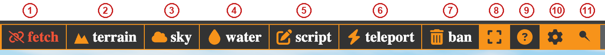</a>
</div>

| # | Button | What it does |
|---|---|---|
| **1** | **fetch** | Toggles blockchain data fetching on/off. When active (green online icon), the app downloads bitmap scripts from the blockchain. When off (red offline icon), no new data is loaded. You must click this once to start seeing onchain builds; the on/off state is persisted to localStorage so subsequent sessions remember your choice. |
| **2** | **terrain** | Opens the **Terrain** panel (shortcut: **Z**). The panel header carries three world-style buttons (`city` / `land` / `flat`); the body holds, top to bottom: Base Level / Block Level combos, the Perlin slider set, per-band color pickers, then View overlay toggles (Block Number, Sunset/Sunrise Flags, Hover Highlight, …). |
| **3** | **sky** | Opens the **Sky** panel (shortcut: **X**) with Sun, Clouds, and Atmosphere sliders. |
| **4** | **water** | Opens the **Water** panel (shortcut: **C**) with all water-rendering sliders. |
| **5** | **script** | Toggles the **Scripts Panel** open or closed (shortcut: **G**). |
| **6** | **teleport** | Opens the Teleport window to fly directly to a bitmap number (shortcut: **T**). |
| **7** | **ban** | Opens the **Ban List** window to block specific bitmap numbers or inscription hashes. |
| **8** | **canvas** | Icon-only button that toggles the 3D viewport between fullscreen and a movable/resizable window. Windowed geometry is persisted. |
| **9** | **help** | Opens the help overlay (shortcut: **H**). |
| **10** | **settings** | Icon-only button that opens the **Settings Panel** with Performance / Camera / UI / Network groups (shortcut: **R**). The settings window's header carries a bug icon that opens the **Debug** window. Atmosphere / Water / Terrain sliders (and View overlay toggles) live in their own panels (toolbar buttons + **X** / **C** / **Z**). |
| **11** | **pin** (thumbtack) | Pins the toolbar so it stays visible. When unpinned, the toolbar slides out of view (1.5 s after the app launches) and reappears when the mouse touches the top edge of the viewport. |

The background viewport color is not a toolbar button; it lives inside the **View** settings group (see "Settings Panel" below).

### 3D Viewport

The main area of the screen shows the bitmap landscape in 3D. The world layout follows the [@ordinalswallet](https://x.com/ordinalswallet) bitmap map convention, arranging all Bitcoin blocks in a 1000-column grid.

<div align="center">
<a href="pics/viewport.png">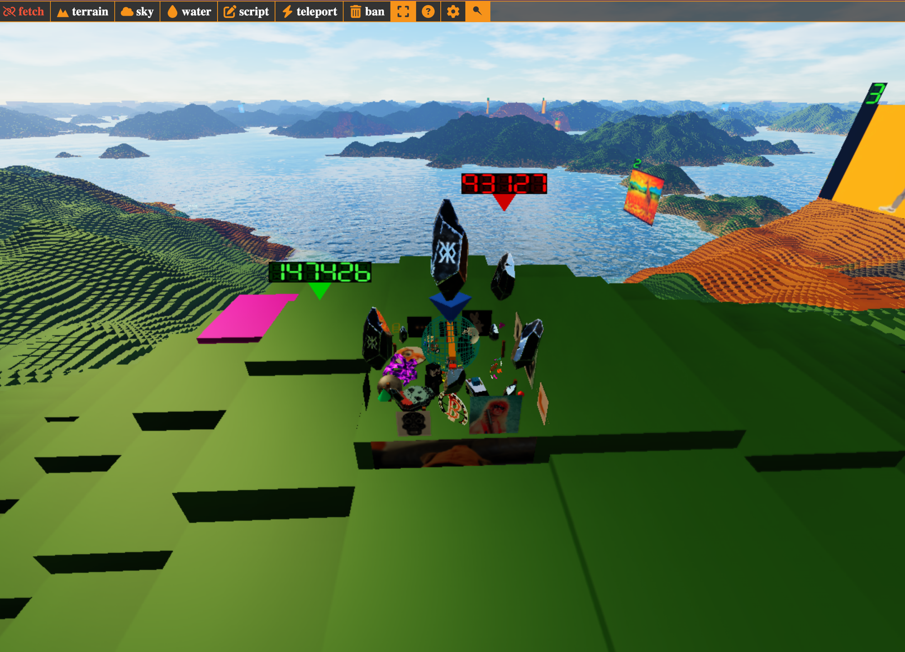</a>
</div>

Key things you'll see:

- **Bitmap blocks**: the grid of tiles representing Bitcoin blocks. Each block can have its own color and 3D content.

- **Floating green numbers**: bitmap numbers that appear when you're close enough to read them. They help you identify which bitmap you're looking at.

- **Billboards**: tall structures placed across the central root cell and every outward mirror ring, one per sunset in the gallery; 0–99 occupy the root cell, 100–199 ring 2, 200–299 ring 3, and so on. Each displays the default sunset image until a child script of the sunset inscription replaces it.

- **Your objects**: any models, quads, primitives, or mosaics placed by scripts. Selected objects show an **orange highlight overlay** in the editor.

### Fetch mode

Toolbar button **#1**. On first launch the **fetch** button is off and bitmap data isn't loaded yet. Click it to start downloading onchain scripts; as data loads, builds appear across the map. The on/off state is persisted to localStorage, so subsequent sessions on the same device resume in whichever state you last left it. On desktop, double-click a bitmap to trigger an individual download; on mobile, the active fetch queue handles loading in the background while you navigate.

### Terrain Panel

Toolbar button **#2**. Click the **terrain** icon (or press **Z**) to open the Terrain panel, the world-control hub. The header carries three world-style buttons (left-to-right: `city` / `land` / `flat`); the body holds Base Level / Block Level combos, Perlin terrain sliders, per-band block color pickers, and View overlay toggles.

<div align="center">
<a href="pics/terrain_toolbar_callouts.png">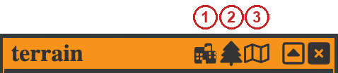</a>
</div>

Each world-style button flips Base Level / Block Level, the band-coloring switch, and a small set of water settings together:

- **city**: Bitcoin difficulty as the base, per-block height from total transacted BTC (the default skyline view). Water is enabled at height 0.01 with amplitude 0 (a flat reflective sheet).
- **land**: Perlin-noise terrain with altitude-band coloring. Water is enabled at height 0.145 with amplitude 0.0007 (visible Gerstner waves at sea level).
- **flat**: All terrain heights collapsed to zero. Water is disabled. Useful for seeing which bitmaps are colored (via `pixels` commands) and where mosaics are placed without elevation in the way; the camera stays in 3D.

Switching modes restores the **Road Fill** value last used in that mode (defaults: city = 0, flat = 0, land/Perlin = 10) so a setting tuned for one mode is preserved when you flip back to it. Per-mode Road Fill is persisted in localStorage along with the editable block colors below.

<div align="center">
<a href="pics/terrain_window.png">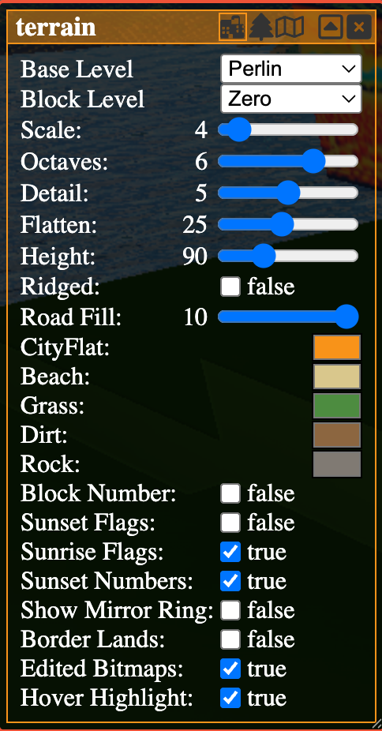</a>
</div>

*View overlays:* toggle which world annotations are rendered. Items in UI order:

- **Block Number**: toggle the floating bitmap numbers on each tile.
- **Sunset Flags**: toggle the OG-sunset (0–99) flag billboards. Each flag is placed at the center of its 100×100 bitmap patch.
- **Sunrise Flags**: toggle the outer-ring sunset flag billboards (sunsets 100+). Each successive 100-inscription tier sits on the next outward mirror ring (100–199 on ring 2, 200–299 on ring 3, and so on).
- **Sunset Numbers**: toggle the floating OG-sunset index labels above each flag.
- **Show Mirror Ring**: debug overlay that suffixes the ring index onto each flag label, useful when working with outer-ring placement.
- **Border Lands**: toggle rendering of the border lands (bitmaps 0–999).
- **Edited Bitmaps**: overlay marker highlighting bitmaps that have a locally-edited script tab open in the editor.
- **Hover Highlight**: pink tile tint + floating triangle + bitmap-number label on the block under the cursor. The triangle and label are rendered in **red** when the cursor is over the bitmap currently being edited (matches the persistent script-marker color), and in green over any other block, useful for spotting your own bitmap while panning.

<div align="center">
<a href="pics/edited_bitmap.png">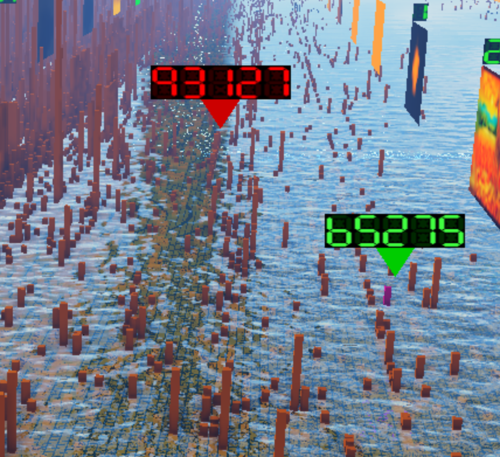</a>
</div>

*World style combos:*

- **Base Level**: ground-plane style: `Zero` (flat), `Difficulty` (terrain heights derived from Bitcoin difficulty), or `Perlin` (procedural noise terrain).
- **Block Level**: individual block style: `Zero` (flat blocks) or `TxOutput` (height per block derived from the total BTC value transacted in the block).

The Perlin slider set below is only effective when **Base Level** is set to `Perlin`. Added in v0.0.14 alongside the altitude-band coloring system.

- **Scale** (1–40): base wavelength of the Perlin noise. Higher values = finer detail.
- **Octaves** (1–8): number of FBM octaves layered on top of the base. More octaves add detail at the cost of compute on heightmap rebuild.
- **Detail** (1–9): persistence/detail multiplier between octaves.
- **Flatten** (5–50): sea-level threshold. Heights below the threshold map to exactly 0 (flat ocean); heights above rescale smoothly. 5 = no flatten, 50 = 0.9 threshold (narrow land).
- **Height** (5–300): vertical scale of the terrain in block units.
- **Ridged**: toggle ridged-multifractal noise for sharp mountain ridges (instead of rounded dunes).
- **Road Fill** (0–10): how much of the road-grid pattern is preserved on top of the terrain. **Per-mode**: each Base Level (Zero/Difficulty/Perlin) remembers its own Road Fill value and the slider re-syncs to that value when you switch modes via the panel header buttons. Defaults: city = 0, flat = 0, land/Perlin = 10.

Below the Perlin sliders, five **block-color pickers** let you re-tint the world. They are persisted to localStorage (key `terrain_colors`) and apply globally across all terrain modes:

- **City/Flat**: the single block color used when band coloring is off (city and flat modes).
- **Beach / Grass / Dirt / Rock**: the four altitude-band colors used in land mode, painted by the heightmap's `matIdx` channel with slope-aware classification and integer-hash dither at the band boundaries.

When Perlin terrain is active, blocks are colored by an **altitude-band palette** (Beach / Grass / Dirt / Rock) selected per voxel via the heightmap's matIdx channel. Band boundaries are slope-aware (steeper terrain compresses the bands), an integer-hash dither stipples the transitions to avoid hard contour lines, and biome noise jitters the thresholds so each band has natural-looking edges.

### Sky Panel

Toolbar button **#3**. Click the **sky** icon (or press **X**) to open the Sky panel, where sun position, 2D cloud rendering, and atmosphere physics live (in a dedicated panel, not in the main Settings window). The panel header carries four planet preset icons followed by three time-of-day preset icons:

<div align="center">
<a href="pics/sky_toolbar_callouts.png">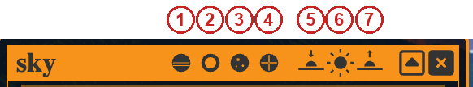</a>
</div>

**1** Earth, **2** Mars, **3** Titan, **4** Venus: the planet buttons re-bake the atmosphere LUTs with that planet's Rayleigh / Mie / Ozone defaults. **5** sunrise (6h), **6** noon (12h), **7** sunset (18h); keyboard shortcuts **1** / **2** / **3** trigger the same time presets.

The body is split into three groups (**Sun**, **Clouds**, **Atmosphere**); editing any Atmosphere or Sun-physics slider re-uploads the per-view UBO and invalidates the transmittance / scattering / sky / aerial LUTs and the IBL cubemap so the new look propagates within a few frames.

<div align="center">
<a href="pics/sky_window.png">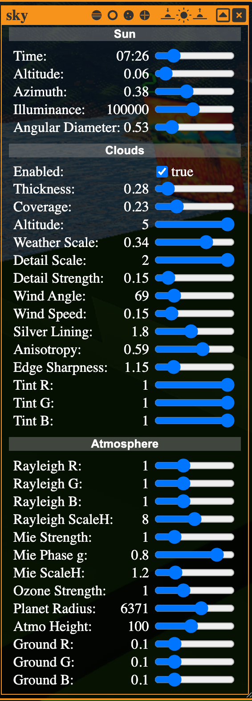</a>
</div>

*Sun:*

- **Time** (5–18.5): wall-clock sun position, rendered as HH:MM next to the slider. Two-way synced with **Altitude**.
- **Altitude** (0–1): normalized sun elevation.
- **Azimuth** (0–1): horizontal sun direction.
- **Illuminance** (10000–200000): sun radiance fed into the atmosphere LUTs. Higher values brighten the whole sky/scene response.
- **Angular Diameter** (0.1–3.0°): apparent disc size of the sun in the sky raymarch.

*Clouds*, added in v0.0.14. Renders a spherical cloud shell driven by FBM noise, with edge displacement for ragged silhouettes, Henyey-Greenstein silver lining, and IBL re-baked when any cloud parameter changes. Disable via the **Clouds** performance slider (set to Junk) for a clear sky.

- **Enabled**: toggle cloud rendering.
- **Thickness** (0–3): vertical density / alpha multiplier of the cloud shell.
- **Coverage** (0–1): low-frequency threshold; higher values yield more sky coverage.
- **Altitude** (0.5–5.0): height of the cloud shell above the ground plane.
- **Weather Scale** (0.005–0.5): wavelength of the low-frequency weather mask. Lower = larger cloud systems.
- **Detail Scale** (0.05–2.0): wavelength of the high-frequency cloud detail.
- **Detail Strength** (0–1.5): contribution of the detail octave to the silhouette displacement.
- **Wind Angle** (0–360°): direction of the cloud drift. Applies to the detail layer; the weather layer drifts at a 45° offset for chaotic motion.
- **Wind Speed** (0–1): scroll speed of the cloud system.
- **Silver Lining** (0–4.0): Henyey-Greenstein anisotropy boost near the sun direction; produces the bright cloud edge at sunset / sunrise angles.
- **Anisotropy** (0–0.95): underlying Henyey-Greenstein scattering coefficient.
- **Edge Sharpness** (0.5–4.0): falloff curve of the silhouette boundary.
- **Tint R / G / B** (0–1): per-channel color tint applied to the cloud body.

*Atmosphere*: physics tuning for the sky raymarch. Defaults reproduce the legacy hard-coded constants (Earth-like Rayleigh, Mie, ozone, ground albedo); changing them re-bakes the transmittance / scattering / sky LUTs and the IBL cubemap on the next frame.

- **Rayleigh R / G / B** (0–3): per-channel multiplier on the Rayleigh scattering coefficients (the blue-sky term).
- **Rayleigh ScaleH** (1–15): Rayleigh scale height in km.
- **Mie Strength** (0–5): overall Mie scattering multiplier (haze near the horizon and around the sun).
- **Mie Phase g** (0–0.95): Henyey-Greenstein anisotropy for the Mie phase function (forward-scattering pull around the sun direction).
- **Mie ScaleH** (0.2–5): Mie scale height in km.
- **Ozone Strength** (0–3): multiplier on the ozone absorption layer (controls the violet/red sunset tint).
- **Planet Radius** (1000–10000): planet radius in km used by the atmosphere shell math.
- **Atmo Height** (20–200): atmosphere shell thickness in km.
- **Ground R / G / B** (0–0.5): ground albedo seen by the atmosphere LUT (affects multi-scattering ambient).

### Water Panel

Toolbar button **#4**. Click the **water** icon (or press **C**) to open the Water panel, added in v0.0.14 in a dedicated panel separate from the main Settings window. Renders a projected-grid water plane with Gerstner waves (4 macro + 3 capillary octaves), PBR cubemap reflections, Beer-Lambert absorption, depth-clamped refraction, screen-space caustics, and an underwater fog/scattering pass. Disable via the **Water** performance slider (set to Junk). Sliders are grouped here by function; in the UI they appear in a single flat list.

<div align="center">
<a href="pics/water_window.png">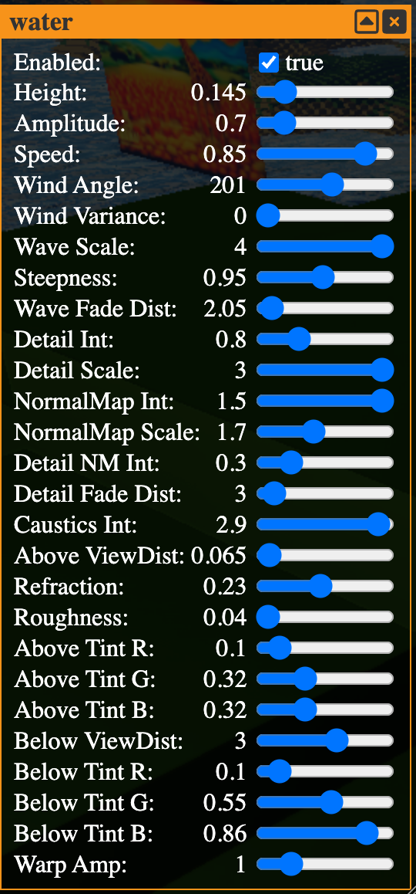</a>
</div>

*General:*

- **Enabled**: toggle water rendering.
- **Height** (0–1): world-space height of the water plane.
- **Warp Amp** (0–5): screen-space UV warp underwater (refractive distortion seen from below).

*Waves:*

- **Amplitude** (0–0.005): macro Gerstner wave height.
- **Speed** (0–1): wave-phase advance per second (internally remapped to 0–0.2).
- **Wind Angle** (0–360°): macro Gerstner wave direction.
- **Wind Variance** (0–180°): per-layer wind-direction spread; capillary octaves and the Voronoi normal map rotate around the macro angle so high variance gives chaotic cross-cutting ripples.
- **Wave Scale** (0.2–4.0): wavelength multiplier for all macro waves.
- **Steepness** (0–2.0): macro Gerstner choppiness (peakiness vs roundness).
- **Wave Fade Dist** (0.1–60): distance over which wave amplitude fades to zero, killing periodic horizon tiling.

*Surface Detail:*

- **Detail Int** (0–3.0): capillary octave amplitude.
- **Detail Scale** (0.2–3.0): capillary octave wavelength.
- **NormalMap Int** (0–1.5): intensity of the Voronoi normal-map LUT (3-octave tileable Voronoi baked at startup).
- **NormalMap Scale** (0.2–4.0): UV tiling of the Voronoi normal map.
- **Detail NM Int** (0–1.5): intensity of the foreground-only Worley F2-F1 ridge LUT, layered on top of the Voronoi normal map.
- **Detail Fade Dist** (0.1–60): distance over which the detail normal map fades out.

*Appearance:*

- **Roughness** (0.04–0.40): PBR roughness of the water surface; lower = mirror-like reflections.
- **Refraction** (0–0.50): strength of the refraction offset applied to the behind-water G-buffer sample.
- **Caustics Int** (0–3.0): intensity of the animated cellular caustics projected onto top-facing surfaces below the water.

*Color & Visibility:*

- **Above ViewDist** (0.005–5.0): characteristic distance for Beer-Lambert absorption when looking from above the surface.
- **Above Tint R / G / B** (0–1): per-channel water tint applied above the surface.
- **Below ViewDist** (0.005–5.0): characteristic distance for the underwater fog/scattering pass.
- **Below Tint R / G / B** (0–1): per-channel water tint applied to the underwater fog.

### Scripts Panel

Toolbar button **#5**. Click **script** (or press **G**) and the Scripts Panel appears on the left side of the screen. This is your main workspace for building. The panel is organized into several components from top to bottom: a toolbar, a tab bar, the code editor, and an embedded console.

<div align="center">
<a href="pics/scripts_window.png">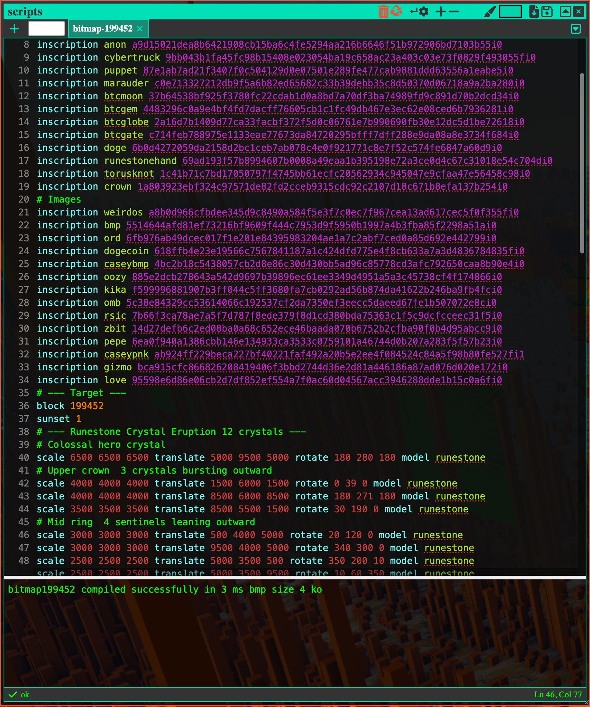</a>
</div>

**Script toolbar:** The top row of the panel contains these icons:

<div align="center">
<a href="pics/scripts_toolbar_callouts.png">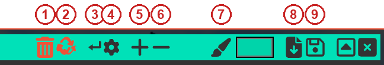</a>
</div>

| # | Icon | What it does |
|---|---|---|
| **1** | **trash** | Closes the current tab after a confirmation prompt. Same underlying effect as the tab's **X** button; the tab is hidden from the tab bar but remains in the overflow dropdown, so you can restore it by selecting it there. There is no permanent-delete path in v0.0.14. |
| **2** | **recycle** | Resets the current tab to the default starter template. |
| **3** | **wrap** | Toggles word-wrap on or off for the editor textarea and syntax overlay. State is persisted. |
| **4** | **settings** (gear, small) | Opens the 15-swatch **syntax highlighting palette** popup to recolor the editor (keywords, numbers, hex, inscription hash, inscription name, bitmap, console, errors, and so on). See below. |
| **5** | **+** (plus) | Duplicates the currently selected object in the scene. |
| **6** | **delete** (minus) | Removes the currently selected object from the script. |
| **7** | **pen** (color picker) | Click the swatch next to the pen to pick a color for the `color` command and painted primitives. |
| **8** | **save** | Downloads the current tab as a `.bss` **source file** (`bitmap_<N>.bss`). Use this for local backup or to share editable scripts. |
| **9** | **export** | Compiles the current tab, runs the round-trip, and downloads a `.bmp` **inscription artifact** (`bitmap_<N>.bmp`). This is the file you inscribe onchain. Disabled when the tab has compile errors. |

**Tab bar:** Below the toolbar, a tab bar supports multiple scripts simultaneously. Each tab keeps its own text, compile state, tokenization cache, and error list.

<div align="center">
<a href="pics/scripts_tabbar_callouts.png">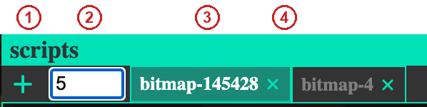</a>
</div>

| # | Action | What it does |
|---|---|---|
| **1** | **+ button** | When the `#` field next to it is empty, create a new tab pre-populated with the BSS 0 0 14 starter (header + `block <N>` + `sunset 1` + `inscription runestone <hash>` + a `scale … model runestone` example). |
| **2** | **`#` bitmap input** | Text field immediately right of **+**. Type a bitmap number (with or without a leading `#`) and press Enter (or click **+**) to create a tab pre-populated with that bitmap's edit target, teleport the camera to it, and auto-fetch its onchain script. This is the mobile-friendly replacement for the desktop double-click-to-fetch gesture. |
| **3** | **Click tab** | Switch to that script. The editor and 3D view update immediately. |
| **4** | **X button on tab** | Close the tab (hides it; still accessible via the overflow dropdown, no confirmation). |
|  | **Double-click tab label** | Rename the tab inline. |
|  | **Drag tab** | Reorder tabs. A drop indicator shows where the tab will land. |
|  | **Overflow dropdown** | An expand button on the right side of the tab bar opens a dropdown listing every tab (visible and hidden) alphabetically, with a check mark next to tabs currently visible in the tab bar. Clicking a row switches to that tab; if it was closed (hidden), selecting it from the dropdown re-opens it in the tab bar. Closed tabs persist here for the session; there is no way to remove them permanently. |
|  | **Double-click a bitmap** (in the 3D view) | Fetch the script attached to that bitmap and open it in a new tab. |

**Code editor:** The main text area features:

- **Line number gutter**: line numbers displayed along the left edge, updating in real time as you type.

- **Syntax highlighting**: keywords, numbers, inscription IDs, and other tokens are color-coded via an overlay that scrolls in sync with the text. Each tab caches its own tokenization.

- **Status bar**: a bar at the bottom of the editor showing the number of compile errors and the current caret position (`Ln N, Col M`).

Changes to the script text are reflected in the 3D viewport in real time.

The **syntax-highlighting palette** popup opens from the small gear in the script toolbar. 15 swatches let you recolor each token class to taste:

<div align="center">
<a href="pics/scripts_window_settings.png">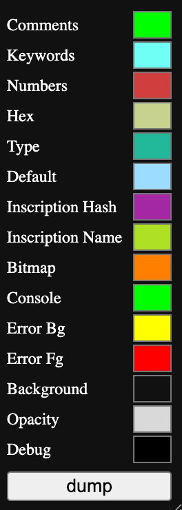</a>
</div>

### Embedded Console

The console is embedded directly below the code editor inside the Scripts Panel, separated by a **draggable splitter**. Drag the splitter up or down to resize the editor and console panes.

The console shows a single success line after compilation, e.g.:

```bash
compiled successfully in 12 ms, .bmp size: 3 ko
```

This confirms the full round-trip passed: text → binary → BMP → binary → text.

If there are errors, the console displays them with line and column numbers (e.g., `line 3, col 5: invalid token`). **Clickable errors:** hover over an error message to highlight it, then click to jump the cursor directly to the error's line and column in the editor. This is your primary debugging tool.

<div align="center">
<a href="pics/scripts_console_error.png">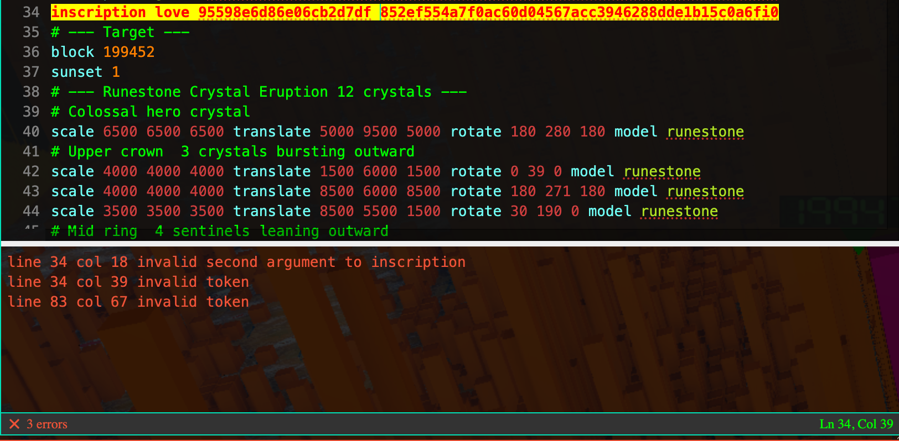</a>
</div>

### Teleport

Toolbar button **#6**. Click the **teleport** icon (or press **T**) to open the Teleport window, type a bitmap number, and press Enter (or tap **go**) to fly directly to that bitmap. You can also change the `block <number>` value in the script editor; it updates live as you type.

<div align="center">
<a href="pics/teleport_window.png">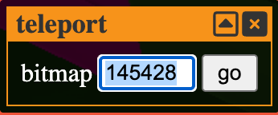</a>
</div>

### Ban List Window

Toolbar button **#7**. Click the **ban** icon to open the Ban List window. The window has a text input, a row of five tabs, and a scrollable list of active bans.

<div align="center">
<a href="pics/banlist_window.png">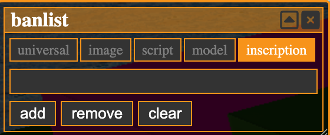</a>
</div>

| Tab | Contents |
|---|---|
| **universal** | Block numbers and inscription hashes. Input is interpreted as a block number or hash depending on format. |
| **image** | Inscription hashes banned as images (auto-populated when an image fails to decode). |
| **script** | Inscription hashes banned as scripts (auto-populated when a script fails to decode). |
| **model** | Inscription hashes banned as models (auto-populated when a glTF model fails to decode or exceeds the 1 s decode deadline). |
| **inscription** | Inscription hashes banned as inscriptions (manual only). |

Input is sanitized to alphanumeric characters on the way in. On the **universal** tab, the list is grouped under **blocks** and **hashes** headers; the other tabs show only inscription hashes. Each tab has its own **clear** action. Bans are persisted in your browser's localStorage and take effect immediately; banned content is skipped during fetch and will not render in the 3D world.

Images, scripts, and glTF models that fail to decode or parse are auto-added to their **per-type** ban list (a broken image goes to the **image** tab, a broken script to the **script** tab, a glTF that fails decoding or exceeds the 1 s decode deadline goes to the **model** tab) so malformed content doesn't retry on every session. Only the **inscription** tab is manual-only. Image inscriptions that return a 404 are added to the **universal** ban list as a negative cache.

### Canvas

Toolbar button **#8**. Click the **canvas** icon to toggle the 3D viewport between fullscreen and a movable, resizable window. Windowed geometry (position and size) is persisted to localStorage, so the viewport returns to your last layout on the next visit. Distinct from **F**, which triggers browser-level fullscreen.

### Help

Toolbar button **#9**. Click the **help** icon (or press **H**) to open the in-app help overlay. The overlay lists Controls (movement, look, thrust, zoom), Shortcuts (the same keyboard shortcuts documented in §3), and Edit Mode interactions (select, gizmo, paint, erase, fetch script). A note at the top reminds you that fetching is disabled by default and points at the **fetch** button.

### Settings Panel

Toolbar button **#10**. Click the **settings** icon (or press **R**) to open the Settings Panel, which holds Performance / Camera / UI / Network groups. All settings are automatically saved to your browser's localStorage and restored on the next visit. Desktop defaults run at the **Legendary** tier for rendering sliders (Atmosphere, Reflection, Ambient, Resolution, Precision, Terrain, Distance, Texture, Clouds, Water), 4096 for Models, and **Junk** (0 fetches per tick) for Inscriptions; raise Inscriptions manually after clicking **fetch** if you want HTML-billboard content to fill in. Touch devices start at **Rare (4)** across Atmosphere, Reflection, Ambient, Precision, Terrain, Distance, Texture, Water, and Models, with **Resolution** kept at Legendary for 1:1 pixels and **Clouds** kept at the desktop default; tune further from there.

<div align="center">
<a href="pics/settings_window.png">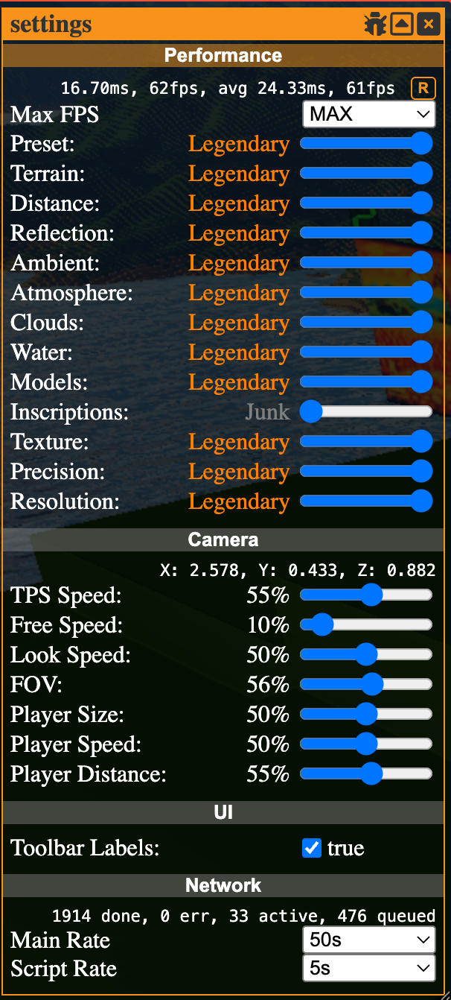</a>
</div>

The panel header carries a **bug icon** that opens the Debug window (described in its own subsection below):

<div align="center">
<a href="pics/settings_toolbar_callouts.png">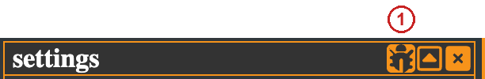</a>
</div>

Almost every quality slider uses a 1–6 tier scale that maps to named presets:

| Tier | Name |
|---|---|
| 1 | Junk |
| 2 | Common |
| 3 | Uncommon |
| 4 | Rare |
| 5 | Epic |
| 6 | Legendary |

A seventh label, **Custom**, is shown on the composite **Preset** readout when you manually mix the underlying sliders so they no longer match a single preset.

**Performance:** (entries listed in UI order). If the app runs slowly, the biggest levers here are **Preset**, **Distance**, and **Resolution**.

<div align="center">
<a href="pics/settings_performance.png">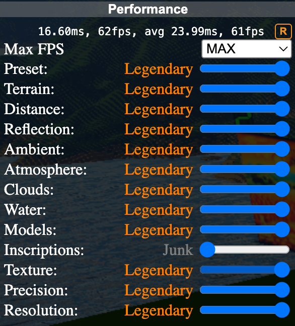</a>
</div>

- **FPS**: read-only current frame rate / frame timing.
- **Max FPS**: 30 / 60 / 120 / 240 / MAX. The default is **60** on the public build (**30** in dev builds); saved settings persist across sessions. **Tuning:** cap to 30 if your device's thermal budget is the limiting factor.
- **Preset** (1–6): composite preset for downstream sliders. Reads as **Custom** when the sub-sliders no longer match a single preset. **Tuning:** drop to 4 (Rare) for a mobile-grade profile in one click.
- **Terrain** (1–6): geometry level-of-detail tier for far cells. Lower tiers render distant cells with fewer faces.
- **Distance** (1–6): concentric mirror rings around the root Bitcoin cell. The root cell holds the actual blockchain map; each ring adds symmetrically reflected copies (X, Z, or both) so the horizon has no visible seam. Higher tiers look more expansive but cost more frames. **Tuning:** dropping from 6 to 2–3 recovers substantial frame time.
- **Reflection** (1–6): cubemap / prefilter resolution for image-based lighting (PBR reflections, sky reflection on water). Lower tiers trade reflection sharpness for VRAM and bandwidth.
- **Ambient** (1–6): screen-space ambient occlusion resolution and sample count (bilateral blur, R8 storage). **Tuning:** drop to 1 (Junk = off) if you don't need contact shadows.
- **Atmosphere** (1–6): sky + aerial raymarch resolution. At tier 6 (Legendary), Atmosphere also enables per-pixel aerial perspective for accurate sky blending on distant geometry. **Tuning:** drop to 5 to skip the per-pixel aerial pass for a cheaper sky.
- **Clouds** (1–6): 2D cloud shell raymarch quality and shadow-tap count. Drop to 1 (Junk = off) to disable clouds entirely.
- **Water** (1–6): water grid resolution and per-pixel detail (Gerstner wave count, normal-map sampling, caustics complexity). Drop to 1 (Junk = off) to disable water rendering.
- **Models** (0–4096): max number of simultaneously rendered glTF models. Slider uses a piecewise-linear curve through tier breakpoints (0 / 64 / 128 / 256 / 1024 / 4096) so low-end values are easier to dial in. **Tuning:** lower in dense districts.
- **Inscriptions** (1–6): caps the number of HTML-inscription iframe fetches per tick (Junk = 0 / Common = 5 / Uncommon = 10 / Rare = 25 / Epic = 50 / Legendary = 100). Raising this makes HTML-billboard content fill in faster at the cost of bandwidth and per-iframe memory.
- **Texture** (1–6): global mip-level cap for model and flag textures. **Tuning:** lowering saves VRAM and bandwidth.
- **Precision** (1–6): depth-buffer precision tier. Tier ≥ 4 enables per-pixel log-depth for accurate horizon blending at altitude; lower tiers use cheaper per-vertex depth that can show z-fighting on distant cells. **Tuning:** drop to 3 or lower to gain fragment-shader headroom.
- **Resolution** (1–6): overall render-target resolution scale. Halving this is a blunt but effective frame-rate knob.

**Camera:**

<div align="center">
<a href="pics/settings_camera.png">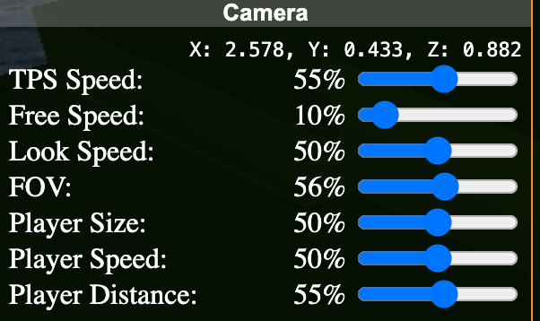</a>
</div>

- **Position**: read-only current camera position.
- **TPS Speed** (0–100): camera orbit / follow speed while in third-person mode.
- **Free Speed** (0–100): free-flight camera speed. The editor-open slowdown is applied automatically on top of this value (no separate Edit Speed slider).
- **Look Speed** (0–100): rotation sensitivity when dragging the mouse.
- **FOV** (1–89°): field of view in degrees.
- **Player Size** (0.5–20): TPS character size. Also sets the orbit radius in orbit mode.
- **Player Speed** (0–100): ground-plane movement speed of the TPS character across the bitmap surface.
- **Player Distance** (1–80): follow distance for the TPS camera.

**UI:**

<div align="center">
<a href="pics/settings_ui.png">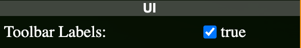</a>
</div>

- **Toolbar Labels**: when enabled, toolbar buttons show their text labels. When disabled (icons-only mode), only icons are shown.

**Network:**

<div align="center">
<a href="pics/settings_network.png">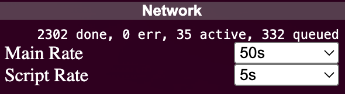</a>
</div>

- **Network**: read-only fetch stats.
- **Main Rate**: 10 / 25 / 50 / 100 requests/sec for bitmap data fetches.
- **Script Rate**: 1 / 3 / 5 / 10 requests/sec for script-child inscription fetches.

### Debug Window

Opened by clicking the **bug icon** in the settings window header (or pressing **B**). Groups counters, internal toggles, and clear-data actions. Useful for performance triage and for resetting local caches without leaving the app.

<div align="center">
<a href="pics/debug_window.png">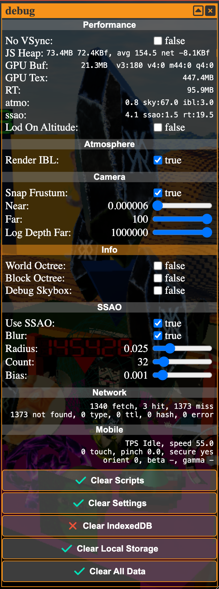</a>
</div>

**Performance:** real-time counters (No VSync toggle, JS heap, GPU buffer, GPU texture, atmosphere flag, scattering / sky / aerial LUT sizes, log-on-altitude flag).

<div align="center">
<a href="pics/debug_performance.png">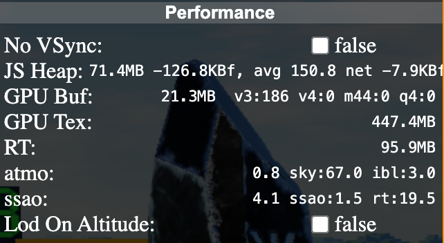</a>
</div>

**Atmosphere:** toggles for IBL re-rendering and related sky integrations.

<div align="center">
<a href="pics/debug_atmosphere.png">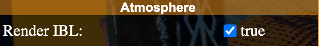</a>
</div>

**Camera:** snap-frustum toggle plus near / far plane readouts. Handy when debugging culling or depth precision.

<div align="center">
<a href="pics/debug_camera.png">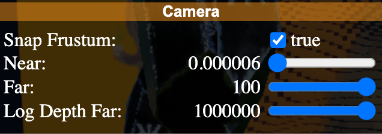</a>
</div>

**Info:** world / debug octree visualizations and debug-skybox toggle.

<div align="center">
<a href="pics/debug_info.png">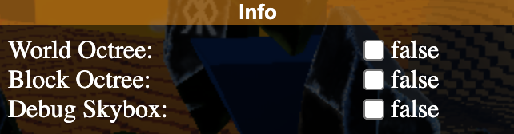</a>
</div>

**SSAO:** screen-space ambient occlusion debugging. Toggle the effect, change blur, radius, sample count, and bias to see how each parameter affects the AO term.

<div align="center">
<a href="pics/debug_ssao.png">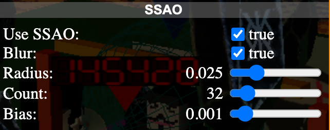</a>
</div>

**Network:** live fetch counters (in-flight requests, completed, errors, misses). Mirrors what the toolbar **fetch** button is doing.

<div align="center">
<a href="pics/debug_network.png">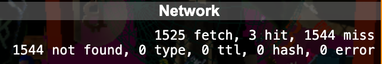</a>
</div>

**Mobile:** TPS-mode flags and touch speed/scale slider. Useful when emulating touch behaviour on desktop.

<div align="center">
<a href="pics/debug_mobile.png">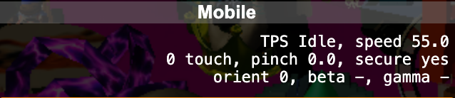</a>
</div>

**Clear data:** four buttons to wipe local state: **Clear Scripts** (tabs only), **Clear IndexedDB** (the inscription cache), **Clear Local Storage** (settings, ban lists, persisted toggles), or **Clear All Data** (everything). Use when the app is misbehaving and you want a clean slate without re-launching from a new browser profile.

<div align="center">
<a href="pics/debug_clear_data.png">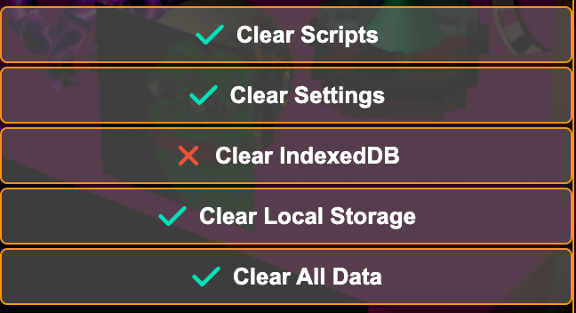</a>
</div>

### Pin

Toolbar button **#11**. Click the **pin** thumbtack to lock the toolbar so it stays visible. When unpinned (the default), the toolbar slides out of view 1.5 s after the app launches and reappears whenever the mouse touches the top edge of the viewport.

---

## 5. Using the Visual Editor

The visual editor lets you manipulate objects with mouse-based gizmos instead of editing raw script text.

1. Click the **script** button (or press **G**) to open the Scripts Panel.

2. The first tab is pre-populated with a v0.0.14 starter (`BSS 0 0 14` header + a runestone inscription + a `model runestone` example); modify it, reset it with the **recycle** icon, or clear it entirely. Use the **+** button in the tab bar to create additional tabs for working on multiple scripts simultaneously.

3. Navigate to a bitmap by editing the `block <number>` value in the script, press **T** to open the Teleport window, or **double-click** a bitmap in the 3D view to fetch its onchain script into a new tab. Drag tabs to reorder them.

4. Click an object in the 3D view to select it. Selected and hovered objects show an **orange highlight overlay** so you can see what you're about to grab:

   <div align="center">
   <a href="pics/object_picking.png">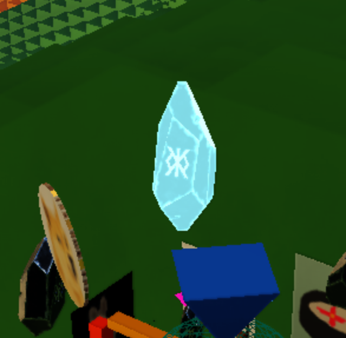</a>
   </div>

   A **unified gizmo** appears at the object's center with three types of handles:

   - **Axis arrows**: drag to translate the object along X, Y, or Z. Plane handles between axes translate along two axes simultaneously.

   - **Quarter-arc rings**: drag to rotate around X, Y, or Z.

   - **Diagonal strips**: drag to scale along one axis, a pair, or uniformly (central triangle).

   <div align="center">
   <a href="pics/transform_gizmo.png">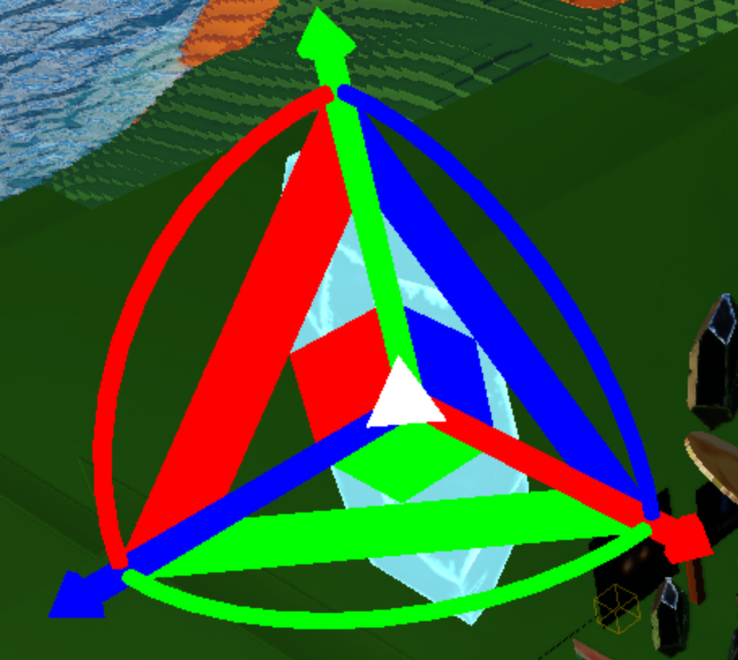</a>
   <a href="pics/transform_gizmo_hovered.png">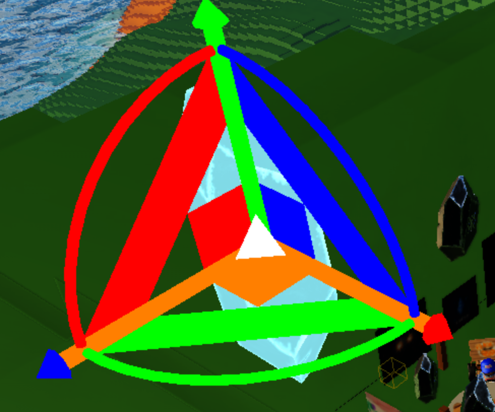</a>
   </div>

   Hovering a handle highlights it; the hovered axis brightens so you can confirm which transform you'll commit on the next drag.

   Use the **+** toolbar icon to duplicate the selected object, or **delete** to remove it.

5. When you manipulate objects with the gizmo, the **script text updates automatically** to reflect your changes. Selected objects display an **orange highlight overlay** in the 3D view. Press **Escape** to cancel a gizmo drag and revert to the pre-drag transforms.

6. You can also edit the script text directly; syntax highlighting and line numbers help you read and navigate the code. Changes are reflected in real time in the 3D view.

7. Check the **embedded console** below the editor for compilation status. Green messages mean success; click on error messages to jump directly to the error location in the script.

### Painting mode

While the editor is open, you can paint any bitmap on the map directly with the mouse, including bitmaps you don't own. This is the visual UI for Block War (see §11): each paint or erase action edits the active script's `bitmaps` / `pixels` lines automatically, keeping the script text and the 3D view in sync.

- **Shift + left-click and drag**: paint each bitmap you hover with the current pen color.
- **Ctrl + left-click and drag**: erase the paint from each bitmap you hover.

The pen color is set via the **pen** icon in the script toolbar (a color picker). Painting is a desktop-only interaction in v0.0.14 (no mobile equivalent).

**Tips:**

- Toggle the **script** button off and on to reset the camera focus to your bitmap.
- When the script panel is hidden, camera speed increases for faster map navigation.
- When editing, camera speed slows down for precision work.
- The **status bar** at the bottom of the editor shows the error count and your caret position (Ln N, Col M) at a glance.
- **Double-click** a tab label to rename it. **Drag** a tab to reorder.
- Toggle **word-wrap** (in the script toolbar) if your pixel lists or long inscription IDs make the editor scroll horizontally. The syntax overlay and line numbers stay in sync either way.
- Click the palette button to open the **syntax-highlighting palette** and retune the editor colors (keywords, numbers, hex, inscription hash, inscription name, bitmap, console, errors). Palette state is persisted.

---

## 6. Script Language Basics

Every BitmapSunset script is a plain text file. Here's the general structure:

```bash
BSS 0 0 14
block <bitmap_number>
sunset <sunset_number>
<inscription declarations>
<control + object commands>
<bitmaps/pixels commands>
```

### Header (required)

The very first line must always be the version header. It must match the app version you're targeting.

```bash
BSS 0 0 14
```

This reads as: *BitmapSunset Script version 0.0.14*. The compiler records a 9-byte binary header (magic + version + filesize) so the reader can reject truncated or padded binaries. You don't write the filesize; the exporter patches it for you.

### Target commands (`block` and `sunset`)

`block <number>` and `sunset <number>` tell the virtual machine which bitmap and which sunset billboard your script is building on.

| Command | Purpose |
|---|---|
| `block <number>` | The bitmap this script targets. The author's `block` value is used as the render target when present (>= 0); the parent bitmap inscription's ID is used only as a fallback when the script doesn't declare a valid `block`. In practice the editor always emits a `block` line, so your script's value is what drives placement. |
| `sunset <number>` | The sunset this script targets, for billboard and mosaic commands. Same precedence as `block`. **Onchain:** the script's parent inscription determines the target sunset; this value is ignored at runtime. **Editor preview:** the value is used to position the preview billboard/mosaic in the local 3D view; the parser currently accepts `0..99` (`Math.trunc(g_NumberWorldBlockCount / 10000)` exclusive, which is 100 with the default 1,000,000-block world). When authoring a build for a 100+ sunset, use any placeholder in `0..99`; onchain execution targets the real parent inscription regardless. |

Both commands are serialized into the binary; they're not stripped on export. `block` accepts only `color` as a modifier (tile tint); other modifiers (`scale`, `rotate`, `translate`, etc.) are rejected. `sunset` accepts `color`, `translate`, `billboard`, and `mosaic` as modifiers; other modifiers are rejected. In the binary, `color` on `block` emits a COLOR opcode preceding the BLOCK opcode. On `sunset`, `color` fills the sunset billboard with a solid color (via a COLOR opcode preceding the BILLBOARD opcode), while the parser consumes `translate` and binds to create separate billboard and mosaic objects. The SUNSET opcode itself carries only the sunset number.

**Example:**

```bash
block 12345
sunset 5
```

This sets the script's build target to bitmap 12345 and sunset billboard #5.

### Named inscriptions

Before you can display anything, register inscription IDs under short **names** with the `inscription` command. Named inscriptions let you reference the same inscription from multiple statements, and the names survive the binary round-trip so readers of your onchain script see meaningful identifiers.

```bash
inscription <name> <inscription_id>
```

Names are 1–16 characters: first character must be a letter; remaining characters may be alphanumeric. All BSS keywords are reserved and rejected as names: `inscription`, `color`, `bitmaps`, `pixels`, `model`, `scale`, `rotate`, `translate`, `block`, `sunset`, `cube`, `sphere`, `script`, `bitmap`, `wire`, `quad`, `circle`, `triangle`, `tripyr`, `squpyr`, `cone`, `billboard`, `mosaic`, `bind`, `alpha`.

**Example:**

```bash
inscription poster a1b2c3d4e5f6a1b2c3d4e5f6a1b2c3d4e5f6a1b2c3d4e5f6a1b2c3d4e5f6a1b2i0
inscription statue f6e5d4c3b2a1f6e5d4c3b2a1f6e5d4c3b2a1f6e5d4c3b2a1f6e5d4c3b2a1f6e5i0
```

You can now reference either inscription from any later statement by putting the name directly after the object keyword: `quad poster`, `model statue`, `billboard flag`, `mosaic tile`, `script subscene`.

### Comments

Lines starting with `#` (and `#` anywhere mid-line) are comments. Since v0.0.13 the compiler **preserves comments across the binary round-trip**: your onchain inscription carries the comment bytes, and any viewer re-decoding the script will see them. Because comments cost inscription bytes, keep them purposeful (author tag, intent, non-obvious hex color reminders).

```bash
# My first build: runestone avatar anchored at the center
inscription avatar <hash>   # rigged glTF
scale 5000 5000 5000 model avatar
```

### Hex literals

Colors and pixel values use the `0xRRGGBB` form (`0x` prefix, up to 6 hex digits; shorter values are accepted and zero-padded to RRGGBB). A combined `0xRRGGBBAA` form (exactly 8 hex digits) sets both color and alpha in a single token.

```bash
color 0xFF8800 scale 10000 10000 10000 cube
color 0xFF880080 sphere
pixels 3 0xFF0000 0x00FF00 0x0000FF
```

---

## 7. Displaying Images (Quads)

A **quad** is a flat rectangular surface used to display an image inscription in 3D space, think of it as a custom billboard or poster.

> **SVG and HTML support:** SVG inscriptions render natively on quads, billboards, and mosaics. HTML inscriptions render on billboards via an iframe overlay (not on quads, mosaics, or other shapes; see §10).

### Basic quad

```bash
inscription poster <inscription_id_of_your_image>
scale 10000 10000 10000 quad poster
```

This places a flat image in the world using the named `poster` resource.

### Positioning with translate and rotate

You can control where the quad appears and how it's oriented:

```bash
scale 10000 10000 10000 translate 5000 10 5000 rotate 90 0 0 quad poster
```

- **`translate X Y Z`**: moves the object to the given coordinates. Values are clamped to the range -10100 to 10100.

- **`rotate X Y Z`**: rotates the object by the given degrees around each axis (X, Y, Z in that order). Values are clamped to the range 0 to 360.

**Tip:** If you can't find your quad, try large scale values first (like `10000 10000 10000`) and work your way down.

---

## 8. Displaying 3D Models

Use the `model` keyword to display a 3D model inscription. Models must be in **glTF format** (binary `.glb`). Draco-compressed meshes (KHR_draco_mesh_compression) are supported. Skeletal animation with crossfading is supported for rigged models.

### Basic model

```bash
inscription statue <inscription_id_of_your_gltf_model>
scale 10000 10000 10000 model statue
```

Models need large scale values to be visible. Always start with `scale 10000 10000 10000` and adjust from there.

### Full example with positioning

```bash
inscription statue <inscription_id_of_your_gltf_model>
scale 5000 5000 5000 translate 5000 2000 5000 rotate 2 45 0 model statue
```

### Control commands and object commands

A script line consists of **control commands** followed by an **object command**. Control commands (`scale X Y Z`, `translate X Y Z`, `rotate X Y Z`, `color 0xRRGGBB`) can appear in **any order** before the object command. Shapes also support `wire` and `alpha 0xBB` (see Section 9 for details); models do not: `model` accepts only `scale`, `translate`, `rotate`, and `color`. Models do not support alpha: passing the 8-digit `0xRRGGBBAA` combined form on a model is parsed without error, but the alpha byte is silently discarded at binary-write time. The object command (`model`, `quad`, `script`, `sphere`, `cube`, etc.) terminates the statement and takes the inscription name as a direct argument (e.g., `quad poster`, `model statue`). `billboard <name>` and `mosaic <name>` are inscription-binding modifiers consumed by the `sunset` command rather than standalone object commands (see Section 10).

A full example:

```bash
scale X Y Z translate X Y Z rotate X Y Z model <name>
```

This is equivalent to:

```bash
rotate X Y Z translate X Y Z scale X Y Z model <name>
```

Both produce the same result; the control commands are collected and the object command triggers rendering.

### Per-object alpha

You can override the default fully-opaque alpha for shapes and quads with the `alpha` modifier, which takes a hex byte. You can also use the combined `0xRRGGBBAA` form (8 hex digits) to set both color and alpha in a single token:

```bash
alpha 0x80 color 0x00FF00 scale 5000 5000 5000 sphere
color 0x00FF0080 scale 5000 5000 5000 sphere
```

Both lines produce the same result: a half-transparent green sphere. Combine `alpha` with `color` on primitives to make translucent decorations.

---

## 9. Primitive Shapes

You can place built-in geometric shapes without needing any inscription at all.

### Basic usage

```bash
color 0xFF0000 scale 10000 10000 10000 sphere
```

This creates a red sphere the size of a bitmap block.

### Available primitives

**2D:** `triangle`, `quad`, `circle`

**3D:** `tripyr` (triangular pyramid), `squpyr` (square pyramid), `cube`, `cone`, `sphere`

`quad` is a flat rectangular plane. When used standalone with a `color` command, it renders as a colored surface. When bound to a named inscription (via `quad <name>`), it renders as a textured surface (see Section 7).

### Wireframe

Primitives render filled (solid) by default. The `wire` modifier renders the next shape as wireframe outlines. It applies only to shapes, not models. Filled rendering is the default for every shape, so no explicit `solid` keyword is needed; simply omit `wire`.

```bash
translate 1000 500 1000 triangle
translate 1000 500 2000 wire triangle
```

This draws a filled triangle at (1000, 500, 1000) and a wireframe copy offset by 1000 on Z.

### Setting color

The `color` modifier sets the color (as a `0xRRGGBB` hex literal) for a primitive shape or quad. It must appear on the same line as the object command it applies to. On textured quads (`quad <name>`) it tints the sampled image; on primitives it fills or outlines the geometry.

```bash
color 0x00FF00 scale 5000 5000 5000 cube
color 0x0000FF scale 3000 3000 3000 translate 5000 5000 5000 sphere
color 0xFF00FF scale 4000 4000 4000 translate 2000 0 2000 squpyr
```

This places a green cube, a blue sphere, and a magenta square pyramid at different positions.

### Displaying all primitives in a row

Here's a script that places one of every primitive across the bitmap:

```bash
BSS 0 0 14
block 199452
sunset 1
color 0xff3030 scale 800 800 800 translate 1200 500 2000 cube
color 0x30ff50 scale 800 800 800 translate 2800 500 2000 rotate 0 25 0 sphere
color 0x3080ff scale 800 800 800 translate 4400 500 2000 cone
color 0xffaa20 scale 800 800 800 translate 6000 500 2000 rotate 0 15 0 tripyr
color 0xff40dd scale 800 800 800 translate 7600 500 2000 rotate 0 30 0 squpyr
color 0x20dddd scale 800 800 800 translate 1200 500 3800 rotate 90 0 0 circle
```

> **Note:** A `color` on the same line as the `block` command (e.g., `color 0xFF0000 block 12345`) also sets the bitmap tile tint; this is by design and independent from the `bitmaps`/`pixels` painting commands, which set per-bitmap colors explicitly.

---

## 10. Billboard & Mosaic

### Billboard

If you own a BitmapSunset (any inscription in the gallery), you can replace the default sunset image on your billboard with a custom inscription (image, SVG, or HTML):

```bash
inscription flag <inscription_id_of_image>
billboard flag sunset <your_sunset_number>
```

**Example:**

```bash
inscription flag <inscription_id_of_image>
billboard flag sunset 5
```

This changes sunset billboard #5 to display your custom image.

You can optionally add a `color` to fill the billboard with a solid color instead of (or before) an image:

```bash
color 0xFF0000 billboard flag sunset 5
```

This fills sunset billboard #5 with red and then overlays the `flag` image on top. If the image covers the full billboard, the color acts as a fallback; if the image has transparency, the color shows through.

### Mosaic

A mosaic draws an image flat on the ground at a specific map-space position, where coordinates correspond to bitmap numbers:

```bash
inscription tile <inscription_id_of_image>
translate <X> 0 <Z> mosaic tile sunset <your_sunset_number>
```

**Example:**

```bash
inscription tile <inscription_id_of_image>
translate 500 0 300 mosaic tile sunset 5
```

This stamps the image onto the ground at bitmap position (500, 300) on the map. Mosaics are visible when looking down from altitude and serve as ground-level art or territorial markers. They're especially impactful in **flat** view mode (click **flat** in the Terrain panel header, shortcut **Z**, to collapse terrain heights; the camera stays in 3D).

> **Resource kind:** `mosaic` and shapes (including `quad`) accept **image** or **SVG** inscriptions only. Binding an HTML-only inscription to a mosaic or shape surfaces an error in the editor console. HTML inscriptions are allowed on `billboard` only, where they render in a sandboxed iframe overlay. The kind is determined from the fetched MIME type, so the error appears asynchronously after the inscription is downloaded, not at compile time.

---

## 11. Block War

Block War turns BitmapSunset into a shared, competitive canvas. The application renders **cross-bitmap commands from all loaded scripts**: builders can visually affect bitmaps they do not own, and every owner sees every other builder's contributions layered over their tile.

Think of it as a public graffiti layer on top of the canonical world: players can enhance each other's builds, plant territorial markers, or wage pixel wars, all from their own bitmap's script.

### Painting bitmaps

The `bitmaps` and `pixels` commands are special painting and fetching commands that operate independently from the `color` control command. They can target any bitmap on the map, not just your own:

```bash
bitmaps <count> <bitmap_number_1> <bitmap_number_2> ...
pixels <count> <hex_color_1> <hex_color_2> ...
```

**Example:** color bitmap 12345 orange (from your own script, even if you don't own #12345):

```bash
bitmaps 1 12345
pixels 1 0xFF7F00
```

The target bitmap turns orange on the map, visible to everyone. Combined with `mosaic` (to stamp images on the ground) and primitive shapes, you can claim visual territory across the entire blockchain landscape.

### Coloring many bitmaps at once

You can reference large numbers of bitmaps in a single script. The `bitmaps` command takes a count followed by that many bitmap numbers, and `pixels` takes a count followed by that many `0xRRGGBB` colors, one color per bitmap.

```bash
bitmaps 140
83184 85184 85185 85186 85187 85188 85190 86189 80183 81183
82183 85183 86179 86180 86181 86182 86183 75182 75183 76180
...
pixels 140
0x57BEFF 0x57BEFF 0x57BEFF 0x57BEFF 0x57BEFF 0x57BEFF 0x57BEFF 0x57BEFF 0x57BEFF 0x57BEFF
...
```

This paints large areas of the map in a single color, useful for faction territory or simply to make your corner of the blockchain visible from altitude.

**Important:** Any bitmap referenced in the `bitmaps` command will also be queued for fetching after your script loads. This is the foundation of the **bootstrapping** system (see Section 14).

### Strategies

- **Color the map:** Use `pixels` to paint bitmaps in your faction's color across large swaths of the map, visible from altitude.
- **Stamp your mark:** Use `mosaic` to place logos, flags, or images on the ground plane of contested bitmaps.
- **Build structures:** Place 3D models or primitives to create visible landmarks.
- **Stack effects:** Multiple scripts from different builders accumulate effects on a single bitmap, creating collaboratively or competitively layered scenes.

### Important notes

- Block War effects are visible the moment the referenced bitmaps are fetched.
- All Block War inscriptions are permanent. They persist on the blockchain indefinitely, creating an immutable record of territorial contests and collaborative builds.

---

## 12. Referencing Other Scripts & Bitmaps

One of BitmapSunset's most powerful features is the ability to reference external content, either a specific script inscription or another bitmap's entire world. This enables collaboration, code reuse, and efficient multi-bitmap builds without re-inscribing large scripts.

### `script`: Reference a specific script inscription

Use `script <name>` to load and execute another script inscription inside your own:

```bash
inscription subscene <inscription_id_of_another_script>
script subscene
```

**How it works:** The app fetches the named inscription and executes it as if its content were inlined into your script. The referenced script runs at its authored transforms; `scale`, `translate`, and `rotate` modifiers on the `script` statement itself are **not** applied (the parser rejects all modifiers on `script`). If you need to reposition a subscene, author its internal objects at the coordinates you want them, or wrap them in a model.

**Use cases:**

- Reuse a complex, expensive script across multiple bitmaps without re-inscribing it.
- Let other people reference **your** script on their bitmaps, collaborative building.
- Keep referencing an old script version even after you've inscribed an update on your bitmap (old inscriptions remain onchain and referenceable by their ID).

**Example**: reference another script and let it draw its own content:

```bash
inscription subscene <inscription_id_of_script>
script subscene
```

### `bitmap`: Clone another bitmap's world

Instead of pointing to a specific inscription, you can reference an entire bitmap by its number:

```bash
bitmap 444
```

**How it works:** The app looks up bitmap 444, finds its latest child inscription (the most recent script), and loads that build. No `inscription` declaration or `bind` is needed, just the bitmap number.

**Key differences from `script`:**

- `bitmap` is a **live link**: if bitmap 444 gets a new inscription, every script referencing `bitmap 444` will automatically reflect the updated build.

- `bitmap` does **not** support modifiers; the parser rejects all modifiers on `bitmap`. The referenced world loads at its original position and scale.

- `bitmap` takes a bitmap number directly, not an inscription ID.

**Use cases:**

- Deploy the same world to multiple bitmaps. Inscribe your main build on one bitmap, then use `bitmap <number>` on all others.

- When you update your main bitmap, all clones update automatically, no need to re-inscribe on every bitmap.

- The most efficient way to manage a network of builds from a single source.

**Example**: one main build, multiple clones:

```bash
# On bitmap 12345 (your main build):
BSS 0 0 14
inscription statue <inscription_id_of_model>
scale 5000 5000 5000 model statue
```

```bash
# On any other bitmap (clone):
BSS 0 0 14
bitmap 12345
```

Now if you update bitmap 12345 with a new child inscription, every bitmap using `bitmap 12345` will reflect the change automatically.

> **Recursion limit:** Combined `script <name>` and `bitmap <N>` reference chains are capped at **8 levels deep**. Scripts that try to recurse deeper are rejected at boot, protecting viewers from fetch bombs and cyclic references.

---

## 13. Exporting & Inscribing to a Bitmap

This is how you make your build permanent and visible to everyone onchain.

### Step 1: Build your world

Write your script and verify it looks correct in the editor's 3D preview. Check the console for any parse errors.

### Step 2: Trim the script

Remove any default `inscription` lines, objects, or commands you're not using. Every byte costs sats to inscribe, so a leaner script means a cheaper inscription. Keep the `block` and `sunset` lines; `block` carries the target bitmap and tile color; `sunset` carries the target sunset number, optional billboard color, and triggers any pending billboard / mosaic binds into the binary as separate objects. Comments are useful for documentation but they **do** cost bytes; keep them purposeful (author tag, non-obvious intent).

### Step 3: Save the source or export the BMP

The script toolbar has two distinct buttons:

| Button | Purpose |
|---|---|
| **save** | Downloads the editor text as a `.bss` source file (`bitmap_<N>.bss`). Use this for local backup, sharing editable scripts, or versioning outside the browser. |
| **export** | Compiles the script, runs the full round-trip (text → binary → BMP → binary → text), and downloads the resulting `.bmp` (`bitmap_<N>.bmp`). This is the file you'll inscribe. Disabled when the tab has compile errors. |

Click **export**. The console confirms success with a single line (e.g., `compiled successfully in 12 ms, .bmp size: 3 ko`).

The BMP encodes your entire script as colored pixels. On ordinals explorers, this means your inscription appears as a visible image, a recognizable visual signature for each onchain build.

### Step 4: Inscribe the BMP as a child of your bitmap

1. Go to any inscription service that supports parent/child inscriptions.
2. Upload the `.bmp` file.
3. Set the **parent** to the **inscription ID of your bitmap** (this is the ordinal inscription ID, not the bitmap number).
4. Inscribe it.

Once confirmed on the blockchain, your build is permanently onchain. Anyone running BitmapSunset will see your creation when they visit your bitmap.

### Inscription Cheat Sheet

| What | Parent | File |
|---|---|---|
| Build on your bitmap | Inscription ID of your bitmap | Exported `.bmp` |
| Bootstrap from your OG sunset | Inscription ID of your OG sunset (0–99) | Exported `.bmp` |
| Update an existing build | Same parent as before (bitmap or sunset) | New `.bmp` (newest child wins) |
| Block War (affect other bitmaps) | Inscription ID of your own bitmap | Exported `.bmp` (use cross-bitmap commands like `pixels`, `mosaic`) |

### Complete example: a world with a 3D model, floor image, and avatar

```bash
BSS 0 0 14
inscription statue <inscription_id_of_gltf_model>
scale 5000 5000 5000 translate 5000 2000 5000 rotate 2 45 0 model statue
inscription floor <inscription_id_of_floor_image>
scale 10000 10000 10000 translate 5000 10 5000 rotate 90 0 0 quad floor
inscription avatar <inscription_id_of_avatar_model>
scale 8000 8000 8000 translate 5000 6000 5000 rotate 0 0 0 model avatar
bitmaps 1 12345
pixels 1 0xFF7F00
```

This script places a 3D model, lays an image on the ground, adds an avatar model, and colors bitmap 12345 orange on the map.

### Inscribing: cost & size tips

- **Cheap**: primitives (`cube`, `sphere`, etc.) with a `color`: they carry no inscription ID, just an opcode + color.
- **Moderate**: one or two named inscriptions + a few `model`/`quad` statements.
- **Expensive per byte**: dense `pixels` / `bitmaps` lists, long inscription IDs, and comments you chose to keep.
- **Keep your `block <N>` / `sunset <N>` lines; they drive placement.** The editor always emits them; the virtual machine prefers them over the parent inscription's ID. Only unused `inscription` declarations are safe to strip.
- **Round-trip is deterministic**: the `.bmp` the editor exports is byte-identical to what the reader will parse, so a green console means the on-chain script will render the same way.

### Recipes: common workflows

These are the short walk-throughs readers most often assemble from the sections above.

**1. First build on your bitmap**

```bash
BSS 0 0 14
block <your_bitmap_number>
inscription statue <inscription_id_of_gltf_model>
scale 5000 5000 5000 translate 5000 1000 5000 model statue
```

Preview by editing the `block` number, export, inscribe with parent = your bitmap's inscription ID. Keep `block <your_bitmap_number>`: the virtual machine uses the author's `block` value as the canonical target (falling back to the parent inscription only when no `block` is declared).

**2. Bootstrap a bitmap from your OG sunset**

```bash
BSS 0 0 14
inscription flag <billboard_image>
billboard flag sunset <your_sunset_number>
bitmaps 1 <your_bitmap_number>
pixels 1 0xFF7F00
```

Inscribe as a child of your OG sunset inscription; the `bitmaps` entry queues your bitmap into the priority loading queue, picked up during Phase 2 (OG sunrise) of the bootstrap pipeline.

**3. Clone one build across many bitmaps**

Inscribe your full build on one bitmap (say 12345), then inscribe this trivial child on every other bitmap you want to mirror it:

```bash
BSS 0 0 14
bitmap 12345
```

When you update bitmap 12345, every clone reflects the change automatically, no re-inscription per bitmap.

**4. Block War graffiti raid**

```bash
BSS 0 0 14
bitmaps 5 10000 20000 30000 40000 50000
pixels 5 0xFF0000 0xFF0000 0xFF0000 0xFF0000 0xFF0000
inscription logo <inscription_id_of_logo_svg>
translate 10 0 10 mosaic logo sunset 0
```

Inscribed as a child of **your own** bitmap, this paints five foreign bitmaps red and stamps your logo on the ground. Visible to every viewer.

**5. Update an existing build**

Inscribe a new `.bmp` child on the same parent (bitmap or sunset). The newest child wins; the old inscription remains onchain and referenceable by ID if you or others want to fall back.

**6. Mobile-only authoring**

On a phone, the editor opens maximized on first show and runs at the Rare quality tier. You can:

- Type or paste a script, use the `block <N>` line to preview, tap **export** to download a `.bmp`.
- Double-tap a bitmap in the 3D view to load its onchain script into a new tab.
- Drag tabs to reorder; double-tap a tab to rename.

Painting (Shift/Ctrl modifiers) is desktop-only in v0.0.14; plan mobile sessions around script editing and exploration, and finish paint-heavy builds on a laptop.

---

## 14. Bootstrapping

### The Problem

BitmapSunset displays every mined Bitcoin block as a bitmap. When the app launches, it needs to decide which bitmaps to fetch first. There's no way to know which bitmaps have builds without checking all of them one by one.

### The Solution: Bootstrapping

Scripts inscribed as children of any BitmapSunset can include `bitmaps` commands; the loader walks those references during startup and adds them to the **priority load queue**. OG sunsets (0–99) get the highest-priority slot; since v0.0.14, outer sunsets (100+) also contribute via a serial second phase, so any sunset script's `bitmaps` commands feed startup loading.

### Loading Order

Since v0.0.14, the loader runs a four-phase serial pipeline. Each phase fully drains before the next begins, giving predictable request waves and a deterministic priority cache.

1. **Phase 1, OG images:** Fetch the billboard image for each OG sunset (0–99), ordered by sunset number.

2. **Phase 2, OG sunrise:** Fetch the child scripts of each OG sunset and execute them. `bitmaps` commands in these scripts queue their referenced bitmaps for priority loading.

3. **Phase 3, outer images:** Fetch the image for each outer sunset (100..N-1, where N is the gallery count, currently 644).

4. **Phase 4, outer sunrise:** Fetch the child scripts of each outer sunset and execute them. Their `bitmaps` commands queue additional bitmaps after the OG-driven queue.

A hardcoded seed list of bitmaps is fetched alongside sunset-discovered bitmaps once the user clicks **fetch** in the toolbar. Both sources feed the same bootstrap queue, and additional bitmaps chain transitively via `bitmaps` commands in scripts. Until **fetch** is clicked, no bitmap data is downloaded regardless of bootstrap priority. The fetch on/off state is now persisted across sessions, so once you've enabled it on a device the next visit resumes downloading automatically.

If your bitmap number isn't in the seed list and isn't bootstrapped by any sunset's child script, users can still load it manually by navigating to it and double-clicking.

### How Bootstrapping Works

When you inscribe a script on your BitmapSunset that references a bitmap number in the `bitmaps` command, that bitmap gets added to the **priority loading queue**.

**Example:** Your sunset script references bitmap 50000:

```bash
bitmaps 1 50000
```

Now bitmap 50000 loads right at app startup, because it’s referenced by a sunset whose script is fetched in an early sunrise phase (Phase 2 for OG sunsets, Phase 4 for outer sunsets).

### Inscribing a Bootstrapping Script

Here’s how to write and inscribe a bootstrapping script for an OG BitmapSunset (0–99).

**Step 1: Write the script**

```bash
BSS 0 0 14
inscription flag <inscription_id_for_billboard_image>
billboard flag translate 700 0 600 mosaic flag sunset <your_sunset_number>
bitmaps 1 <your_bitmap_number>
pixels 1 0xFF7F00
```

**What each line does:**

- `billboard flag`: displays the named `flag` inscription on your sunset billboard.
- `translate 700 0 600 mosaic flag`: also draws the image flat on the ground at bitmap position (700, 600) on the map.
- `sunset <number>`: the sunset this script targets. The author-declared value drives the billboard/mosaic binds; the parent sunset inscription is used only as a fallback when no `sunset` is present.
- `bitmaps 1 <number>`: **this is the bootstrapping line.** It tells the app to load the specified bitmap when this sunset is fetched.
- `pixels 1 0xFF7F00`: colors the bootstrapped bitmap orange on the map.

**Step 2: Export the BMP**

Click the **export** icon to compile and download the `.bmp` file. Check the console for success messages. Use **save** if you also want a `.bss` source backup.

**Step 3: Inscribe as a child of your sunset**

1. Go to your preferred inscription service.

2. Upload the `.bmp` file.

3. Set the **parent** to the **inscription ID of your OG BitmapSunset** (the sunset’s ordinal inscription ID, not a bitmap).

4. Inscribe.

Once confirmed, every time the app launches and fetches your sunset, it will also queue your bitmap for immediate loading.

### Bootstrapping Multiple Bitmaps

You can bootstrap several bitmaps from a single sunset:

```bash
bitmaps 3 50000 150000 200000
pixels 3 0xFF7F00 0x00FF00 0x0000FF
```

This loads three bitmaps at startup, each colored differently on the map. You can also lend bootstrap priority to other people’s bitmaps, a potential monetization or collaboration path.

### Chaining Bitmaps

You can chain multiple bitmaps together. In your sunset script, reference your main bitmap. In that bitmap’s script, reference more bitmaps:

```bash
Sunset #5 → loads bitmap 50000
Bitmap 50000 → loads bitmap 150000, bitmap 200000
```

This way, a single sunset can bootstrap an entire network of builds.

> **Chain depth cap:** Transitive `bitmap <N>` and `script <name>` references are capped at **8 hops**. A sunset chain like Sunset → A → B → … that tries to recurse past the ninth hop will stop at the cap.

### Without a Sunset

If you don’t own an OG BitmapSunset or a low-number bitmap, users can still view your build by:

1. Navigating to your bitmap location in the 3D world.

2. Clicking the **fetch** button in the toolbar.

3. Double-clicking on the bitmap.

This manually triggers a download and display of your build. It’s just not automatic at launch.

---

## 15. Updating Scripts

### On a bitmap

Inscribe a new `.bmp` child on the same bitmap. The app automatically loads the **most recent** child inscription. Your old script inscription remains onchain but is superseded.

### On a sunset

Same process: inscribe a new `.bmp` child on the same sunset. The newest child takes precedence.

### Backward compatibility

Older onchain scripts (`BSS 0 0 9` through `BSS 0 0 14`) still render correctly; the current app keeps dedicated readers for each prior version. If you're writing new scripts, always use `BSS 0 0 14`.

### Version compatibility

| From | To | Changes |
|---|---|---|
| v0.0.9 | v0.0.10 | Identical script syntax; no script-level changes. |
| v0.0.10 | v0.0.11 | Unified `image` command replaced with separate object commands (`quad`, `model`, `script`) and `billboard`/`mosaic` modifiers on `sunset`; resources remain index-based |
| v0.0.11 | v0.0.12 | Identical script syntax; app-only changes (SVG support, orbit camera, ban list, teleport, canvas window) |
| v0.0.12 | v0.0.13 | **Named inscriptions** (`inscription <name> <hash>` + `model <name>`/`quad <name>`/…) replace the v0.0.12 `resource <hash>` keyword and numeric-slot form; **`BLOCK` object type removed**: `block` is now exclusively the target command, not a drawable primitive; **9-byte binary header** with filesize for EOF validation; **comment opcodes** round-trip `#` comments through the binary; **`0x` hex prefix** is the canonical emit form for `color` and `pixels`; **`editBitmap` / `editSunset` keywords renamed** to `block` / `sunset`; editor **inscription-kind validation** rejects HTML inscriptions bound to `mosaic` or shapes (including `quad`). **Stricter parser:** unknown opcodes rejected, `solid` keyword removed (filled is the default), per-axis shorthand tokens removed (`sx`/`sy`/`sz`/`tx`/`ty`/`tz`/`rx`/`ry`/`rz`: use the three-component `scale`/`translate`/`rotate` forms instead), duplicate modifiers rejected, modifier ordering enforced in the binary encoding (scale→translate→rotate→wire→bind→color→alpha; the text parser accepts any order and normalizes), inscription declarations must precede shapes, canonical encoding enforced (most compact form required), modifier state resets between shapes, dangling modifiers rejected. |
| v0.0.13 | v0.0.14 | Identical script syntax; binary format unchanged. App-only changes: full water rendering (projected grid + Gerstner waves, PBR cubemap reflections, Beer-Lambert absorption, depth-clamped refraction, screen-space caustics, underwater fog and scattering); 2D clouds (FBM weather mask, edge-displaced silhouettes, Henyey-Greenstein silver lining, IBL rebake on slider change); Perlin terrain base level (ridged FBM, sea-level threshold flatten, configurable octaves/height/road-fill); altitude band coloring (per-block matIdx with slope-aware Beach/Grass/Dirt/Rock palette, integer-hash dither at thresholds); CBOR gallery loader extends sunset bootstrap and billboard placement to outer rings (0–99 on the root cell, 100–199 on ring 2, 200–299 on ring 3, and so on); any sunset can have its billboard / mosaic customized via a child script (Sunrise Boot resolves the target from the parent inscription, not the `sunset <N>` line in the script body); rendering perf overhaul (cubemap half-cadence + quadrant cull, SSAO at 1/4 face size, aerial raymarch 32→8 steps, heightmap mip chain, OIT format shrink, cellData skip-on-unchanged); underwater rework (Fresnel see-through reflection, wave-aware camera, IBL refresh on terrain crossing). |

---

## 16. Scale Reference

| Scale Value | Relative Size |
|---|---|
| `1 1 1` | Smallest possible object (minimum) |
| `100 100 100` | Human-sized (good for avatars) |
| `1000 1000 1000` | Building-sized |
| `10000 10000 10000` | Size of an entire bitmap block |
| `50000 50000 50000` | Larger than a bitmap, will overlap neighbors |
| `65535 65535 65535` | Maximum scale (covers multiple bitmaps) |

### Coordinate system

- **X** = horizontal axis

- **Y** = vertical axis (height)

- **Z** = depth axis

Scale values are clamped to the range **1–65535** per axis. Translate values are clamped to **-10100–10100**. Rotate values are clamped to **0–360** degrees.

**Note:** In the current version, objects can extend beyond your bitmap's boundaries. Proper clamping on the horizontal plane is planned for a future release. The vertical axis will remain unlimited; build as tall as you want.

---

## 17. Security & Safety

BitmapSunset is a fully onchain application. It runs entirely in your browser and reads data exclusively from the Bitcoin blockchain via ordinals recursive endpoints. While the application requires no servers of its own, it depends on ordinals content servers to deliver inscription data, the same decentralized infrastructure that serves all ordinals applications.

### BitmapSunset will never ask for:

- Your recovery phrase, private keys, or wallet credentials.

- To connect your wallet, sign messages, sign transactions, transfer funds or assets.

- To navigate to external links or websites. The application does not load resources from outside the ordinals sandbox.

- To download or execute any additional software or browser extensions.

- To verify your identity, account or any personal information.

- To enable any permissions.

- To create a user account, log in, or provide any personal data. There is no identity system, login mechanism, or personal data collection.

### Best practices:

- Always verify the BitmapSunset inscription ID using trusted sources (the official @BitmapSunset X account).

- Use a secure browser profile, a virtual machine, or private mode without wallet extensions.

- There is no wallet connection from within the app. Inscription and transactions happen through external inscription services.

- If something feels suspicious, double-check via official channels.

### DISCLAIMER

- BitmapSunset is provided **"AS IS"** and **"AS AVAILABLE"** without warranties, guarantees, or support of any kind.

- You acknowledge and accept all risks associated with using blockchain-based applications, including financial losses.

- You are solely responsible for securing your private keys, Bitcoin, and other digital assets.

- We are not liable for any damages, losses, or security breaches resulting from the use of this application.

- BitmapSunset inscriptions are not investments and carry no expectation of financial return.

- BitmapSunset inscriptions are dynamic, customizable art. The interactive behaviours associated with specific inscription numbers (billboard position, bootstrap loading, mosaic stamps) are properties of the current renderer and may change, be reduced, or be removed at any time without notice.

- Any roadmap, "future", or "planned" language anywhere in this document or in related materials is aspirational. No future feature is promised, guaranteed, or sold.

- BitmapSunset is not a common enterprise. Each inscription is acquired and held independently. There is no pooled treasury, no revenue share, no royalty arrangement, no governance right, and no ongoing service obligation associated with ownership.

- The value of an inscription, if any, derives from its character as art (a chronological development screenshot forming part of a historical timelapse, with dynamic and customizable behaviour in the renderer) and from its position on the Bitcoin blockchain. It does not derive from any promise or expectation of work to be performed by the developer.

- While inscriptions are permanently stored on the Bitcoin blockchain, access to them depends on ordinals content servers and infrastructure outside the creators' control.

- All inscriptions are permanent and irreversible; once data is inscribed, it cannot be modified or deleted.

- It is your responsibility to comply with any applicable laws and regulations in your jurisdiction.

- By using BitmapSunset, you confirm that you understand and accept these terms.

---

## 18. Troubleshooting

### "line 1, col 1: invalid magic / invalid token / invalid version"

- The `BSS 0 0 14` header must be the **very first line** of the script. Nothing before it; no blank lines, no spaces.

- Make sure you're running app version 0.0.14 (check the browser tab title or the script editor's console header; it should read `BitmapSunset 0 0 14`).

- If you copied the script from X/Twitter, check that no timestamp or extra text was accidentally pasted at the end.

### Model not showing

- Start with `scale 10000 10000 10000`. Models often appear tiny at small scales.

- It might be hidden inside another object; try increasing the scale dramatically to locate it.

- Double-check that the inscription ID is correct and points to a valid glTF model.

### Image not showing on quad

- Make sure you used `quad` (not `model`) for image inscriptions. `model` is for glTF 3D files only.

- Try `scale 10000 10000 10000` to make it large enough to find.

### SVG inscription not rendering

- Verify the inscription has `svg+xml` content type. Other XML formats are not supported.

- The SVG may contain blocked content (e.g., `javascript:` URLs or `data:` URIs). These are stripped by the sanitizer for security.

- Check if the SVG references external resources that exceed the size or recursion limits.

### Camera too sensitive / spinning too fast

- Adjust the **Look Speed** slider (0–100) in settings to reduce camera rotation sensitivity.

- Reduce the **target FPS** to 30 in the app settings.

- Enable **hardware acceleration** in your browser settings.

- Use **Chrome** or **Brave** (Firefox performance is lower).

- Disable resource-heavy settings in the app: Distance (mirror rings), Terrain (geometry LOD), Ambient (SSAO), Atmosphere/Clouds/Water rendering.

### Bootstrapped bitmap not auto-loading

- You still need to click the **fetch** button for bitmap world data to start downloading.

- Bootstrapping controls the **order** of loading, not whether fetching is active.

- Loading consistency may vary; this is a known issue being investigated.

### Models not visible on mirror maps

- Known bug in v0.0.14 (open since v0.0.13). Models appear on the primary (A) mirror but may not render on other mirrors.

- Editing `block <N>` teleports you to the A mirror where models are visible.

- Fix is being investigated.

### Mosaic shows "requires image or svg" error

- The inscription you bound to `mosaic` is an HTML inscription. Swap it for an image or SVG, or move it to `billboard` (which accepts HTML via the iframe overlay).

### v0.0.13+ binary rejected with filesize error

- The `.bmp` you tried to load has an inconsistent filesize field in its binary header. Re-export from the editor rather than hand-editing the BMP.

### Console shows errors

- Check the **embedded console** below the code editor in the Scripts Panel for the exact error line and column.
- **Click on an error message** to jump directly to the error location in the script.
- Common causes: misspelled keywords, wrong number of arguments, missing inscription ID, extra whitespace before the `BSS` header.
- Green messages = success. Red/error messages = something needs fixing.

### Nothing happens when I click Export

- The **export** button is disabled when the current tab has compile errors. Clear the errors first.
- Check the embedded console for the exact failure line.
- Make sure the `BSS 0 0 14` header is present and on the very first line.

### Content not loading (banned)

- Check the **ban list** panel; you may have previously banned the block number or inscription hash. Check all five tabs (universal, image, script, model, inscription). Remove the ban entry to restore loading. Images and scripts that fail to decode are auto-banned to their per-type tab.

### Common error messages

| Message (as shown in the console) | Usual cause |
|---|---|
| `invalid magic` / `invalid version` | The `BSS 0 0 14` header is missing, misspelled, or preceded by whitespace. |
| `invalid token` | Unknown keyword. Check spelling and capitalization. |
| `read binary` / `offset binary` | The v0.0.13+ binary's declared filesize doesn't match the decoded stream. Re-export. |
| `mosaic '<name>' requires image or svg (got iframed inscription)` | You bound an HTML inscription to `mosaic`. Use an image or SVG, or switch to `billboard`. |
| `shape '<name>' requires image or svg (got iframed inscription)` | You bound an HTML inscription to a shape (`quad`, `cube`, etc.). Use an image or SVG, or switch to `billboard`. |
| `invalid bind` | The inscription name after `model`, `quad`, `billboard`, or `mosaic` was not declared with `inscription <name> <hash>`, or is otherwise invalid. |
| `'<modifier>' not allowed on <command>` | A modifier was used on a command that doesn't accept it (e.g., `color` on `bitmap`, `wire` on `model`). |
| `model '<name>' requires glTF model (got <kind>)` | You bound a non-glTF inscription (image, SVG, or HTML) to `model`. |
| `invalid color` | The `color` argument is not a valid `0xRRGGBB` hex literal. |
| `invalid block` | A bitmap number is out of the valid index range. |
| `missing bitmaps` / `missing pixels` | The `<count>` prefix doesn't match the number of entries that follow (not enough values listed after the count). |

---

> **For the full development roadmap, technical architecture, and collection overview, see the [BitmapSunset Vibe Paper](vibepaper.md).**

## 19. Quick Reference Card

```bash
BSS 0 0 14                              ← version header (always first line)
# comment                                ← preserved through the binary (costs bytes)
block <number>                           ← build target bitmap (used in editor; onchain, the parent inscription is the target)
sunset <number>                          ← target sunset for billboard / mosaic (valid: 0–99; used in editor; onchain, the parent inscription is the target)
inscription <name> <inscription_id>      ← register inscription under a name
scale X Y Z model <name>                 ← display 3D model
scale X Y Z quad <name>                  ← display flat image (image/SVG only)
billboard <name> sunset <N>              ← display on sunset billboard (optional: prefix with color 0xRRGGBB)
translate X Y Z mosaic <name> sunset <N> ← draw on ground (X/Z = bitmap numbers; image/SVG only)
scale X Y Z translate X Y Z rotate X Y Z model <name>
                                         ← full example (control commands can appear in any order before the object command)
wire                                     ← wireframe mode (shapes only; inline modifier, same line as object)
color 0xRRGGBB                           ← set color (inline modifier, same line as object)
color 0xRRGGBBAA                         ← combined color + alpha (8 hex digits)
alpha 0xBB                               ← override alpha for shape/quad (inline modifier, default 0xFF)
scale X Y Z triangle                     ← triangle primitive (2D)
scale X Y Z quad                         ← flat quad primitive (2D, or textured with resource)
scale X Y Z circle                       ← circle primitive (2D)
scale X Y Z tripyr                       ← triangular pyramid primitive (3D)
scale X Y Z squpyr                       ← square pyramid primitive (3D)
scale X Y Z cube                         ← cube primitive (3D)
scale X Y Z cone                         ← cone primitive (3D)
scale X Y Z sphere                       ← sphere primitive (3D)
bitmaps <count> <num1> <num2> ...        ← bootstrap / chain bitmaps
pixels  <count> 0xRRGGBB 0xRRGGBB ...    ← color bitmaps on the map
bitmap <number>                          ← clone another bitmap's latest build (live link, no transforms)
inscription <name> <script_id>           ← reference a specific script inscription (same syntax)
script <name>                            ← execute referenced script (no modifiers allowed)
```
